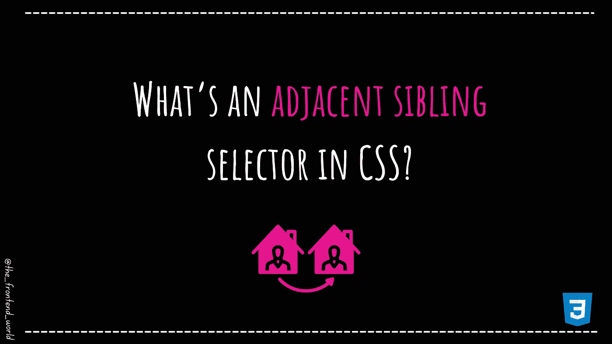

# CSS 中的相邻兄弟选择器是什么？

> 原文：<https://medium.com/geekculture/whats-an-adjacent-sibling-selector-in-css-5a5f14bfa4aa?source=collection_archive---------11----------------------->

## 直观地了解 CSS 组合子！

By FAM

# 首先，什么是 CSS 组合子？

> "组合子解释了选择器之间的关系."— w3schools