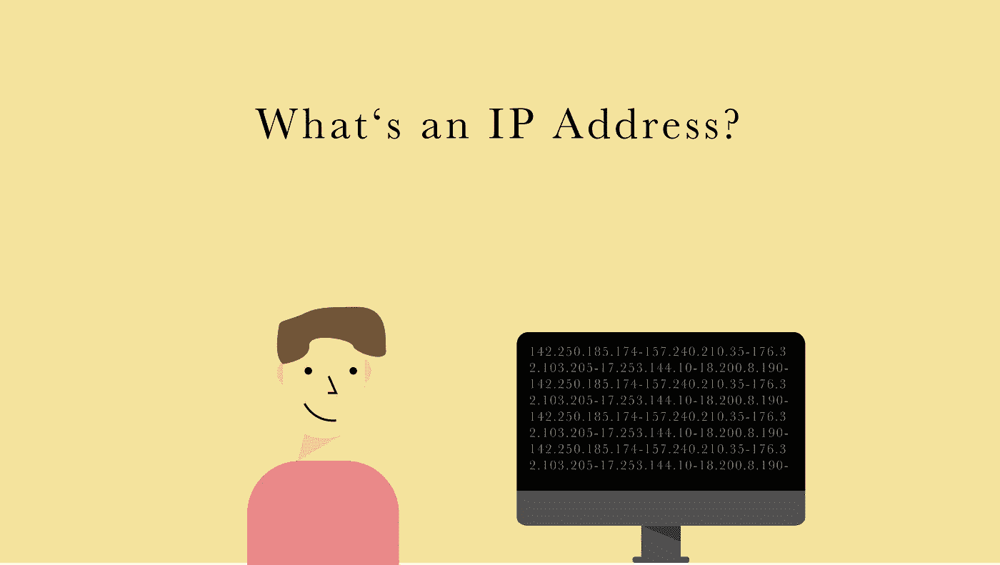
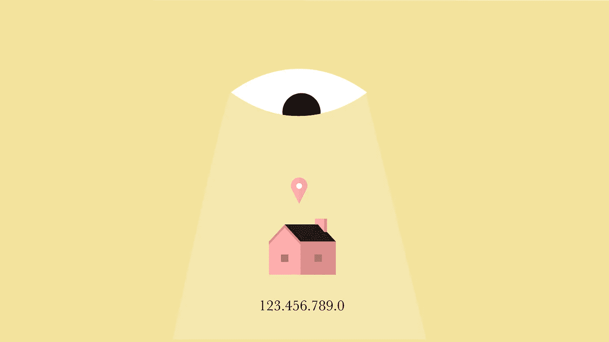

# 什么是 Ip 地址？

> 原文：<https://medium.com/geekculture/whats-an-ip-address-63ee07caab2b?source=collection_archive---------38----------------------->

了解绝对的基础知识

made by author

为了使像计算机和服务器这样的设备相互通信，每个设备都需要一个地址，更具体地说，是一个 Ip 地址，用于定位设备并向其发送数据。

如果您想要在浏览器中访问某个网站，您可以向使用其 IP 地址存储该网站的服务器发送请求，然后该网站会使用您电脑的 Ip 地址将该网站发送回您的电脑。没有它，网站就不知道要把数据发送到哪里。

所以你访问的每个网站都需要你的 IP 地址来给你发送网站内容，就像邮递员需要你的地址来投递包裹一样。

Ip 地址由两部分组成，网络和主机，也称为设备。

## 域名服务器(Domain Name Server)

但是人类不擅长记忆长数字。因此，你不用输入 Ip 地址来访问谷歌，而是输入域名，然后你的计算机会要求 DNS 服务器查找与域名相关的 Ip 地址，这样你就可以向它发送请求。

## 虚拟专用网络

如果有人知道你的 Ip 地址，他们可以在地理定位技术的帮助下找到你的实际位置。

好消息是你可以用 VPN 隐藏你的 Ip 地址。这样，你的连接会被重新路由到一个虚拟服务器上，再也无法追踪到你了。

这篇文章也有视频格式: