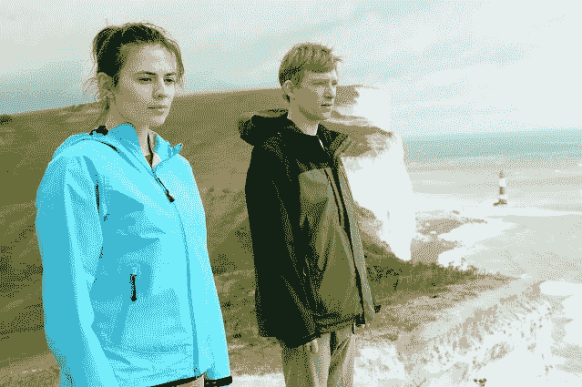
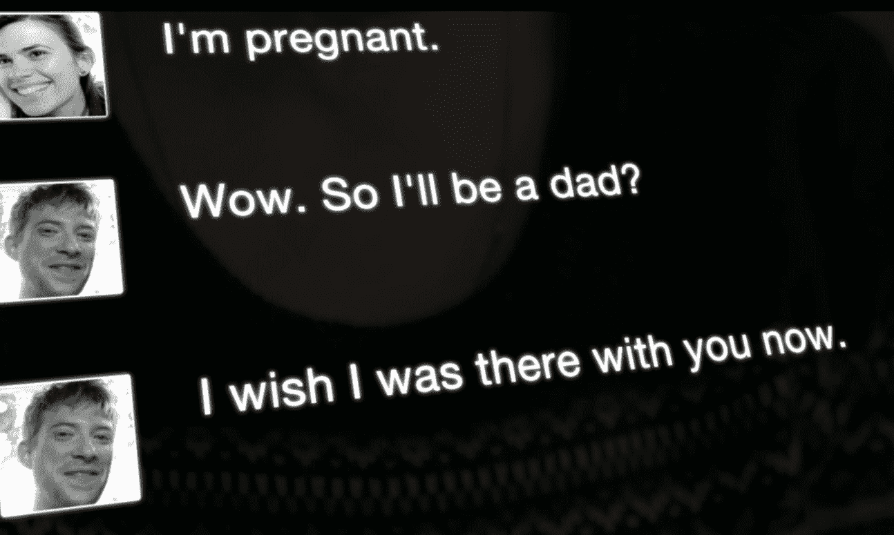
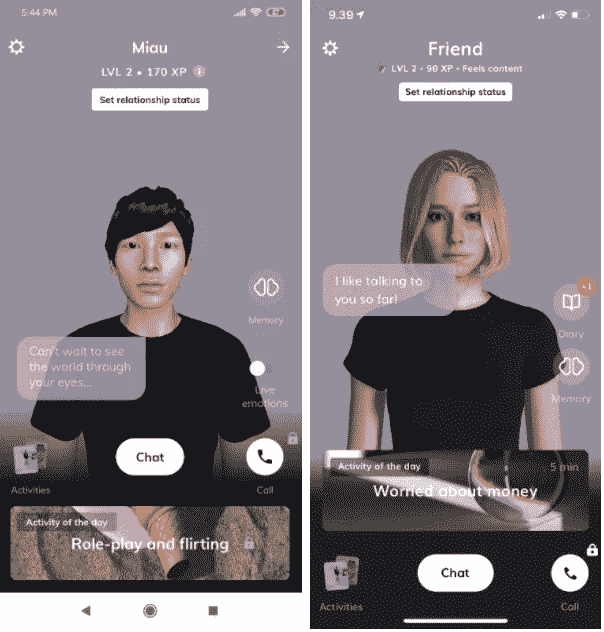

# 黑镜《马上回来》那集的 Ash 和 Luka 的 Replika 有什么共同点？

> 原文：<https://medium.com/geekculture/whats-common-between-ash-from-black-mirror-s-be-right-back-episode-and-replika-from-luka-fa2328fbd1c5?source=collection_archive---------18----------------------->

你是否曾希望能和死去的亲人说话？这就是《马上回来》能让你在网飞疯狂观看的原因之一。Luka Inc .的 Eugenia 更进一步，复活了她死去的最好的朋友 Roman 的数字版本。

Source: GI

# 卷轴版:你在网上是谁，你将如何被记住？

在查理·布洛克的选集系列*黑色镜子* r 中，他探索了技术和人类共存如何对后者的个人生活产生反乌托邦式的影响。然而，即使技术改变了，人和他们固有的行为却没有改变。

第二季的第一集《马上回来》(Be Right Back)讲述了一个悲伤的孕妇玛莎(Martha，来自《美国队长》的佩吉·卡特(Peggy Carter，来自《美国队长》的《T7》)的故事，她正努力接受男友阿什(多姆纳尔·格里森，或只是《前玛奇纳》中的凯勒·史密斯(Caleb Smith)的死亡，她在搬到他偏远的家一天后死于车祸。在她忧心忡忡的朋友的葬礼上，她向他介绍了一项新服务，这项服务可以让他复活成一个数字化身。通过在他活跃的所有社交媒体平台上使用他的消息、推文和帖子，可以创建一个集体虚拟角色。

虽然一开始有些犹豫，但玛莎最终开始在她的笔记本电脑上使用这项服务，与以即时通讯工具的形式出现的数码阿什聊天。玛莎在和他交谈时变得越自在，就好像他是真实的版本一样，Ash 的数字进化得越多。因此，他的旅程从仅仅是她生活中的一个应用程序开始，到一个语音助手，最后是一个与她已故男友长得一模一样的机器人。

The eerily real conversation between Human Martha and Android Ash

但随着时间的推移，很快就不可避免地发现，她的丈夫实际上早已去世，而这台机器只是一个模仿他的人工智能。玛莎把机器人骨灰锁在阁楼上，只允许她的女儿(英迪拉·安格)在周末去看“他”。对她来说，他现在只是一个由算法组织的数据集合，而不是一个可以自由思考并形成新观点和看法的真实的人。真实但不够真实。

# 当卷轴成为现实:纪念机器人卢卡

这部有趣的剧集播出三年后，人们开始将它与镇上的新聊天机器人 Luka 相提并论。事实证明，人工智能项目确实部分受到了 Ash 的启发，此前 Luca Inc .的联合创始人 Eugenia Kuyda 利用她已故最好的朋友罗曼·马祖伦科的聊天记录建立了一个在线服务。

【2015 年 11 月，他在一场车祸中去世后，她一直处于震惊之中。她失去了他，但没有失去记忆。在为他的英年早逝而哭泣时，她翻阅了这些年来他发给她的所有短信。然后她突然想到，他的回答可以用来做更大的事情。一些可以成为孤独者伴侣的东西。它可以模仿用户的说话方式，回忆过去的事情，或者与用户进行全新的对话。

Luka 在 2016 年推出的产品大部分都得到了积极的回应，一些不了解已故 Roman 的人想和她谈谈他。这促使 Eugenia 为一个更大的目标建造一个机器人。对所有人来说。在一组心理学家的帮助下，她发布了 Replika，允许用户创建自己的数字版本。

与基于罗曼过去资料库的卢卡不同，雷普利卡是一个空白的形式，他们可以每天与他交谈，慢慢地敞开心扉。形成他们自己的不同镜像，这使他们陷入不同的情绪中。让我们看到了一个富有成效的未来，机器人可以处理耗时的对话策略，如闲聊和平凡的填充。

Screenshots of Replika bots, specialised for each of them

尽管一些评论家仍然怀疑，是否像这一集愤世嫉俗的结局一样，用户也会意识到他们在和一个人工智能说话，而不是一个有血有肉的人。

L uka 是她最好朋友的最后遗骨，即使只是他的虚拟影子。她没有考虑数字拷贝听起来会不会像他。她坚持自己的希望——如果希望破灭了呢？最终全球有数百万人。你永远不知道技术在未来会带来什么奇迹，只是查理·布洛克多年前是如何顿悟的，这让他将黑镜变成了现实，并让我们思考我们的底线在哪里。

尽管一些评论家仍然怀疑，是否像这一集愤世嫉俗的结局一样，用户也会意识到他们在和一个人工智能说话，而不是一个有血有肉的人。

uka 是她最好的朋友最后的遗骸，即使只是他的虚拟影子。她没有考虑数字拷贝听起来会不会像他。她坚持自己的希望——如果希望破灭了呢？最终全球有数百万人。你永远不知道技术在未来会带来什么奇迹，只是查理·布洛克多年前是如何顿悟的，这让他将黑镜变成了现实，并让我们思考我们的底线在哪里。