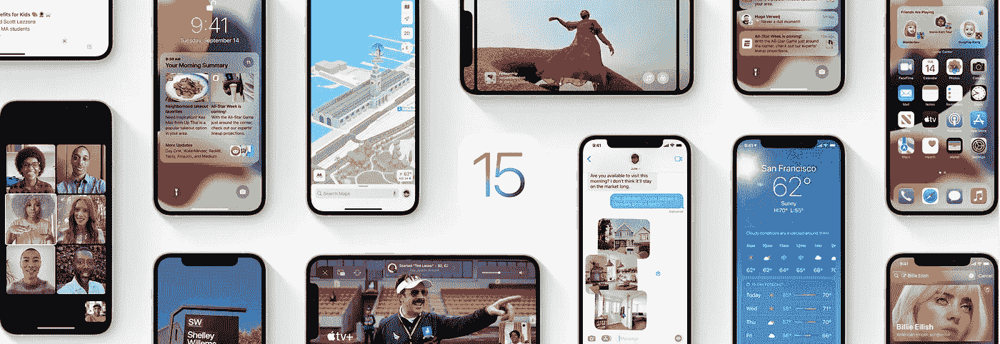
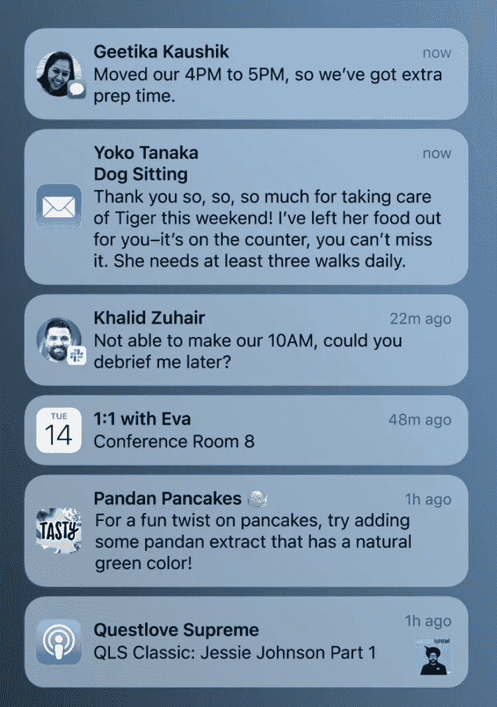
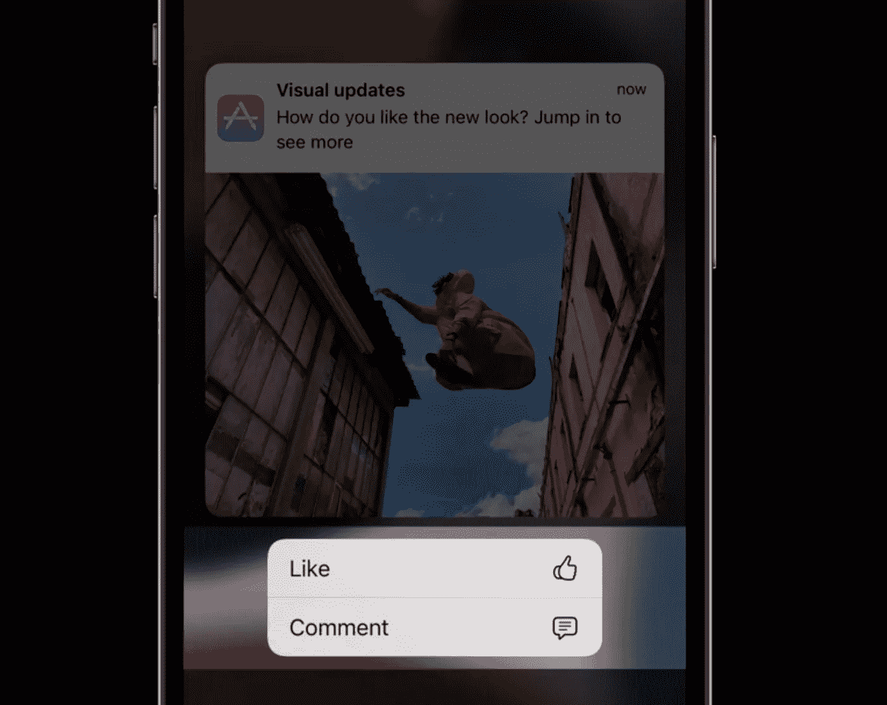
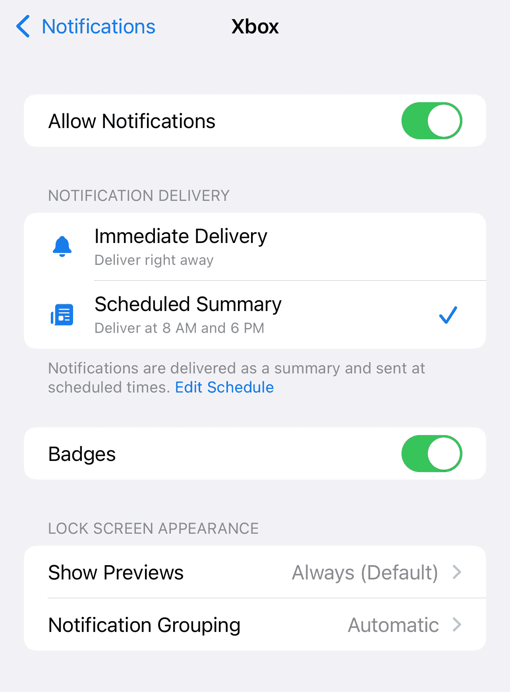
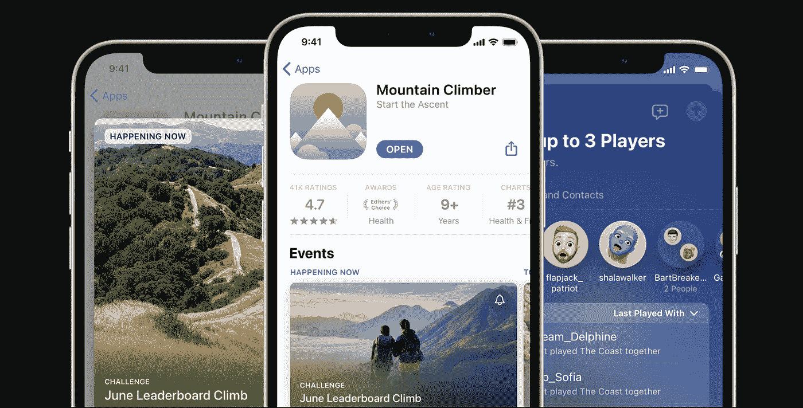
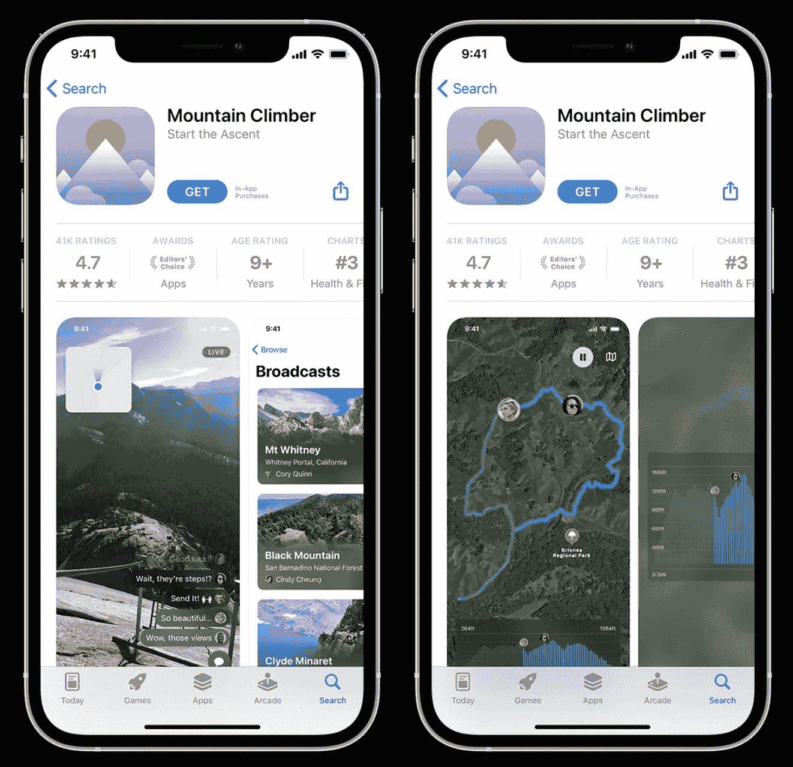
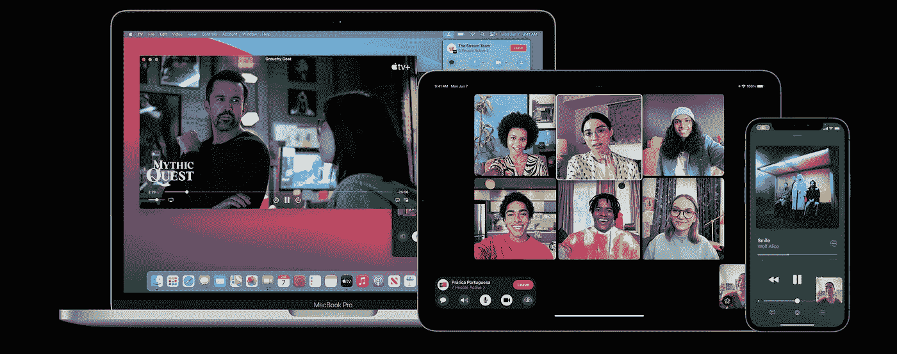

# iOS 15 的新功能——面向开发者

> 原文：<https://medium.com/geekculture/whats-new-in-ios-15-for-developers-cdde64a68511?source=collection_archive---------2----------------------->

## 焦点和通知、应用商店发现、共享播放等

Image source: [Apple](https://www.apple.com/ios/ios-15/)

去年，苹果终于为他们的生态系统带来了最受欢迎的功能之一:widgets。随着它们在发布时令人难以置信的受欢迎程度，创建自定义图标(即，每个启动特定应用程序的快捷方式)的能力迎来了新一轮的定制化浪潮。这种趋势迅速传播开来，没过多久，用户就可以在互联网上分享他们的艺术作品。

由于这一巨大成功，2021 年 4 月， [iOS 14 在超过 90%的合格设备上运行](https://www.macrumors.com/2021/04/06/ios-14-adoption-90-percent/)。继 iOS 13 之后，2020 年又是苹果不需要科技爱好者说服别人安装最新版本 iOS 的一年。黑暗模式和小工具——*旗舰功能——说了算。*

*从开发者的角度来看，事情并不乐观。苹果没有给开发者足够的时间在公开发布前提交他们的应用程序，导致 iOS 14 的发布受到影响。幸运的是，今年没有惊喜:苹果尊重通常的一周时间框架，在 9 月中旬的活动后立即发布了 RC 版本(发布候选版本，以前命名为“金主”或 GM)。*

*虽然 iOS 15 没有带来显著的视觉变化，但它捆绑了大量的改进，为新的体验和交互铺平了道路:*

*   *随着 SharePlay 的推出，FaceTime 获得了重大的共享升级。*
*   *通知已经过重新设计，使其更容易识别。*
*   *Focus 通过根据用户当前正在做的事情过滤出通知，有助于减少分心。*
*   *“地图”提供了探索主要城市的新方法，并利用增强现实(AR)提供步行方向。*
*   *Live Text 使用设备上的智能来识别 iOS 和网络上照片中的文本。*
*   *Safari 已针对辅助功能进行了重新设计，并支持扩展。*

*[所有这些以及其他数百项变化](https://www.apple.com/ios/ios-15/features/)主要面向用户，并且[广为宣传](https://www.youtube.com/watch?v=NJpIvnz3yWs)。开发者应该通过苹果文档和 WWDC 视频的组合来赶上这个新版本，因为这是可用的最全面的资源集。*

*然而，对于那些只想知道什么可能会影响他们即将推出或现有的应用程序的人来说，找到一个精简的信息来源可能是一个挑战。因此，这篇文章列出了你在为 iOS 15 准备下一次应用更新时应该考虑的事情(如果你还没有的话)。*

***变化由**部分组织，首先是你今天应该考虑的那些，以确保你的应用尊重新的系统控制，然后是你应该利用的其他功能，以使你的应用脱颖而出。*

# *焦点和通知*

***优先级**:高(可选，但强烈推荐)*

*通知是应用程序体验的重要组成部分。除了用户界面的变化，iOS 15 还提供了提升特定类别通知的新方法。让我们看看有哪些新功能，如何增强它们，并利用它们当前的功能。*

## *视觉变化*

*通知现在有了新的外观，专注于更大的应用程序图标、联系人图像和任何相关媒体。例如，通信应用程序现在会在左侧突出显示与您联系的人的照片，而媒体应用程序(如播客)会在通知文本的右侧显示相应媒体的图标。*

**

*Notifications in iOS 15\. Image source: [Apple](https://www.apple.com/ios/ios-15/)*

*您可以将通知操作与图标相关联，这样用户就可以更容易地从视觉上识别它们。查看`[UNNotificationAction](https://developer.apple.com/documentation/usernotifications/unnotificationaction)`和`[UNNotificationCategory](https://developer.apple.com/documentation/usernotifications/unnotificationcategory)`API，了解如何在您的应用中实现这一点的更多信息。*

**

*Notification actions with icons. Image source: [Apple](https://wwdc.io/share/wwdc21/10091)*

## *通知管理*

*两个新功能影响了 app 通知的交付和中断:**通知摘要**和**焦点**。*

*通知摘要收集通知，并在计划的时间显示通知。默认情况下，如果打开，通知摘要每天会出现两次**:早上(上午 8 点)和晚上(下午 6 点)。用户可以自定义频率，并选择立即发送特定应用程序的通知，仅在通知摘要中发送，或者完全禁用它们。***

******

***An example of notification management in iOS 15 (with notification summary enabled)***

***作为开发人员，您可以通过遵循以下最佳实践来增加出现在通知摘要顶部的机会:***

*   ***在通知中包含媒体附件。***
*   ***[为每个通知声明一个相关性分数](https://developer.apple.com/documentation/usernotifications/unnotificationcontent/3821031-relevancescore)，这样只有你的应用最相关或最重要的信息才会出现在摘要中。***

## ***焦点***

***在 iOS 15 中，设备可以设置为特定的聚焦模式，影响哪些应用程序和人可以发送通知。(例如，在“工作”焦点期间，只有生产力应用和同事可以发送中断消息。)***

***这项功能可以进行深度定制，尽管 iOS 会在设置时智能地识别它认为与特定焦点相对应的应用/人的类型。用户也可以选择只显示某些主屏幕页面，减少视觉混乱和干扰。***

***在`UserNotifications`框架内， [**有一个新的枚举定义了四个不同的中断级别**](https://developer.apple.com/documentation/usernotifications/unnotificationinterruptionlevel) 。这些措施如下:***

***Interruption levels and their capabilities in iOS 15 (* allows notification summary and Focus)***

*   *****被动(新)**:用于不需要立即关注的通知，如媒体推荐、非突发新闻。***
*   *****有效**:默认中断等级。如果用户有“请勿打扰”的提示，例如体育更新、直播视频、内容创建者发布的新媒体，请使用此提示。***
*   *****时间敏感(新)**:仅在需要中断时使用，即当您需要立即关注时，例如，软件包更新、帐户安全、突发新闻。***
*   *****关键** : 这在 iOS 14 中已经存在，并且**需要一个批准的权限**。例如:恶劣天气警报、当地安全警报。***

***如果不设置中断级别，系统会分配默认级别(活动)。因此，利用这一点来告诉系统每个通知的优先级。***

***要深入了解通知和新 API，请查看 WWDC 演讲:[发送通信和时间敏感通知](https://developer.apple.com/videos/play/wwdc2021/10091)。***

# ***应用商店发现***

*****优先级**:中(可选，但强烈推荐)***

***App Store 是应用发现和管理的基石。今年，一些新功能将有助于开发者扩大受众，并为特定用户群定制体验。***

## ***应用内事件****

***App Store 现在允许您[展示您应用中发生的事件](https://developer.apple.com/app-store/in-app-events/)(例如，游戏比赛、直播、排行榜挑战)。用户无需安装应用程序即可快速发现活动，从而提高参与度和下载量。在机器学习的帮助下，iOS 将智能地为每个用户量身定制推荐。***

******

***Each app’s Store page can feature in-app events. Image source: [Apple](https://developer.apple.com/app-store/whats-new/)***

## ***定制产品页面****

***您可以使用多达 35 页的内容来扩充您的宣传材料，这些内容可以包含不同的文本、图像和应用预览。这些必须提交审核，但独立于 app 更新。***

***每个自定义页面的 URL 都有一个新的 PPID(产品页面 ID)参数，附加到每个唯一 URL 的末尾。比如:`https://apps.apple.com/[region]/app/[app_name]/[app_id]?ppid=[ppid]`。***

******

***The same app using different custom pages depending on the audience. Image source: [Apple](https://developer.apple.com/app-store/product-page-updates/)***

***这个特性非常适合拥有不同受众的开发人员。(一个体育应用可以将用户重定向到他们最喜欢的球队或比赛的定制页面，而不是每个人的通用页面。)***

***有关应用商店发现更新的更多信息，请查看[苹果开发者页面](http://Get More from Your Product Pages)和 WWDC 演讲:[准备好优化你的应用商店产品页面](https://developer.apple.com/videos/play/wwdc2021/10295/)。***

*****App Store 应用内活动和定制产品页面将于今年晚些时候推出。****

# ***SharePlay****

*****优先级:**因应用类型而异***

******

***SharePlay* works across multiple devices and apps. Image source: [Apple](https://developer.apple.com/shareplay/)***

***SharePlay 是 iOS 15 最受吹捧的功能之一，它通过利用 FaceTime 的新功能来实现新的媒体共享体验。当用户播放媒体时，回放会跨设备同步。回放控制是共享的；如果有人暂停媒体，它会为通话中的每个人停止播放。***

***然而，由于有如此多的新事物需要同步，通话质量是一个重要的问题。苹果声明:***

> ***[…]由于您的应用在每台设备上运行，无需重新传输，因此您的应用体验质量不会受到影响。***

***这是一个相当自信的声明，但它仍然引起了一些怀疑。一方面，苹果相信自己有能力提供无缝体验。另一方面，这个特性还没有经过野外的实战考验。我希望 SharePlay 的延迟能够确保这项功能如期运行，同时在第三方应用中提供足够的开发者支持。***

***如果你正在开发一款通讯应用，并且有兴趣将你的应用与 FaceTime 和 SharePlay 集成，请查看一下`[GroupActivities](https://developer.apple.com/documentation/GroupActivities)` [API](https://developer.apple.com/documentation/GroupActivities) 和[这四个 WWDC 会议](https://developer.apple.com/videos/wwdc2021/?q=group%20activities)。***

***此外，如果你错过了， [FaceTime 现在可以在非苹果平台上使用](https://support.apple.com/en-us/HT212619)！*****

*****SharePlay 将于今年晚些时候推出，并进行软件更新。同时，* [*你可以在 15.0 开发环境中实现并测试这个特性*](https://developer.apple.com/news/?id=mxaeu6er) *。如果你在 15.1，苹果已经* [*重新启用了 SharePlay*](https://www.macrumors.com/2021/09/21/ios-15-1-shareplay-reenabled/) *而不需要 SharePlay 开发配置文件。****

******FaceTime 通话在非 Apple 平台上使用浏览器，不支持 share play(MAC OS Monterey 上的 Safari 除外)。* [*根据苹果*](https://developer.apple.com/shareplay/) *的说法，SharePlay 只在 iOS 15、iPadOS 15、macOS Monterey、tvOS 15 上支持。****

# ***促销支持***

*****优先级:**中(推荐新机型用户使用)***

***除了 iPad Pro，新的 iPhone 13 Pro 和 Pro Max 型号还有一个 LTPO(低温多晶氧化物)显示屏，能够在 10 到 120 Hz 之间刷新。***

***这项技术允许系统根据屏幕上的内容和用户动作(例如，点击、滑动、快速滚动)来动态控制面板的刷新率。结果是显著*更流畅的体验，而不影响电池寿命。***

***在软件方面，iOS 15 已经包括了对开箱即用推广的支持，如果你使用这些框架:***

*   ***UIKit***
*   ***斯威夫特伊***
*   ***斯普利特基特***
*   ***`CAAnimation`***

***苹果警告开发者自定义动画不会自动管理:***

> ***应用中的自定义动画需要能够适应刷新率的变化。显示刷新率会因为很多原因而改变，你的应用程序在任何时候都不能设定任何特定的刷新率。**例如，在低功耗模式下或设备过热时，系统会禁用更快的刷新率。此外，虽然 UIKit 和 Core Animation 正在管理各种 GUI 元素，但 Core Animation 可能会选择改变刷新率来提供增强的用户体验。*****

***核心动画负责决定哪些动画必须呈现在屏幕上，并计算适当的刷新率。注意**你不能明确地设置显示器的刷新率**、**、**，但是你可以为你的动画提供关于理想刷新率的提示(更多信息见下文)。***

## ***在 iPhone 13 Pro 上解锁促销***

***要解锁应用中的`CADisplayLink`回调和`CAAnimation`动画的全范围刷新率，请将以下密钥添加到您的 Info.plist:***

***`<key>CADisableMinimumFrameDurationOnPhone</key><true/>`***

***如键名所示，iPad Pro 型号不需要此键。***

## ***计时提示***

***在 iOS 14 之前，你可以用`[preferredFramesPerSecond](https://developer.apple.com/documentation/quartzcore/cadisplaylink/1648421-preferredframespersecond)`属性为你的应用设置首选刷新率。在 iOS 15 中，你应该使用`[preferredFrameRateRange](https://developer.apple.com/documentation/quartzcore/cadisplaylink/3875343-preferredframeraterange)`，它是一个`[CAFrameRateRange](https://developer.apple.com/documentation/quartzcore/caframeraterange)`。这个结构有`minimum`、`maximum`和`preferred`帧速率属性。如果你想知道要设置哪些范围，[考虑一下苹果的表格作为参考](https://developer.apple.com/documentation/quartzcore/optimizing_promotion_refresh_rates_for_iphone_13_pro_and_ipad_pro)。***

***在 WWDC 演讲中深入探讨了优化内容以进行推广:[针对可变刷新率显示器进行优化](https://developer.apple.com/videos/play/wwdc2021/10147/)。***

*****对刷新率的敏感度各不相同(尤其是在智能手机等较小的显示器上)。为了测试您的灵敏度并模拟系统禁用高刷新率的场景，您可以通过在设置>辅助功能>运动>限制帧速率中将帧速率限制为最大 60 Hz 来执行 A/B 测试。****

# ***堆栈视图更改***

***如果您使用 Xcode 13 来创建带有堆栈视图的布局，那么它们对内容的布局方式会有一个微妙但重要的变化。iOS 14(及更早版本)和 iOS 15 之间的填充分布行为有所不同，如下所示:***

******

***Differences in stack view fill distribution between versions. Image credit: [Keith Harrison](https://useyourloaf.com/blog/stack-view-changes-in-ios-15/)***

***出现这种行为是因为 iOS 14(及更早版本)自动添加了一个歧义消除约束，其抗压优先级(759)高于截图中的 UI 元素(默认为 750)。***

***根据 [Keith Harrison](https://useyourloaf.com/blog/stack-view-changes-in-ios-15/) 的说法，早期版本的解决方法是**将拉伸视图的抗压优先级设置为高于歧义消除约束**的值。在这种情况下，值 760 将被设置在交换机上，因为它被限制在其帧的左侧。***

***此问题有一个错误报告，但没有收到 Apple 的回应。不管怎样，iOS 15 中的行为已经被悄悄地改变了，现在堆栈视图可以像你预期的那样工作了。只要确保在两个版本上都测试了布局。***

# ***贬值***

***虽然今年 iOS 15 SDK 中没有重大的弃用，但知道有什么变化总是有帮助的。这篇文章列出了今年所有公开的反对意见。***

# ***结论***

***本文涵盖了 iOS 15 中最具影响力的变化，重点突出(无意双关！)关于通知管理和中断。正确定义通知的中断级别对于确保你的应用尊重新的系统控制和用户对不同紧急程度的感知至关重要。***

***此外，早期采用新功能会让你处于有利地位——用户重视对他们每天依赖的应用程序的持续支持和承诺。我希望这篇文章能给你指明正确的方向。***

***感谢阅读！***