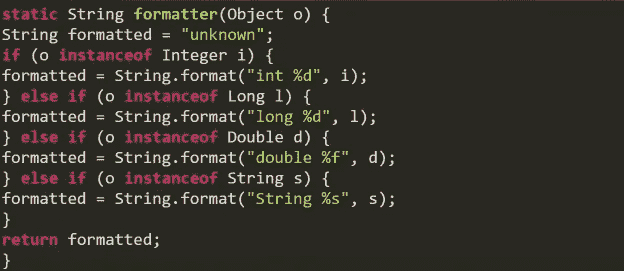
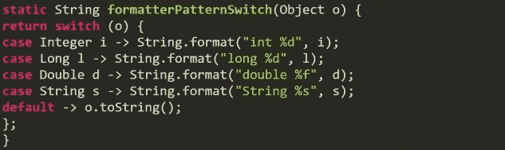
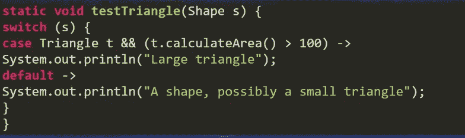
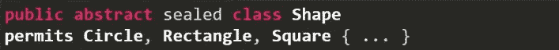

# Java 17 有什么新特性？

> 原文：<https://medium.com/geekculture/whats-new-in-java-17-1b4854fa9e9c?source=collection_archive---------8----------------------->

## 让我们回顾一下 Java 17 的最新特性

Photo by [Nathan Dumlao](https://unsplash.com/@nate_dumlao?utm_source=medium&utm_medium=referral) on [Unsplash](https://unsplash.com?utm_source=medium&utm_medium=referral)

2021 年 9 月 13 日，racle 发布了新的 java 长期支持(LTS)版本:Release 17。在这一新版本中，Oracle 引入了新的许可条款和条件，即所谓的“Oracle-免费条款和条件(NFTC)”。

Java 17 是 LTS 版本。其他 LTS JDK 是 Java 8 和 Java 11。LTS JDK 每三年发布一次，而非 LTS 则每六个月发布一次。相比之下，LTS 版本的支持持续几年，而非 LTS JDK 的支持仅持续六个月，在下一个非 LTS 版本发布时结束。

虽然 Java 17 是 LTS 版本，但没有重大更新。JEP 406 和 JEP 409 对于任何 java 开发者来说都是非常有用和重要的。

## JEP 406:开关的模式匹配(预览)

*   通过允许模式出现在 case 标签中，扩展了 switch 表达式的表现力和适用性。
*   当需要时，允许开关的历史零敌意被放松。
*   引入了两种新模式:保护模式和括号模式。

Java 17 之前:

现在，在 Java 17 增强之后，我们可以像这样重构上面的代码:

保护模式:使用模式和布尔表达式进一步细化模式。

## JEP 409:密封类

用密封的类和接口增强 java 编程。密封的类和接口限制了哪些其他类或接口可以扩展或实现它们。

*   在声明和 permissions 子句中使用 sealed 修饰符来指定允许扩展密封类的类。

*   子类必须是最终的、密封的或非密封的。

## JEP 306:恢复总是严格的浮点语义

使浮点运算始终严格

## JEP 356:增强型伪随机数发生器

为伪随机数生成器(PRNG)提供新的接口类型和实现，以便更容易地使用各种 PRNG 算法，并更好地支持基于流的操作。

## JEP 403:强封装 JDK 内部

严格封装 JDK 的所有非关键内部元素。

## JEP 412:外部函数和内存 API(孵化器)

引入一个 API，java 程序员可以通过它与 java 运行时之外的代码和数据进行互操作。

## JEP 414 : Vector API(第二个孵化器)

引入一个 API 来表达矢量计算，在运行时可靠地编译成最佳矢量指令。

## JEP 415:特定于上下文的反序列化过滤器

允许应用程序配置特定于上下文和动态选择的反序列化过滤器。

## JEP 382:新的 macOS 渲染管道

更改了 macOS 的 java 2D macOS 渲染管道(例如在 Swing 中使用),以使用 Apple Metal API，而不是已弃用的 Apple OpenGL API。

## JEP 398:反对删除小应用程序 API

小程序 API 将被删除。从 JDK 9 开始它就被废弃了。大多数浏览器都不再支持它了。

## JEP 407:删除 RMI 激活

虽然 RMI 仍然在使用，但是随着最近十年的 web 技术，RMI 激活机制已经过时了。

## JEP 410:删除实验性的 AOT 和 JIT 编译器

移除实验性的基于 java 的提前(AOT)和实时(JIT)编译器。

## JEP 411:反对删除安全管理器

不赞成在未来的版本中删除安全管理器。安全管理器可以追溯到 java 1.0。多年来，它并不是保护 java 代码客户端的主要手段。

*参考:*

 [## JDK 17

### JDK 17 是 Java SE 平台版本 17 的开源参考实现，由 JSR 390 在…

openjdk.java.net](https://openjdk.java.net/projects/jdk/17/)