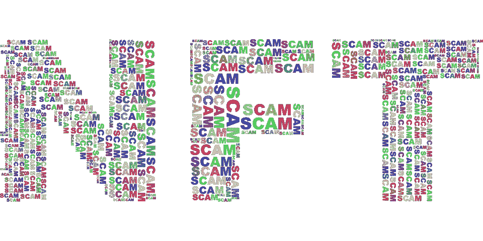

# 再说一遍，NFTs 有什么问题？

> 原文：<https://medium.com/geekculture/whats-that-problem-with-nfts-again-9bb85e0a70e?source=collection_archive---------0----------------------->

## 与丹·奥尔森的“直线上升”搏斗

Image courtesy of [Pixabay](https://pixabay.com/vectors/nft-non-fungible-token-typography-6888382/)

[2022 年 7 月 7 日最后更新]

**不是财务建议(NFA)|自己做研究(DYOR)**

几天前，丹·奥尔森(Dan Olsen)放弃了一个全面的、[严厉的视频](https://youtu.be/YQ_xWvX1n9g)，在视频中，他竭尽全力向我为之奉献了一年生命的所有事情传达一个真人快打式的死亡。