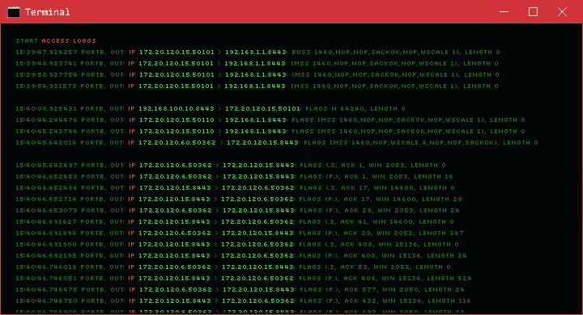
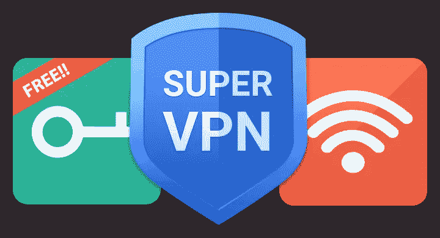

# “最好”的 VPN 是什么？

> 原文：<https://medium.com/geekculture/whats-the-best-vpn-6d836ab80cf9?source=collection_archive---------18----------------------->

## 一个比时间更古老的问题

虚拟专用网就像一个保护隧道，保护你的数据不受外界影响，同时隐藏你的真实 IP 地址。

VPN 服务是保持安全和访问受限流媒体内容的便捷方式，但它们也是黑客、广告商和政府窃取和窥探你的数据的良好工具。

# 为什么我需要 VPN？

虚拟专用网屏蔽了你的浏览，用一层加密隐藏了你的真实 IP 地址和你访问的网站。这有助于避免被广告商或者政府追踪，如果你没有言论自由的话。

如果你正在旅行，被迫使用公共 Wi-Fi 热点，这可能特别有用。公共热点对黑客来说是一个诱人的目标，他们通常会窥探这些未加密的网络，捕捉你的登录信息和通过它们发送的所有其他信息。有了 VPN，所有从你的电脑(或手机)发出的信息都被加密，即使在公共热点也无法访问。

但是隐私并不是使用 VPN 服务的唯一原因，许多人使用它来访问在他们的国家被限制的内容。例如，如果你在瑞典，想访问网飞的美国内容，你只需连接到美国的 VPN 服务器，网飞就会认为你在美国冲浪。

# 没有日志？

虽然他们确实保护你的隐私，但这种保护是有代价的，如果你不注意，你的信息可能会被泄露。当使用虚拟专用网时，虚拟专用网提供商将知道你的所有浏览习惯，因为你电脑上的所有信息都要通过他们的服务器。

关于你的浏览习惯的信息保存在日志中，这些日志可以被执法部门传唤和提供。一些 VPN 提供商明确表示他们根本不记录日志，或者只记录法律要求的时间，但他们并不都是真实的。

## 连接日志

这些日志有助于 VPN 提供商监控每台服务器的工作负载、管理流量并防止滥用。任何限制每个用户连接数的 VPN 提供商都必须保存这些日志，以便实施这一限制。

在最好的情况下，它们是有限的和匿名的，但它们可能包括:

*   您何时连接到 VPN 服务器以及连接了多长时间。
*   您最初连接的 IP 地址。
*   您正在连接的虚拟专用网络服务器。
*   崩溃后发送的诊断数据。

连接日志可以用来识别你的电脑，正因为如此，一些公司，如 ExpressVPN，承诺永远不会保留它们。

## 使用日志

当 VPN 公司承诺他们是“无日志提供商”时，使用日志就是他们所说的日志。这些日志，有时被称为流量日志，记录了你的 IP 地址进行的每一次交互，你访问的每一个网站，你下载的每一个文件。

使用日志可以包括:

*   您访问过的所有网站的列表。
*   您在未加密频道上发送或接收的所有信息内容。
*   您在设备上使用的应用程序和服务的列表。
*   您的物理位置，如果 IP 包含在日志中。

获得 VPN 的一个主要原因是避免被广告商和你的 ISP 跟踪。如果你的 VPN 提供商保留了这些日志或者对这个问题不清楚，去别的地方看看。

# 为什么“免费”VPN 是危险的

## 拦截的流量

有很多免费的 VPN 服务，但是运行一个有几十或几百台服务器的 VPN 服务是要花钱的，那么他们如何支付他们的账单呢？

他们通过向广告商和政府出售他们收集的关于你和你的浏览习惯的数据来支付账单。你可能正在使用源自中国的免费 VPN 服务上网，然后你的数据被中国当局共享。

[在 2019 年对谷歌和苹果应用商店的回顾中](https://www.top10vpn.com/research/free-vpn-investigations/ownership/), 60%的流行免费 VPN 应用是秘密由中国人拥有的，90%有严重的隐私缺陷。通过提供大部分免费 VPN 服务和拦截数据，中国已经用最少的努力和自愿的参与者创建了一个巨大的工业间谍网络。

在一项关于免费 Android VPN 服务的研究中， [CSIRO 发现](https://cdn-resprivacy.pressidium.com/wp-content/uploads/2019/01/paper-1.pdf)这些拥有数百万下载量的高评级应用中有高达 38%包含恶意软件。这种恶意软件可以窃取个人信息，如密码、社会安全号码，甚至包含锁定您设备的勒索软件。

## 强制广告

通过在你的浏览器中隐藏广告服务跟踪器，一些免费的 VPN 提供商强迫你在你访问的每个页面上观看他们的广告。这是一种简单的赚钱方式，通常伴随着秘密收集你的数据并出售给广告商的后门。

## 出售你的宽带

在国外获得他们喜欢的订阅服务是人们使用 VPN 服务的主要原因之一，但如果它太慢了，看不下去又有什么意义呢？

一些 VPN 提供商通过限制你的带宽来填补空白，然后出售剩余的带宽。有时他们不在乎把你的带宽卖给谁，这可能会给你带来法律问题。众所周知，Hola 被发现向任何付费团体出售其用户的带宽，导致垃圾邮件发送者利用其客户的数据传播垃圾邮件和恶意软件。

# 我们的建议

这里列出了一些互联网上最受推荐的 VPN 服务，它们都提供免费试用或免费版本。

如果你不想花钱，但仍然需要一个 VPN，你应该考虑尝试大牌的试用版。如果你喜欢这个应用程序，你绝对应该考虑购买它，因为免费 VPN 只是一个蠕虫罐。

## 冲浪者

> 总体最佳

1 个月:€10.85/米，6 个月:€5.44/米 1 年:€2.09/米(成交)
首页:[surfshark.com](http://www.surfshark.com)

Surfshark 是互联网上最值得推荐的 VPN 服务之一，虽然比竞争对手小，但他们在速度、功能和价格上弥补了它的不足。Surfshark 提供无限制的设备支持，因此您可以将所有设备连接到一个帐户。他们也没有限制该帐户的连接数，甚至过滤掉恶意软件，阻止广告和跟踪。

由于其所有的功能和低廉的价格，Surfshark 显然是赢家。

对于所有订阅，Surfshark 提供 30 天退款保证，因此您可以在申请退款前试用一个月。

## 质子虚拟专用网

免费，基础:€4/米，加:€8/米，远景:€24/米
首页:【protonvpn.com】T4

ProtonVPN 非常重视隐私和安全，通过私有服务器的安全掩体路由您的流量，同时还包括到 Tor 服务器的内置 VPN 路由。该公司有良好的透明政策，并且完全开源，定期公布审计结果。

ProtonVPN 是少数几个提供免费版本的 VPN 提供商之一，尽管没有付费版本快，但它仍然提供无限的带宽和数据。免费版仅支持一种设备，并能访问荷兰、日本和美国的服务器，在所有 55 个国家，你都需要付费版。

## 隧道熊

> 最适合初学者

免费，无限制:3.33 美元/米，团队:5.75 美元/用户每月
主页:[tunnelbear.com](https://www.tunnelbear.com/)

TunnelBear 也是一项基于加拿大的 VPN 服务，它的友好的吉祥物熊可以立即识别出来，这有助于使该技术对新用户更加平易近人。像其他注重隐私的 VPN 提供商一样，TunnelBear 有一个反登录政策和一个明确的隐私政策，它也经过了独立审计。

TunnelBear 有一个免费试用选项，所以你可以在提交之前测试一下，看看你能得到什么样的速度。

## 穆尔瓦德

免费，基础:€4/米，加:€8/米，远景:€24/米
首页:[mullvad.net](https://mullvad.net)

就像 ProtonVPN 一样，Mullvad VPN 是完全开源的，服务已经过独立审计。他们为每个主要平台和路由器提供应用程序，高级用户甚至可以下载 OpenVPN 配置文件。

Mullvad VPN 的总部设在瑞典，虽然他们不是业界最大的名字，但他们非常重视隐私。有了 Mullvad，你可以完全匿名地支付服务费用，包括一个随机生成的现金账号，然后邮寄出去。

与其他付费选项一样，Mullvad 有 30 天的退款保证，因此您可以在决定之前放心尝试。

## ExpressVPN

> 适合流式传输

1 个月:€12.95/米，6 个月:€9.99/米，1 年:€8.32
首页:[expressvpn.com](https://www.expressvpn.com/)

总部位于英属维尔京群岛的 ExpressVPN 公司在竞争中脱颖而出，因为它被独立验证不会保留客户活动日志。他们已经接受了独立审计，也没有在法庭上出示日志，甚至他们的服务器被土耳其政府查封，但他们什么也没发现。

他们拥有适用于几乎所有设备的应用，包括路由器、Android 和 iOS。ExpressVPN 提供快速可靠的连接，并能可靠地绕过网飞的国家限制。

ExpressVPN 不提供试用期，但提供 30 天退款保证，只要你记得要求退款。

## Windscribe

月费:$ 9/米，年费:$ 4.08/米，自定义:$ 1/位置/米
主页:【windscribe.com】T4

Windscribe 价格便宜，速度快，重视隐私和安全，是最值得推荐的 VPN 提供商之一。

Windscribe 是一项基于加拿大的 VPN 服务，在正常的每月或每年订阅之外提供定制的支付计划。每支付一美元，您就可以获得 1 个国家和 10 GB 的月流量。这是完美的，当你在度假，只想看一些节目在你的祖国，你可以只支付 1 个国家。

就像 ProtonVPN 一样，Windscribe 提供免费的 VPN 服务，每月 10 GB 的数据限额。