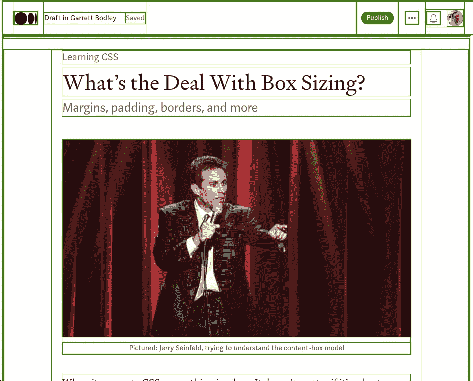
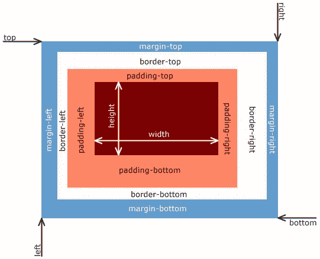
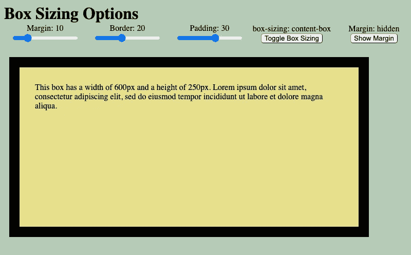
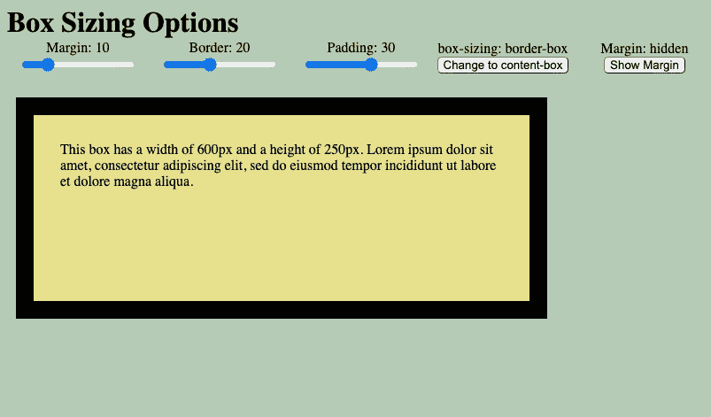

# 盒子尺寸是怎么回事？

> 原文：<https://medium.com/geekculture/whats-the-deal-with-box-sizing-c8840dc7da24?source=collection_archive---------27----------------------->

## 学习 CSS

## 边距、填充、边框等等


Pictured: Jerry Seinfeld, trying to understand the content-box model

说到 CSS，一切都是一个盒子。不管是按钮、输入、div、span 等等。一天结束时，它们都是视口中的盒子。通过打开开发工具并添加自定义样式规则，您可以很容易地看到这一点。

```
* {
  border: 1px solid green !important;
}
```



It’s boxes all the way down, Jerry

添加后，您将能够看到页面的布局几乎完全取决于这些框的大小和间距。了解如何调整盒子模型的大小，以及各种大小属性的作用，是从事 web 开发的基本知识。让我们开始吧。

# 内容框还是边框框？

除了高度和宽度，盒子模型还有**边距**、**边框**和**填充**属性。



[Visualization of the box model pulled from Wikipedia](https://en.wikipedia.org/wiki/CSS_box_model)

**Margin:** 指定元素的边框和页面上其他所有内容之间的距离。**页边距没有用其所属元素的** `**background-color**` **填充，是有效的透视或“空白”。**

**边框**:元素的外边缘。如果没有指定`border-color`，缺省情况下边框颜色与文本颜色匹配。边框的颜色通常不同于元素的`background-color`

**填充:**描绘元素内容和它的边框之间的间距。**填充用其所属元素的** `**background-color**` **填充。**

这些属性的行为取决于**框尺寸**设置。有两个框尺寸选项:**内容框**和**边框框**。大多数元素的缺省值是`box-sizing: content-box`。同时`border-box`被设置为`<table>`、`<select>`、`<button>`元素以及类型为`radio`、`checkbox`、`reset`、`button`、`submit`、`color`或`search`的`<input>`元素的默认值。

# **内容框**



An element with box-sizing: content-box.

使用`box-sizing: content-box`，元素的大小通过 ***加上*** 其宽度和高度的边框、填充和边距大小来计算。假设一个元素的宽度为 600 像素，填充为 30 像素，边框为 20 像素，边距为 10 像素。总宽度将由以下等式表示:

```
600px + 30px + 20px + 10px = 660px total page width
```

或者用更抽象的术语来说:

```
width + padding + border + margin = total page width
```

使用`box-sizing: content-box`，页面上元素的宽度不仅仅由`width`属性决定，而是由`width`、`padding`、`border`和`margin`加在一起决定。

# **边框**



The same element, but with box-sizing: border-box.

有了`box-sizing: border-box`，事情就不一样了。就像之前一样，边距表示元素边框之外的空间，是元素宽度 之外的 ***。然而，`padding`和`border`宽度功能不同**。当设置为 border-box 时，页面上元素的宽度保持不变，边框和填充占据了元素***内的空间*。***这意味着*增加*填充或边框实际上会*减少*元素内容的可用大小。

使用与前面相同的尺寸，总宽度的新公式如下:

```
600px + 10px = 610px total page width
```

或者抽象地说:

```
width + border = total page width
```

# 沙盒演示

下面是一个基本的沙盒，允许你调整元素的边距、边框和填充，以及在`content-box`和`border-box`设置之间切换。我还添加了出于教育目的使边距可见的功能，不过请记住，元素的边距总是透明的。

如果你觉得这篇文章有帮助，请考虑订阅未来的博客文章。感谢您的阅读，祝您编码愉快！