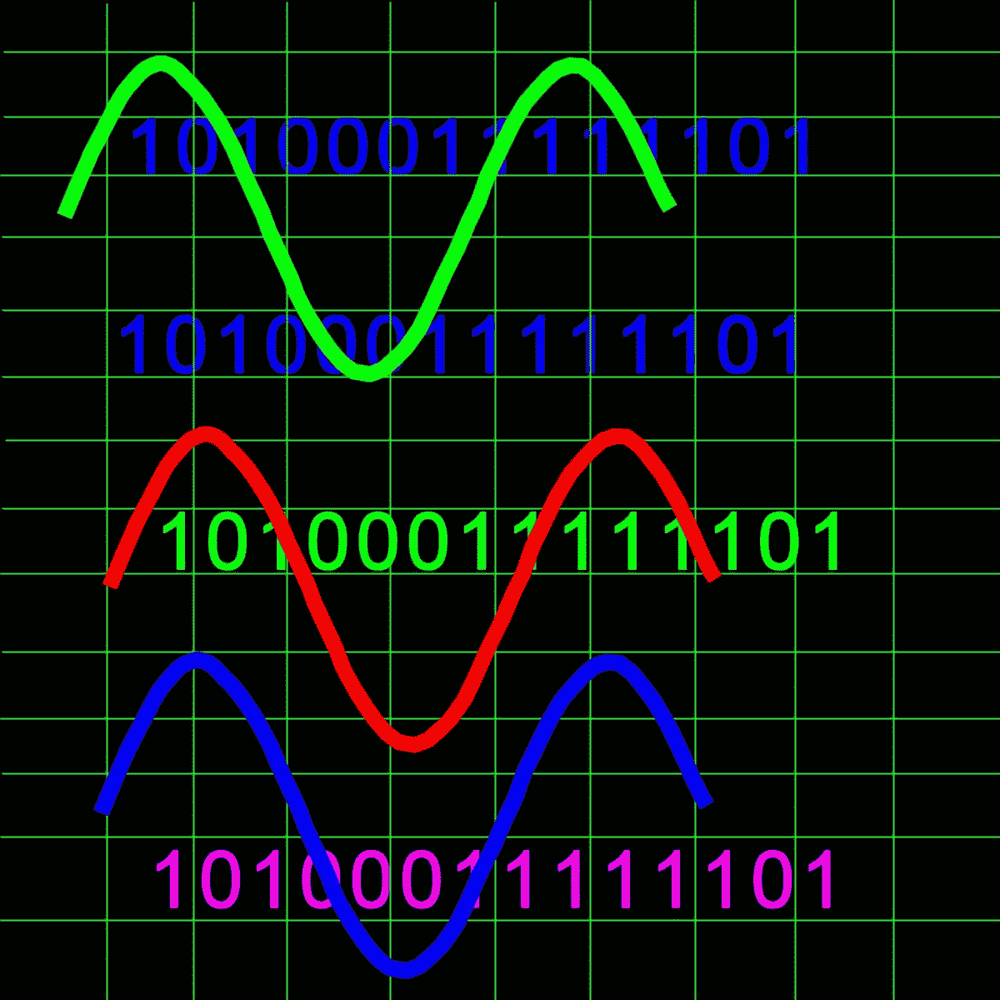

# 模拟和数字有什么区别？

> 原文：<https://medium.com/geekculture/whats-the-difference-between-analog-and-digital-e6776f5d8464?source=collection_archive---------31----------------------->

© Eugene Brennan

我们经常在通信、录音、相机、电视、收音机和其他电子设备中听到模拟和数字。但是到底有什么区别，数字的比模拟的好吗？为什么在音频、数字成像和电子通信中数字取代了模拟？

在这篇文章中，我希望能揭开这个谜。