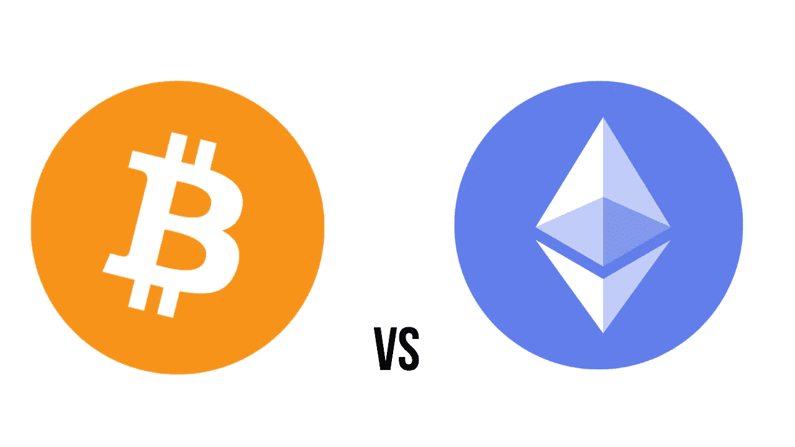

# 比特币和以太坊有什么区别？

> 原文：<https://medium.com/geekculture/whats-the-difference-between-bitcoin-and-ethereum-999ae66c9f13?source=collection_archive---------14----------------------->

Image by author

随着过去几年对加密货币越来越感兴趣，人们很难忽视比特币和以太坊的存在。

但是比特币和以太坊到底是什么，这两种加密货币之间有什么比较和区别？

下面将会给你一个截至 2021 年 10 月的市场价格。