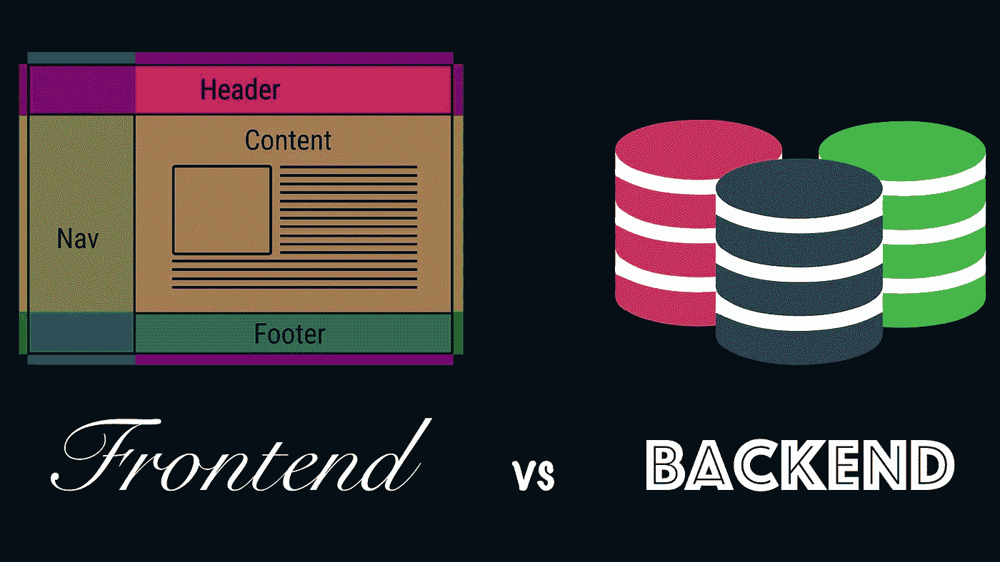

# 前端和后端有什么区别？

> 原文：<https://medium.com/geekculture/whats-the-difference-between-frontend-and-backend-47ac556c863d?source=collection_archive---------16----------------------->

前端和后端是 web 开发中两种不同的专业化。在 21 世纪初，前端开发人员是设计网站的同一个人，而其他人是后端开发人员。

现在，在一家中型或大型公司中，涉及的角色要多得多。但在小公司(也叫*初创企业*)里，有两种类型的开发人员是很正常的:一种负责前端，一种负责后端。

# 设计师

**前端开发者不是设计师**。这是一种误解。设计师是在纸上画出设计或使用像 Photoshop 这样的应用程序的专业人士。设计师必须提供一个图像格式的最终设计，也提供了网站的图形元素的其余部分。

如果网站必须在不同的设备间剧烈变化(使用*响应式*设计)，设计师也要负责设计这些不同版本的外观。

# 前端

前端是与**用户界面**和**交互**相关的一切。这包括作为呈现信息的语言的 HTML、作为样式化信息的语言的 CSS 和作为交互语言的 JavaScript。

为了使工作更容易，前端开发人员通常使用某种 CSS 框架，其中最流行的是 Twitter Bootstrap。这表示拥有一系列定义样式基础的文件，前端开发人员可以对其进行定制。

如果应用提供了 API，通常的做法是使用一个 JavaScript 框架来实现所有模板，这样后端只通过 [API](https://en.wikipedia.org/wiki/Application_programming_interface) 与前端通信。这些 JavaScript 框架有模块化代码的方法，因此维护更容易。这些框架的例子可以是 Angular、React、Vue 等。

如果你想使用后端框架的模板系统，那么前端开发人员必须适应编写模板所选择的语言。但是如果你只想把后端作为 API，那么模板必须在前端部分实现。

简而言之，前端开发人员必须基本了解 HTML、CSS 和 JavaScript，后者越来越必要。从这一点来看，有很多工具和框架可以使这项工作变得更容易，尽管开始时您必须经历一个学习过程。

# 后端

后端是你在浏览器里直接看不到的。它是在后台处理信息和准备信息的东西。

现在没有人从头开始实现后端(除了那些你已经知道的大型互联网公司)。为了简化工作，通常使用框架。对于 **Ruby** 来说，最常见的框架是 **Ruby on Rails** ，它提供了 [MVC](https://en.wikipedia.org/wiki/Model%E2%80%93view%E2%80%93controller) 模式。V 是后端可以与前端重叠的地方，就像我们之前看到的模板一样。

但是如果应用程序必须提供一个简单的 API，有一些有趣的微框架，比如 Sinatra，它允许你在一个文件中实现路由和控制器。

后端开发人员通常应该负责数据库，数据库可以是关系型的(如 [PostgreSQL](https://www.postgresql.org/) )或面向文档的(如 [MongoDB](https://www.mongodb.com/) )。后一种类型也被称为 NoSQL。当一个数据库大到足以成为公司的核心时，另一个角色就接管了:数据库管理员。

但这并不全是为了向浏览你网站的用户展示信息。发送电子邮件通知是由异步运行的队列系统管理的，以提高并发性。这件事有几种解决方法。在 Ruby 的世界里，一个流行的系统是 [Sidekiq](https://sidekiq.org/) ，它使用 [Redis](https://redis.io/) 来快速访问它需要处理的内容。

最后，应用程序必须传输到服务器。除了微软 web technologies，其余的都使用 Linux 服务器，所以后端开发人员需要有设置和优化这个操作系统的知识。因此，在部署工具的帮助下(像 [Capistrano](https://capistranorb.com/) )，只有变更被转移。

# 全栈

最后，我们来到全栈开发人员角色，它将后端和前端组合在一起。这种类型的开发人员在开发团队中最为常见。最终，我们都必须以这种方式工作，使开发过程更加敏捷。

以我的观点和经验，一个全栈开发者通常是一个后端开发者，有很好的前端知识，深入了解 CSS 和一些 JavaScript 框架。

在这种情况下，可能有几个前端开发人员支持整个堆栈的工作。

# 结论

当你开始学习 web 开发时，你需要清楚应该关注哪个方向，因为后端和前端都已经很大了，并且正在取得巨大的进步。

如果你喜欢用户界面，并且习惯使用 HTML 和 CSS，那么 frontend 就是你的领域。但是请记住，JavaScript 是必须的，因为您将在各种工具和框架中使用它。记住前端开发者不是设计师。

如果您觉得使用数据库和处理请求更舒服，后端就是为您准备的。您可能还需要管理操作系统和部署(将更新的代码传输到服务器)。但最重要的是选择一门自己喜欢的语言。Ruby 是个不错的选择。事实上，Ruby 的口号是“程序员最好的朋友”🙂