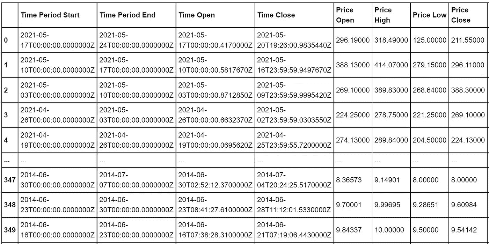
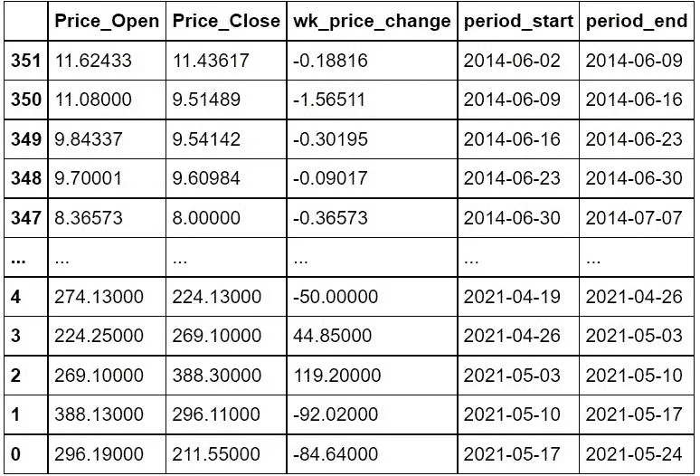
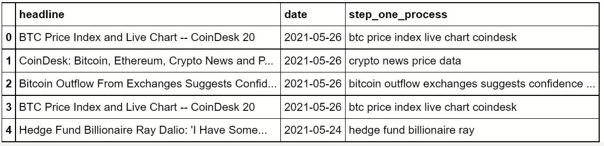

# Lambda 函数和列表理解有什么区别？

> 原文：<https://medium.com/geekculture/whats-the-difference-between-lambda-functions-and-list-comprehensions-54247515e17d?source=collection_archive---------56----------------------->


Photo by [Christopher Gower](https://unsplash.com/@cgower?utm_source=unsplash&utm_medium=referral&utm_content=creditCopyText) on [Unsplash](https://unsplash.com/s/photos/coding?utm_source=unsplash&utm_medium=referral&utm_content=creditCopyText)

**数据科学家最耗时的任务之一**(或者，实际上，只是寻求以某种有意义的方式利用数据的人，并且是从一开始就处理数据的人……这不是拥有“数据科学家”头衔的人独有的)**是数据准备。**

在大多数情况下，在进行任何建模、构建训练集或许多其他步骤之前，必须首先收集、清理和组织数据。

以下面的数据框架为例，它包含莱特币的历史价格信息，莱特币是“最古老”的加密货币之一，由前谷歌工程师李宗南在 2011 年作为比特币的“精简”版本推出:



假设我们想要*清理*在“时间段开始”列中的条目，在这种情况下，这可能指的是让特定的日期清晰可见，没有所有的零，也没有时间信息。

一种方法是创建一个全新的列，*循环遍历*每个条目，并且只提取日期(即在第 **0** 行中，对于*时间段开始*列，它将是**2021–05–17**)。

现在，这个*可以用循环*的*来实现*，但是我选择使用列表理解:

```
ltc_series_sorted['period_start'] = [i[0:10] **for** i **in** ltc_series_sorted['Time_Period_Start']]
```

对于循环来说，列表理解通常比*更快，并且需要更少的代码。*

当完成一个数据科学项目时，能够用更少的代码更快地完成任务是非常重要的。

在“时间段开始”和“时间段结束”列上使用上述代码，然后删除所有其他不需要的列，得到了这个清理后的数据框架(您也可以在“wk_price_change”列中看到我完成的一些功能工程的结果):



然而，除了使用列表理解之外，还可以使用 Lambda 函数以及 apply()或 map()等函数。

就我的理解，Lambda 函数可以永远被认为是*T21 函数，只有在它们被创建的地方才需要它们。这与传统的函数不同，我们通常会创建一个函数，以便在以后使用它。*

> Python 中更多的传统函数是为以后使用而创建的。Lambda 函数是为使用*而创建的，目前仅用于*。

而列表理解只输出列表， **Lambda 函数可用于输出列表或值**。人们甚至可以在 Lambda 函数中使用更普通的函数(其中函数是*定义的*)。

下面是一个 Lambda 函数与 apply()一起使用的示例，任务是通过删除*停用词*对加密出版物标题进行一些 NLP 预处理。

```
df_testr['step_one_process'] = df_testr['headline'].apply(**lambda** x: ' '.join([word.lower() **for** word **in** x.split() 
                                                                    **if** word.lower() **not** **in** stop_words **and** word.isalpha()]))
```

停用词是给定语言中的常用词，可能不会为分析和执行相应文本的建模增加太多价值。

我们可以在这里看到 Lambda 函数与 apply()一起使用的结果:



你能看到一个被多次删除的单词吗？

单词 ***和*** 已经从行 0、1 和 3 中移除，并且其他单词也已经从数据帧中移除。

据我所知，列表理解和 lambda 函数都比循环的*提供了更好的性能。*

但是这两者有什么区别呢？

列表理解和 Lambda 函数之间的区别似乎很大程度上是偏好的问题。

但是，在想要在不使用*定义*函数的情况下利用函数*的情况下，lambda 函数似乎非常有用。*

在研究他们的差异后，似乎许多人更喜欢列表理解，因为它们通常可读性更强。

我倾向于同意。

然而，lambda 函数同样有用。