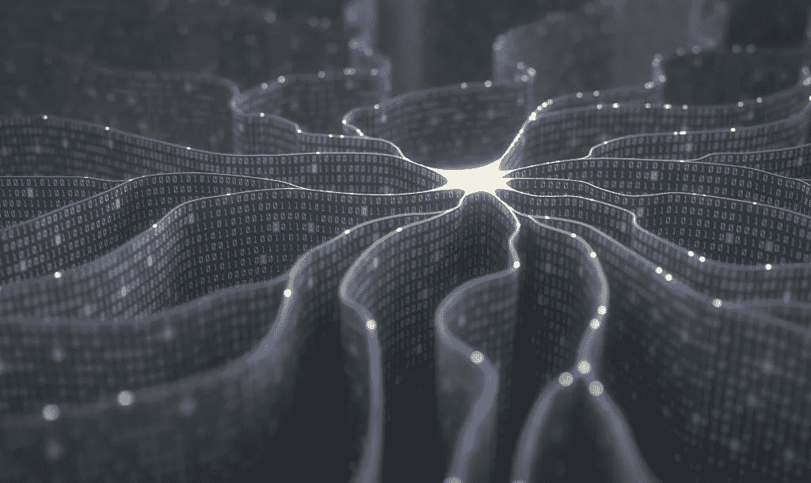
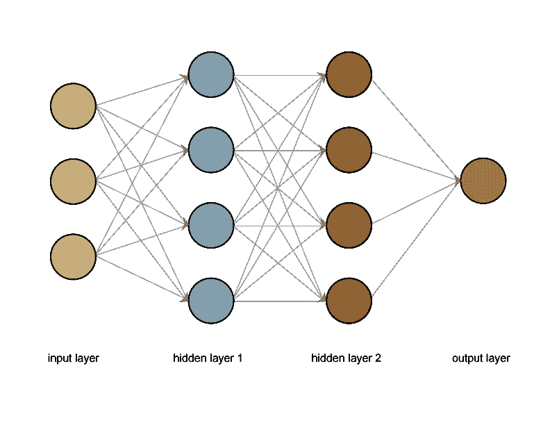

# 神经网络有什么新闻？

> 原文：<https://medium.com/geekculture/whats-the-news-with-neural-networks-e673da2efe26?source=collection_archive---------3----------------------->

## 大数据的力量

过去十年机器学习进步的爆发有许多原因。我们现在有了大幅改进的硬件来进行快速计算，内存也比以前更便宜了。数据现在是“大数据”，它既被小心翼翼地储存起来，又可以在 ImageNet 等存储库中公开获取。就个人而言，这些进步已经是技术空间的福音。但是对于人工智能(AI)来说，他们已经打开了真正强大的东西的大门——神经网络。

# 神经什么？

神经网络。你可能听说过他们。他们处于机器学习热潮的最前沿，是许多最令人印象深刻的进步的驱动力。在*围棋*和流行视频游戏*星际争霸中，将机器引向最优秀人类的技术？*神经网络。可以识别图像和面部的算法的支柱，这引发了监控和隐私恐慌？神经网络。

然而，神经网络并不是从一家大型科技公司的孵化器中诞生的新想法。他们不是从一个大学生辍学，然后创建了一个革命性的技术公司的天才。神经网络实际上是…旧帽子。或者曾经是。

神经网络的概念(我们稍后会谈到)已经存在多年了。它们可以追溯到 20 世纪 70 年代，更简单的版本甚至在 20 世纪 40 年代就已经存在了！那么，如果它们已经存在了几十年，为什么现在才流行起来呢？

答案与前面提到的硬件和数据进步有关。神经网络处理大量数据。他们也需要大量的数据来帮助他们学习。直到过去十年，这使得除了最简单的网络之外，任何网络的培训都非常耗时且昂贵。

随着这些年来硬件的巨大进步，使用更先进的神经网络成为可能。在娱乐业和现在的密码矿工的硬件需求的帮助下，GPU(图形处理单元)已经被开发出来，它可以以闪电般的速度计算特定的数学运算。幸运的是，在训练神经网络时也有同样的操作。使用最初为电影和视频游戏中的美丽视觉效果开发的技术，可以帮助我们训练网络，所需时间只是传统 CPU 的一小部分。

# 名称又能代表什么呢

神经网络的力量可能是显而易见的，但在这一点上，人们可能也想知道它们首先是什么。这个名字提供了一些线索。神经网络不是一个可以自己做决定的单一物体。顾名思义，它是一个由所有相连的小物体组成的网络。那是什么网络呢？我们称之为神经元。我们大脑中的神经元？是啊！嗯，不。但算是吧！

神经网络中的神经元可以被认为是大脑中的神经元。它们是微小的个体单位，在一个庞大的结构化网络中与其他神经元相连。这些连接允许微小的数据在它们之间流动。在我们的大脑中，这些是电脉冲。在神经网络中，我们在神经元之间发送数字。然后，神经元获取所有与它们相连的神经元提供给它们的数字，并对它们进行处理。这个过程并不复杂——事实上，它极其琐碎。毕竟，它只是一个微小的单位——我们大脑中的一个细胞。但是它会将处理过的信息发送给与之相连的其他神经元。另一个号码。又一个电脉冲。诸如此类。微小的神经元被输入微小的信息片段，对该片段进行微小的计算，并将其转发给其他神经元，这些神经元一遍又一遍地做同样的事情，直到我们最终到达最后一组神经元——其输出就是我们的最终结果。

通过以完美校准的平衡方式联网在一起的许多小个体单元的集体努力，我们可以实现巨大的计算能力。整体大于部分之和。

# 平衡动作

如果这一切听起来不可思议且遥不可及，那么不要担心——确实如此。我们到底应该如何以如此完美的平衡来排列这些神经元，使它们的微小计算组合起来，使机器能够识别人脸？我们不能。那么我们如何让它工作呢？好吧，我们毕竟是在讨论机器学习。机器学习是我们解决这个问题的方法。我们不会校准神经元来保持平衡。他们将自我校准。

为了实现这一点，我们需要训练数据。我们需要标有我们想要的机器输出的数据。我们可以将这些数据提供给未配置的神经网络。它将处理数据，并可能输出一些无意义和无用的东西。但这很好。我们可以用一个叫做误差的数学函数。这个误差只是衡量我们的输出与我们期望的目标有多大的不同。然后，利用微积分，我们可以发现有多少误差是由我们每一个神经元的校准引起的！使用这些信息，我们可以稍微调整神经元，并重复这个过程——将数据输入网络，观察输出，计算误差，并使用微积分来了解如何调整神经元，使它们更加准确。这个过程会持续一段时间，直到我们收敛到一个校准的网络。这个使用误差函数、微积分和调整的过程就是机器学习。

# 代价换来的力量

虽然它在概念上很简单(至少在这个忽略细节的解释中)，但它非常耗费资源。目前，我正在自己的桌面上微调一个神经网络，以识别西方艺术风格。虽然数据集只有几个 GB，但运行一次训练迭代几乎需要一个小时。完成我计划的 50 次迭代学习时间表需要将近两天的时间。即使这样，如果网络仍然需要了解更多，我可能需要安排另一个！我也不会在我从什么地方拖出来的满是灰尘的机器上运行这个。这是一款几乎全新的台式机，采用 3.7 GHz AMD Rhyzen 8 核处理器，32GB 内存，几乎没有其他负载。

神经网络的训练成本很高。如果你想提高性能，你可以购买昂贵的 GPU，但这可能会让你花费近 1000 美元。公司和研究机构可能有资金来解决这个问题，但个人、小公司和小研究团体可能没有。幸运的是，他们不再需要了。

云服务已经开放了远程处理，为那些希望训练神经网络的人提供了其他计算选项。没有昂贵的钻机？不用担心，只需从谷歌远程租赁一个，价格只是它的一小部分。

# 神经网络世界

神经网络就在这里，它们不会离开。新的进展和计算架构不断发布。[卷积网络](https://www.megaputer.com/convolutional-neural-networks-polyanalyst/)擅长处理图像，递归网络可以处理可变大小的数据、流数据或顺序数据。神经网络的确很强大，远远超过我们现有的其他解决方案。但是它们不能模拟我们大脑中真正发生的事情。即使在我们最先进的网络中也有一些深层的缺陷。例如，很容易混淆神经网络。一个旨在识别停车标志的网络可能会被标志上几个精心放置的贴纸所欺骗。例如，如果这些技术被用于自动驾驶汽车，会有很深的安全问题。

[神经网络深深依赖于用来训练它们的数据](https://www.megaputer.com/an-introduction-to-machine-learning/)(就像我们在之前的文章中讨论的那样)。它们还依赖于我们如何配置它们的输出。大多数网络被设计来给出一个决定。对于对象检测，网络必须返回它认为输入图像是什么。但是，当我们向网络输入“什么都没有”，比如一个完全空白的图像或模糊的静态噪声时，会发生什么呢？网络被迫返回一些东西，所以它“看到”，比如说，一只狗在空的空间里。这是胡说八道。在人类拒绝严格定义无意义的情况下，为什么它会选择一个物体而不是另一个？作为另一个例子，如果我们通过插入一些察觉不到的小随机噪声来稍微改变图像，我们就可以完全欺骗神经网络。之前它正确地认为图像是一只蝴蝶，现在它认为图像是一辆卡车，而人类在图像中看不到任何区别。这很糟糕，它反映了我们今天构建神经网络时的深层问题。

神经网络占据了一个有限的空间。他们既可怕地强大，又可笑地简单无知。他们可以胜过人类的主人，但却被最小的变化所欺骗。我们不会很快看到神经网络实现像人类一样的感知能力，它们也没有准备好部署在许多其他类型的系统中。但是它们已经被用在了应该引起警惕的地方。

中国已经在使用面部识别技术来标记维吾尔少数民族成员。通过将我们口袋里的手机变成监控设备，准确的语音识别确保个人即使不在摄像头附近也有可能被跟踪。“深度假货”是一种不断发展的视频类型，它可以修改现有的视频，将一个人的脸和声音映射到另一个人的脸上，以创建一个假视频，可用于敲诈或造谣。虽然*终结者*仍然是科学幻想，但使用神经网络进行稳定、导航、瞄准和战术的武装军用无人机将以无法预测的方式彻底改变武装冲突。

尽管神经网络在一些地方被用于压迫，但在另一些地方也被用于拯救。医疗机构越来越多地部署网络系统来检测诸如癌症或传染病之类的疾病。实验室可以使用类似的网络来模拟复杂的生物分子和开发治疗方法。神经网络甚至被用于交通灯控制系统，以增加车流量和减少事故。

神经网络接下来会带我们去哪里？很难说。但似乎很明显，这个世界被抓住了，并将继续留在一个神经元网络中。

*原载于 2019 年 5 月 28 日*[*【https://www.megaputer.com】*](https://www.megaputer.com/2019-news-neural-networks/)*。*