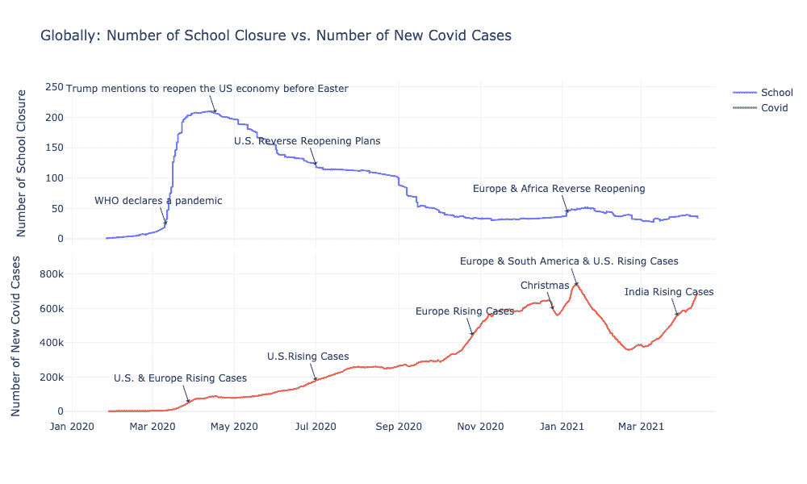
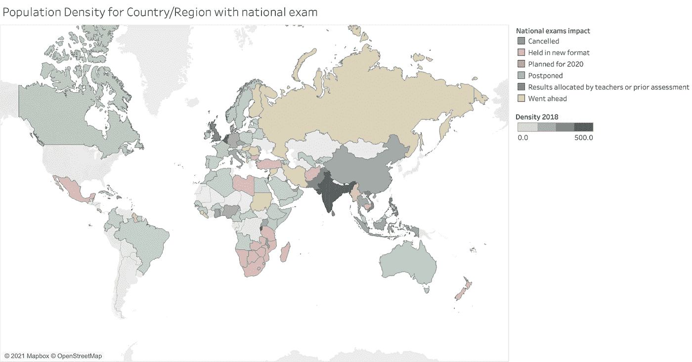
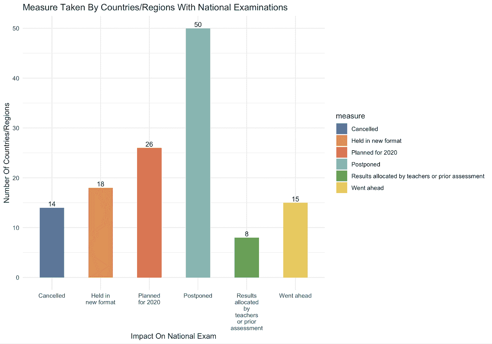
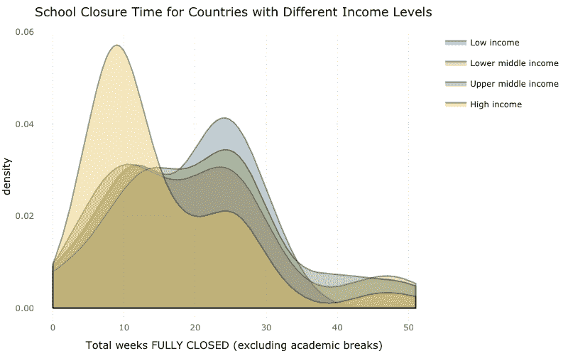
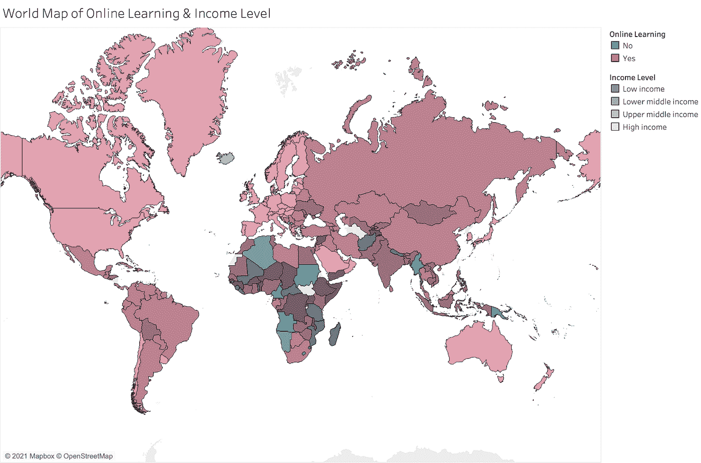
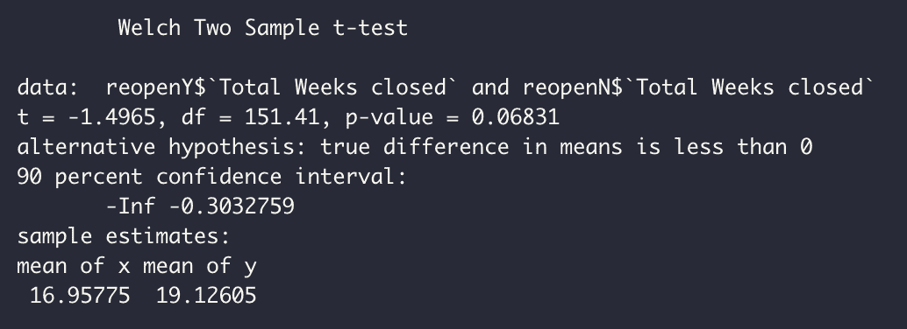
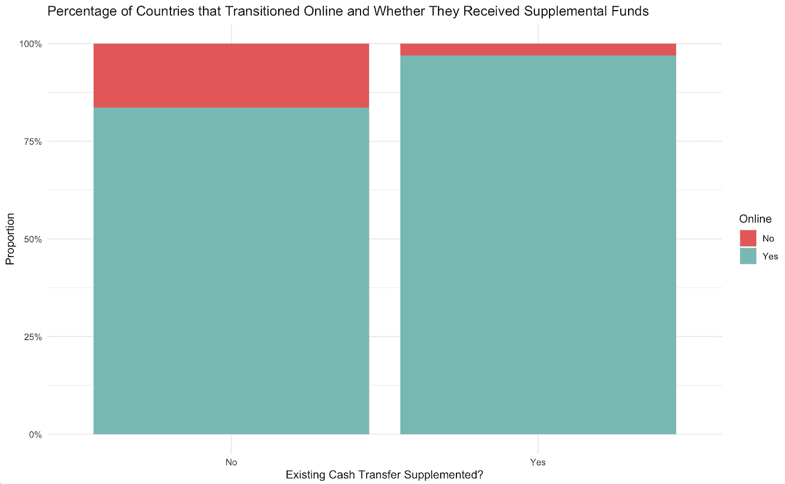
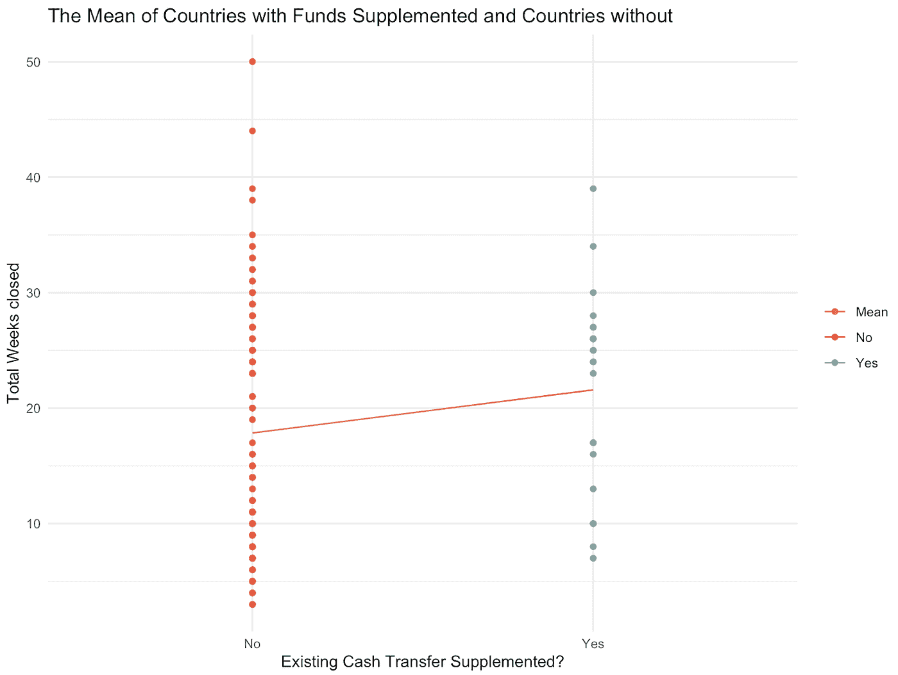
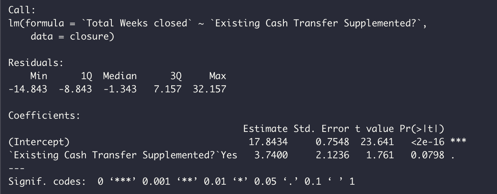

# 教育的代价是什么？

> 原文：<https://medium.com/geekculture/whats-the-price-of-education-9d053a7d55d6?source=collection_archive---------37----------------------->

作者:(项目负责人)、Charisse Hung、欧阳天朗、Ma、Daphne Chen

浅析新冠肺炎对全球教育的影响

# 介绍

作为新冠肺炎疫情的学生，我们在过去的一年里亲身经历了在线学习的挑战。我们想分析全球各国在疫情期间是如何处理教育的，以及它是如何影响学生的。此外，我们强调了不同国家的收入和学校关闭的影响。

# 数据集概述

对于我们的项目，我们使用了全球发展中心(CGD)的数据。CGD 的新冠肺炎教育政策跟踪系统提供新冠肺炎疫情之后学校关闭和重新开放的信息。我们还从 [OurWorldInData](https://ourworldindata.org/covid-cases) 获得 COVID 数据，从[国际货币基金组织](https://www.imf.org/external/datamapper/NGDP_RPCH@WEO/OEMDC/ADVEC/WEOWORLD) **获得 GDP 数据。**

# **案例号和学校政策**

这是一个时间序列图，比较了全球范围内学校关闭的数量以及每天新增的 COVID 病例。

从该图中，我们观察到几个重要的转折点，并将它们与全球新闻联系起来:

*   2020 年 3 月 11 日:世卫组织宣布成为疫情。

由于对新病毒的恐惧和不确定性，许多国家决定关闭学校，尽管那时 COVID 病例只出现在欧洲和美国。

*   2020 年 4 月 17 日:特朗普提到重启经济

由于疫情导致更少的经济活动和更高的失业率，许多国家通过协议和治疗指南开始了重新开放进程。

*   2020 年 7 月 1 日和 10 月 26 日:美国和欧洲病例增加

随着 COVID 在美国和欧洲变得严重，各国犹豫着重新开放或决定再次关闭学校，这可以通过平坦的蓝线显示出来。但是重新开放学校的大趋势仍在继续。

*   2021 年 1 月至 4 月:病例波动

在最近 3 个月里，由于印度病例的上升，新的 COVID 病例波动很大，但学校关闭的数量已经达到一个稳定点，有 30 个国家仍然关闭。

从图中我们可以看出，学校重新开放的决定并不一定与 COVID 病例数一致，而且随着人们逐渐学会如何控制疫情，国家更愿意开放学校。然而，重要的是要注意到，各国是根据自己的 COVID 情况作出决定的，这并没有反映在这张总图中。为了解决这个问题，我们制作了一个交互式地图仪表板，显示各国关闭学校的时间框架以及届时每天的新病例。

正如我们所看到的，关闭和重新开放学校的决定在不同的国家有很大的不同。现在我们将对此进行进一步调查。

随着新冠肺炎病例开始在全球蔓延，许多国家在 2020 年初提前关闭了学校。通过检查可视化的坐标轴，**我们可以看到，当学校关闭时，一个国家的确诊病例数远远少于学校重新开放时新冠肺炎的确诊病例数**。这可能是由几个因素造成的。随着新冠肺炎疫情的开始，关于这种疾病及其传播方式的信息并不多。这种知识的缺乏和恐惧导致一些国家预防性地关闭学校，即使在某些情况下，这些国家没有确诊的新冠肺炎病例。当学校重新开学时，尽管出现了更多的新冠肺炎确诊病例，但也有了更多关于感染传播方式的知识。这使得学校能够实施安全措施，防止新冠肺炎病毒在学校传播。

当各国最初在 2020 年初关闭学校时，没人知道疫情会如何发展。这里我们看到一个散点图，比较了国家计划关闭学校的预期时间和学校关闭的实际时间。虚线表示 y=x 或者如果学校关闭时间的实际长度等于预期关闭时间，则点将在哪里。正如我们所看到的，除了一个国家，所有国家都低估了关闭的时间。唯一的例外是日本，它位于线下。从图中，我们可以看到，学校预计关闭大约一个月，但平均学校完全关闭了 18 周。另一个有趣的地方是香港。在世界卫生组织宣布全球卫生紧急状态后，香港于 2020 年 1 月关闭了学校。由于香港邻近新冠肺炎病毒传播迅速的 mainland China，以及 2003 年非典的经历，香港的学校被要求停课三个月。或许非典的严重经验给了香港在一段时间内关闭学校的先见之明。

# GDP、学校关闭时间和 COVID 案例之间的权衡

我们想知道关闭学校是否一定会导致 GDP 下降和 COVID 病例减少。因此，我们做一个散点图来探讨它们之间的关系。在该图中，每个数据点代表一个国家，y 轴是实际 GDP 的变化百分比，x 轴是学校关闭的持续时间(周)，颜色表示该国相对于其人口的 COVID 病例总数。

## **关键要点:**

1.  在这个散点图中没有明确的模式，**所以学校关闭和经济增长之间的权衡可能不存在**。
2.  有更多 COVID 病例(深红色)的国家更有可能有更长时间的学校关闭(右边的聚类)。然而，也有一些离群值，如瑞士。
3.  依赖旅游业的国家受影响最大。例如，马尔代夫和斐济的 GDP 在 2020 年大幅下降，因为全球疫情阻碍了国际旅行。然而，与大多数国家相比，他们的学校停课时间相对较短。这意味着他们的 GDP 下降可能与学校关闭无关。
4.  几个非洲国家的 COVID 病例相对较少，但学校停课时间最长。他们的检测机制可能无法反映真实的感染人数，但当地政府发现关闭学校在现实中是必要的。

# **对国考的影响**

国考是许多国家教育体系不可或缺的一部分。在过去的一年里，新冠肺炎迫使各国适应和改变他们的国家考试方法。

50/131 个国家决定推迟考试，而其余国家决定以新的形式举行考试或通过事先评估进行分配。只有一小部分国家(15/131)进行了考试。在进行考试的国家，其人口密度低于其他类别。

# **来自低收入国家的学生更弱势吗？**

这张密度图显示了不同收入组国家学校关闭时间的分布情况。高收入国家显示出与其他国家截然不同的模式，最有可能实现不到 10 周的停课时间。对于其他中等收入国家来说，大约 10 至 25 周的关闭时间也大致相同。对于低收入国家，它们最有可能有 20 至 30 周的关闭时间。但与此同时，低收入国家的关闭时间范围更小，极端案例也更少，因为它们的右尾比其他群体更短。

总的来说，这张图表明 COVID 对教育的影响可能与一个国家的收入水平相关。我们对完全关闭的总周数和收入水平进行了简单的线性回归模型。p 值 0.00882 证实了**不同收入水平国家的平均学校关闭时间不尽相同**。我们进一步对不同群体的学校关闭时间的平均值进行了事后 Tukey 测试。结果显示，高收入国家的学校关闭时间明显短于中上收入国家，家庭信心水平为 90%。

上面的柱状图展示了在我们的数据集中关闭学校的不同收入水平国家所采用的不同学习方法的分布情况。高收入群体中的国家采用在线学习的比率往往更高。我们注意到，对于高收入国家来说，几乎 100%的国家都可以向学生提供在线教育资源。然而，低收入国家的这一比例仅接近 60%。比例检验结果告诉我们**这样的差异是显著的**。与此同时，根据两两比例测试的结果，低收入国家的无线电学习率明显高于所有其他群体。高收入国家的电视学习率明显低于中等收入国家。

我们注意到，虽然高收入国家大多放弃广播和电视作为远程学习方法，但低收入国家的学生却依赖它们来学习。但事实是，广播和电视比在线学习更少互动和及时反馈。基于此，**有理由说低收入国家的学生在疫情**期间处于更不利的地位。

我们进一步调查哪些地区的学生缺乏在线学习资源。上面的世界地图显示了每个关闭学校的国家是否采用了在线学习及其收入水平。我们可以看到，没有采用在线学习的国家主要位于非洲和亚洲。此外，没有采用在线学习的国家以相对较暗的颜色填充，这表明收入水平低于预期。

# 外部因素(如工会和补充资金)会进一步影响学校关闭吗？

在过去的一年里，新冠肺炎极大地影响了人们的生活方式。许多国家为其公民制定了严格的指导方针，以努力减少疾病的传播。因为这个疫情，许多企业无法维持下去。不同国家的学校被迫关闭；许多没有重开计划。他们各自的国家是否向教育系统投入了额外的资金和资源，这些资源是否影响了学校为学生提供教育的能力(例如，在线转移教育)？然而，除了疫情，还有其他外部因素影响这些学校关闭的时间吗？

虽然学校已经考虑到了学生的安全，但教职员工和教师的安全同样重要，尽管他们经常被忽视。根据数据，我们研究了工会(主要优先考虑教师和员工安全的外部因素)如何影响学校关闭时间。从图中可以看出，有工会参与的国家的平均总关闭周数为 16.95775 周，而没有工会参与的国家的平均关闭周数为 19.12605 周。

为了检验上述差异是否显著，对这两个变量进行了假设检验。无效假设是有工会参与的国家和没有工会参与的国家之间的关闭持续时间没有差异。另一个假设是，有工会参与的国家的总休周数更少。

使用 0.1 的α水平，因为 p 值(0.06831)小于α，我们拒绝零假设，并得出结论，有工会参与的国家比没有工会参与的国家有更少的总关闭周数。我们已经证明了这种相关性；于是，新出现的问题是为什么？仔细观察数据，“工会参与的细节”一栏提供了这些工会如何影响重新开放日期的见解。

例如在塞内加尔，

> “教师工会的成员……虽然他们承认远程学习有助于教育的继续，但他们坚持要求教育机构有组织地恢复学年……”

挪威的照会说，

> "工会正与教育部和雇主合作，为教育工作者提供专业建议。"

在韩国，

> “……工会作为教育部和教师之间的桥梁，在疫情局势中发挥了至关重要的作用。”

这些案例似乎表明，工会正在与教育委员会和学区密切合作，以帮助更顺利地重新开放，这可能有助于缩短关闭时间。

某些国家已经能够过渡到在线教育环境；然而，并不是每个家庭都有能力这样做。在这一节中，我们研究了现有的现金转移补充是否与学校是否在线过渡和学校物理关闭的持续时间相关。下图显示，向学校补充资金的国家的在线教育比例高于没有补充资金的国家。

确切地说，大约 96%的现金转移得到补充的国家实现了学校在线化，而没有现金转移的国家只有大约 80%实现了学校在线化。这些学校因为能够在不完全关闭的情况下维持在线学习环境而有较长的关闭期，这是否有关联？下一个图显示，没有补充现有现金转移的国家平均有 17.84337 个总关闭周，而提供资金的国家平均有 21.58333 个。

下面还显示了对分类变量进行的线性回归，分类变量是现有的现金转移是否补充了学校停课总周数。斜率告诉我们，有补充现金的国家比没有补充现金的国家多 3.74 周的关闭持续时间。使用α= 0.1，由于 p 值 0.0798 小于α，我们可以拒绝两个均值相同的零假设。

因此，我们的结论是，接受资金的国家与未接受资金的国家之间的总关闭周数略有不同。虽然这一假设检验表明这两个变量之间存在一定的相关性，但也完全有可能在上述检验的变量和另一个更重要的变量(如收入)之间存在共线性，这一点在前面的部分已经分析过了。虽然本节显示了外部因素、在线教育和总关闭周数之间的一些相关性，但可以对 ANOVA、r 平方和方差膨胀因子进行进一步分析，以进行进一步研究。

# **结论**

在这篇文章中，我们用数据分析证明了影响学校关闭和重新开放的各种因素。我们面临的主要挑战是找到合适的数据集来帮助回答特定的主题问题，以及处理数据集之间的不一致。显而易见，新冠肺炎对全球教育产生了巨大影响。为了阻止病毒的传播，几乎所有国家的学校都关闭了。考虑到可用的资源以及经济的社会经济地位，每个国家处理疫情的方式都不一样。虽然本文仅涉及某些国家由于这些外部因素而相对于其他国家的优势和劣势，但进一步的研究以及更先进的分析可能是帮助缩小差距并确保未来更好的行动计划的第一步。

GitHub:【https://github.com/datares/team-boba 