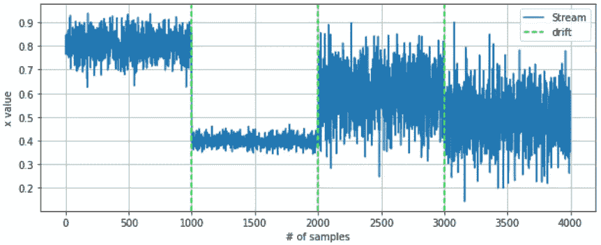
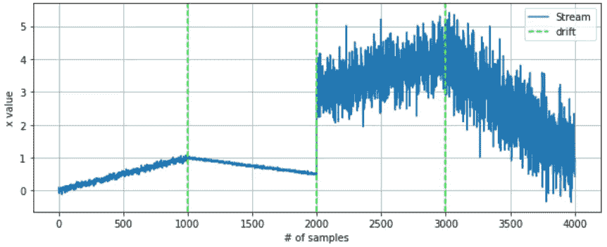
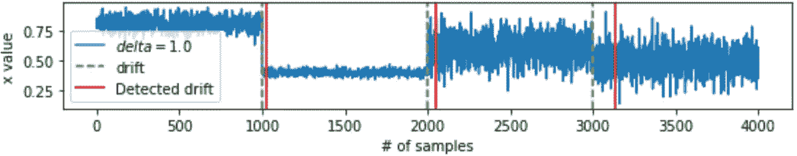
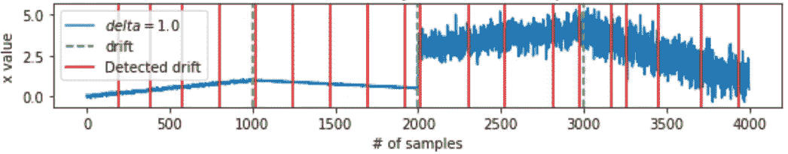
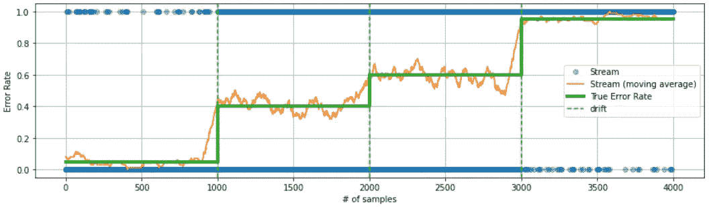
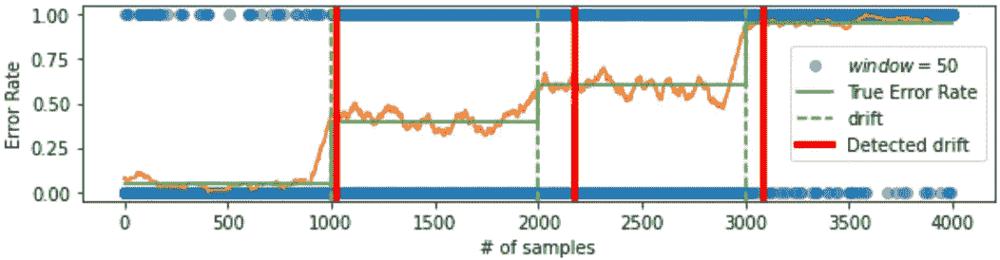

# 再问一次，什么时候是训练大联盟模特的好时机？

> 原文：<https://medium.com/geekculture/whats-the-right-time-to-train-ml-models-again-f6e6aadba48b?source=collection_archive---------28----------------------->

作者:Davide Fiacconi——radical bit 的数据科学家

# 数据集随着时间而变化，模型也应该适应

建立一个执行机器学习模型需要大量的时间进行实验。在得到正确的模型之前，数据科学家尝试不同的算法或不同的特征工程策略。一旦模型被调整到最佳状态，就可以在生产环境中为它服务了。

然而，当数据科学家优化他们的模型时，实验是针对不随时间演变的冻结数据集进行的。关键的假设是，这样的数据集代表了模型在预测时将遇到的数据分布。不幸的是，当模型进入生产阶段时，这种假设可能并不总是可靠的。事实上，它的有效性取决于数据生成过程以及后者是否会随着时间的推移而演变。例如，如果数据来自与 UI 交互的用户，那么 UI 本身或交互模式的变化可能会推动数据分布的发展。

因此，监控模型的性能，同时识别数据中的潜在漂移，对于检查生产中模型的健康状态和 MLOps 最佳实践的支柱至关重要。

# 漂移模式和检测策略

我们称漂移为数据分布随时间的总体演变。有可能确定漂移的 3 个根本原因。

*   **数据漂移**:当模型输入数据的分布随时间发生变化时，就会发生数据漂移。
*   **概念漂移**:当模型试图预测的目标值的定义随时间变化时，就会发生概念漂移。
*   **上游变更**:上游变更不是概念数据变更；该术语主要指在数据处理的上游阶段(数据收集、数据预处理)可能出现的技术问题，可能会导致数据模式或类型的变化，或者丢失一些要收集的功能。

忽略上游的变化，高效的机器学习系统在生产中的真正挑战是处理数据和概念漂移。通常，评估期间的模型是“静态”的。静态是指通过训练过程学习到的内部参数不变。因此，在数据漂移的情况下，只要输入数据发生了如此大的变化，以至于看起来像是模型以前没有看到的东西，模型性能就可能下降。此外，模型在训练期间学习的预测概念与模型的参数紧密相关。因此，当概念漂移发生时，它将继续提供仍然绑定到原始概念的预测，因此与新的期望不一致。在现实世界的应用程序中，没有什么可以阻止数据和概念漂移同时发生，这使得它们很难被分开。

为了解决漂移问题，已经设计了各种算法。每种方法都有自己的优点，但它们通常都适合于识别数据分布或任何相关统计数据(如平均值)随时间的变化。想法是查看后续的数据窗口，由数据点的数量或时间间隔定义，以便有一个“旧的”和一个“最近的”数据样本进行比较。

但是这样的算法是如何工作的呢？我们可以承认两种不同的方法。

1.  **只看输入数据**。其思想是直接查看输入数据流，并通过查看一些统计数据的演变来尝试检测变化。这种模型直接解决数据漂移问题，包括自适应窗口(ADWIN)算法等技术。
2.  **评估模型预测**。这个想法是在模型预测的评估流中寻找漂移。换句话说，每当模型接收输入数据并做出预测时，提供该预测的观察到的基本事实，以便建立相应的模型误差流。然后对后一个流进行漂移调查，潜在的预期是数据或概念漂移可能会导致模型性能下降，从而导致更多的错误。漂移检测方法(DDM)算法及其任何变体都依赖于这种方法。

# 测试漂移检测方法的模拟场景

让我们分别考虑 ADWIN 和 DDM 算法作为第一类和第二类的代表。测试这些方法如何检测漂移以及它们的最佳用例是很有趣的。为了做到这一点，我们模拟了几个合成的单变量数据集，这些数据集代表了漂移可能发生和表现的不同方式，我们对每个数据集运行了两种算法，以查看它们是否能够识别漂移以及多久之后能够识别漂移。

## 测试 ADWIN 算法

我们描述了 ADWIN 算法的测试用例。下图显示了第一个合成数据集，其值是流中记录数的函数。

它描述了一种情况，其中变量 x 的值围绕恒定参考值振荡，参考值和振荡幅度都根据指示数据漂移的绿色虚线而变化。

第二个合成数据集如下所示。相对于第一个的主要区别在于，参考值具有随时间变化的趋势，理想化了 x 变量代表例如具有变化趋势的时间序列的情况。如前所述，垂直绿线标记数据漂移时刻。最后，请注意，由于 ADWIN 处理的是输入数据，因此对值的范围没有明确的限制，尽管在这些示例中，为了简单起见，我们将数字保持在 0 和 1 之间。

然后，我们可以将 ADWIN 算法应用于这两个测试案例。结果如下图所示，红色垂直线标记检测到的漂移。在不进入如何设置算法的“灵敏度”参数的细节的情况下，比较两个测试案例的结果仍然是有益的，因为它们确实主要由两个数据集本身的特征驱动。

我们可以立即注意到，该算法在第一个数据集上工作得非常好，迅速识别了漂移时刻，而在第二个数据集中出现了太多假定的漂移。回想一下 ADWIN 寻找数据平均值随时间的变化，就可以理解这种差异。在第一个数据集中，尽管值有波动，数据的平均值是恒定的，并且它确实随着漂移而变化。另一方面，第二组数据中引入的趋势是平均值随时间变化。从某种意义上说，算法是在挑选正确的变化；然而，这两个数据集描述了两个概念上不同的场景。在第一种情况下，数据的顺序(在每次漂移之间)是不相关的，而在第二种情况下，顺序性包含部分信息(即潜在趋势)，如果数据被打乱，它确实会产生影响。举个例子，第一种情况类似于要评估流失概率的客户简档序列，其中在评估客户 B 之前评估客户 A 没有区别，反之亦然，而第二种情况类似于股票市场数据，是时间序列数据，因此顺序对价值是上升还是下降有影响。因此，第二种情况下的潜在趋势不应被解释为数据漂移。

## 测试 DDM 算法

下图显示了用于 DDM 算法的测试数据集。由于后者不直接评估数据，而是评估由进行推理并接收真实反馈的假定模型产生的相应误差流，因此数据集的结构不同于 ADWIN 案例。

绿色粗线显示了假定模型的误差率。漂移对应于错误率的增加。一开始，模型有 5%的错误率(好模型)；然后，发生漂移，错误率突然跳到 40%；然后，出现新的漂移，错误率再次上升到 60%；最后出现最后的漂移，错误率变得差到 95%(模型大部分时间都是错的)。蓝点是模型结果的流，即当模型出错时值为 1，当假设预测正确时值为 0。它们是按照与每个漂移之间的误差率一致的比例随机采样的(例如，当误差率为 5%时，1 的 5%和 0 的 95%)，正如橙色线所证实的，这是从采样数据推断的后验误差率，与真实的基本误差率一致。

因此，有了数据集，我们可以评估 DDM 算法的性能。如下图所示。

如前所述，检测到的漂移用红色垂直线标记。该算法可以迅速检测基础模型性能中漂移的出现。同样，这里的场景是:有一个假定的模型接收数据流并创建相应的预测流。这些预测是根据地面事实进行检查的，也就是说，应该有一种方法来验证这些预测的正确性。因此，我们有 DDM 算法使用的模型误差流来寻找模型性能中任何漂移的发生。

# 激进比特对此做了什么？

那么，我们能得出什么结论呢？假设模型监控是生产中任何机器学习系统的基础，我们必须意识到没有一种技术可以处理所有情况。参考上面分析的两种方法，我们可以看到它们都有优点和缺点。

1.  **只看输入数据**。这种监控策略易于实现，因为它仅需要模型的输入数据，并且它不依赖于建立相应的过程来收集模型预测的评估，因此即使在模型推断难以被直接验证的情况下也是有用的。另一方面，可能很难适应每一种输入数据，它更适合于时间不敏感的数据，即排序不提供信息的数据，而不适用于时间序列。
2.  **评估模型预测**。这种监控策略与模型的定量性能直接相关，因此通常在检测模型的漂移或任何意外的“不当行为”时更精确。然而，收集必要的反馈来验证模型预测的正确性可能是很重要的，这是采用这种策略所必须的。此外，对于某些类型的应用程序(例如回归任务)，以动态的方式定义模型是“正确的”还是“错误的”可能不太明显。

在 Radicalbit，我们正在升级我们的 MLOps 平台，以纳入这些算法和它们的一些变体，以便更好地适应不同的情况。我们还致力于将它们与不同的技术相结合，努力将 R&D 和产品策略相结合，以提供一个灵活的平台，使模型监控变得高效和有效。