# Spotify Wrapped 2021 怎么了？

> 原文：<https://medium.com/geekculture/whats-up-with-spotify-wrapped-2021-5d0d60c166cc?source=collection_archive---------19----------------------->

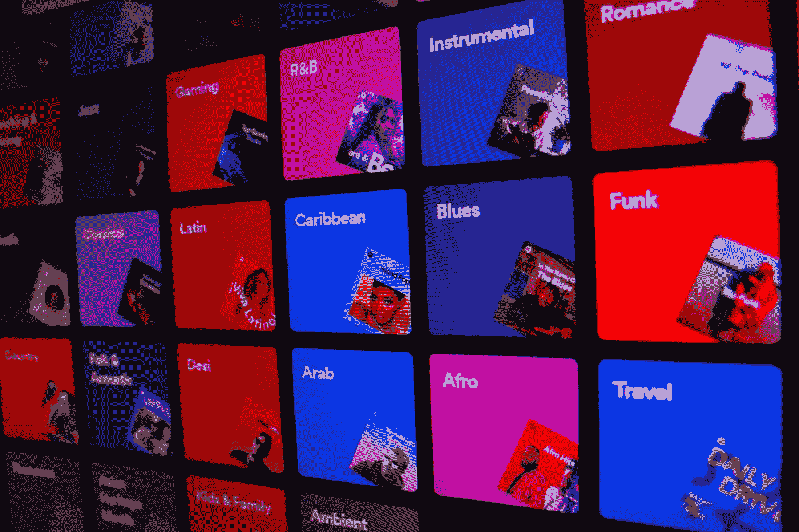

12 月对 Spotify 用户来说是一个特殊的月份。每年这个时候，名为 Spotify Wrapped 的年度总结发布。这不仅是音乐爱好者的一个很酷的功能，也是一个天才的营销活动，因为全世界数百万用户正在分享他们的收听习惯。

在设计 Spotify 包装的体验时，Spotify 以其非传统的方法而闻名。自 2016 年以来，该公司每年都用生动的图表、有趣的动画给音乐粉丝带来惊喜，今年甚至内置了互动小测验。

尽管 Spotify Wrapped 每年都是热门话题，但 2021 版吸引了非同寻常的关注，尤其是抖音和推特上的年轻一代。

# 2021 年有什么新鲜事？

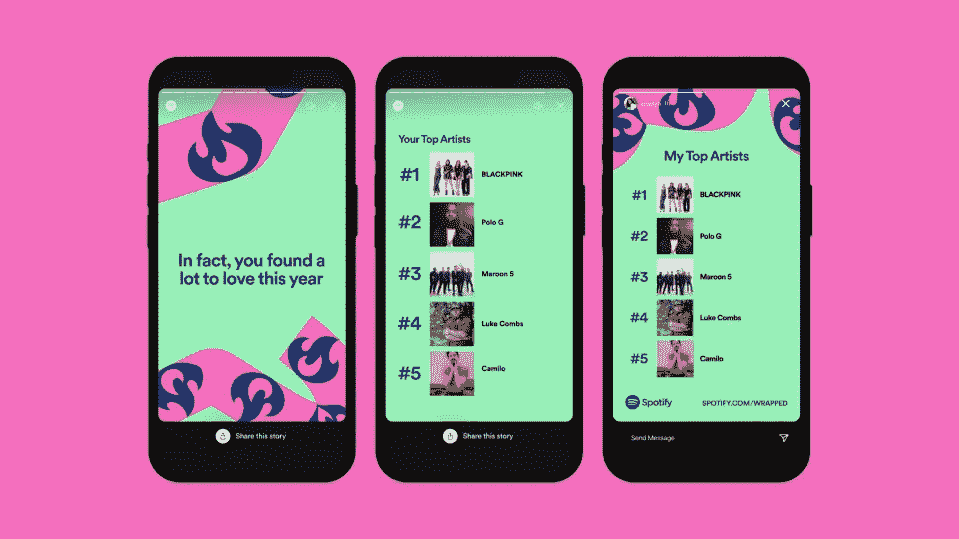

*source:* [*https://newsroom.spotify.com/*](https://newsroom.spotify.com/2021-12-01/the-wait-is-over-your-spotify-2021-wrapped-is-here/)

今年的 Spotify Wrapped experience 于 12 月 1 日推出，已经做了很多宣传。用户可以回顾他们喜欢的艺术家、歌曲和播客。此外，他们可以在自动创建的播放列表中收听他们最喜欢的 100 首歌曲。音乐爱好者还可以看到一些有趣的统计数据，如收听时间和播放次数。

Spotify 试图通过包括阅读“音频光环”在内的新功能保持领先，因为阅读光环今年早些时候已经遍布抖音。

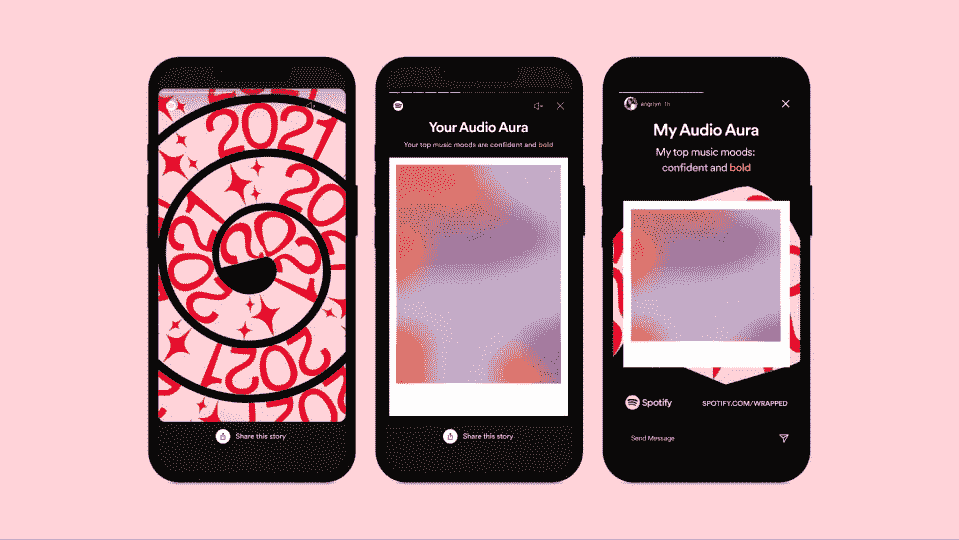

*source:* [*https://newsroom.spotify.com/*](https://newsroom.spotify.com/2021-12-01/the-wait-is-over-your-spotify-2021-wrapped-is-here/)

Spotify Wrapped 的独特和不寻常之处之一是，它让用户对他们的数据被收集和分析感到兴奋。

人们往往对数字时代的隐私和对个人信息的控制有一些强烈的看法。通过这一功能，Spotify 不仅可以尽可能多地收集用户习惯的数据，还可以每年获得感觉被其他流媒体平台忽视的新客户。本质上，他们成功地将数据收集和 FOMO(害怕错过)货币化。他们甚至让数据收集变得很酷。

# 额外链接:Spotify 的包装设计和数据工作流程

如果你有兴趣了解 Spotify 在设计体验和管理相关数据方面的方法，你可以在这里阅读更多内容(我们将在 2021 年更新这些链接，届时它们将在 Spotify 设计和工程博客上发布):

以这样的活动来结束一年也是一个辉煌的营销举措，因为点对点营销被认为是最有效的策略之一。Spotify 让分享结果变得非常容易，并鼓励用户在短暂的动画体验中多次分享。

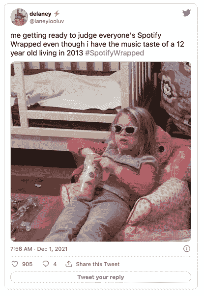

# Spotify 的设计方法

就设计而言，Spotify 以其非传统的方法、原创的动画和有趣的颜色组合而闻名。Spotify 的设计师们不怕打破规则，敢于跳出框框思考，这与娱乐业的特殊性完美契合。

有趣的动画和内置的游戏将纯文本变成了真正的交互式用户体验，全世界都在为它而战。每一个画面都可以独立分享，有完美的意义。应用程序中的直观控制允许用户返回到他们感兴趣的幻灯片，就像在 Instagram stories 中一样。

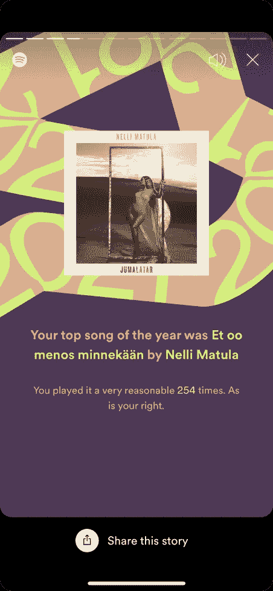

每张幻灯片都有一个“分享这个故事”CTA 按钮和多个现成的分享选项。

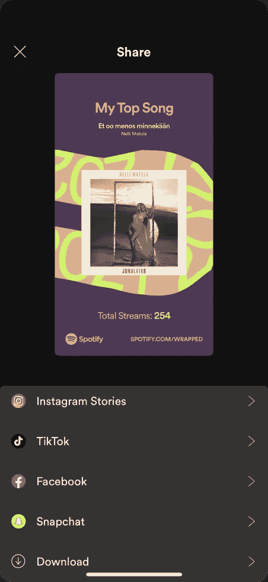

虽然 Spotify Wrapped 确实是一个天才的倡议，但今年的版本受到了抖音社区的许多批评。

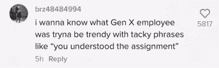

source: TikTok

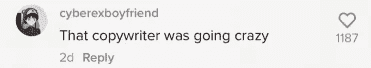

source: TikTok

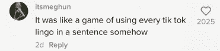

source: TikTok

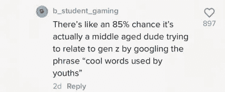

source: TikTok

主要原因是 Spotify 被指责过于努力与 z 世代保持联系。

事实上，创作者们试图尽可能多地提及 2021 年的抖音趋势。为了做到这一点，他们使用了诸如“共鸣检查”、“你是主角”和“你理解任务”这样的短语。

他们还提到了阅读 aura 和护肤日常趋势。对于许多抖音用户来说，这一切看起来都被过度使用，不自然。

另一个吸引年轻用户注意的问题是图形，尤其是“顶级流派”屏幕。

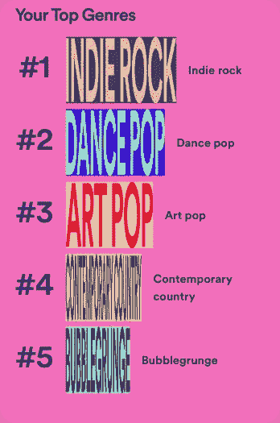

许多用户指出文字难以辨认。

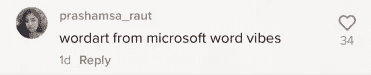

source: TikTok

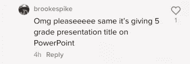

source: TikTok

这些彩色的文字显然是为了暗示另一种“充电端口文字”的趋势——这种趋势基于一种只能从躺着的手机(连接到充电器并放下)上读取的字体的使用

除此之外，艺术文本应该创建一个图表，听得最多的类型是最宽的，第五个是最薄的。

2020 年使用了一个非常相似的图表，但没有文字。

一些人认为这是 Spotify 试图在艺术中使用野蛮主义，考虑到它以前在设计方面的行为，这是可能的。不幸的是，无数用户并不欣赏这种创新，因为它的模糊性。

另一个被指出的“缺陷”是不完美的图像。作者可能想强调的是，这完全是为了好玩，一点也不严肃，然而很多用户认为它看起来不够成熟而且“廉价”。

Spotify 的设计师做出了一些有趣的选择，使用难以辨认的字体搭配旁边的普通文本。

这是 100%打算看起来“糟糕”。它不仅给人们提供了谈论的话题，还散发出最近获得关注的“丑陋艺术”的氛围。

# “糟糕的设计”是一种新趋势吗？

抖音的创造者——艾米丽·祖盖——通过故意提出糟糕的设计，收集了超过 200 万的追随者。她为多力多滋(Doritos)和亚马逊(Amazon)等品牌重新设计标志的视频迅速走红。

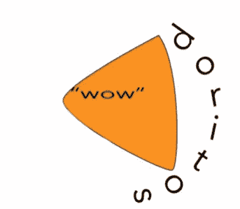

*source: @emilyzugay on TikTok*

这些视频促成了与 Panera Bread 的特别圣诞合作。艾米丽设计了节日杯。

她的设计看起来很便宜，这正是它们与众不同的地方。

*source: @emilyzugay on TikTok*

但是为什么每个人都喜欢艾米丽，却批评 Spotify 呢？

Spotify 包装的设计也没那么差，这就是让人困惑的地方。并非所有用户都知道这是故意的，这与著名的 TikToker 故意让人畏缩的设计形成了对比。

# 色彩的力量

非传统的图形由不明显的颜色选择支持。

这是一个调色板，看起来像一个商业相关的计划，使用深蓝色和冰川色调结合薰衣草灰色。

但这些正是屏幕上使用的颜色:

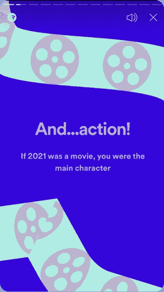

这是一个设计的例子，使用相似的颜色组合，结果却完全不同。

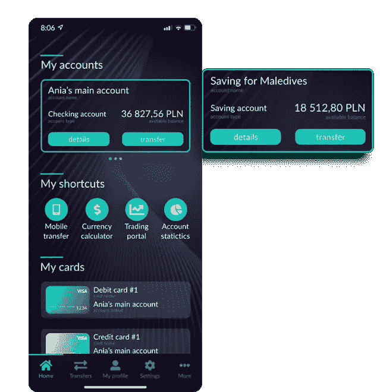

调高一种颜色可以使整个幻灯片看起来更生动，单独的调色板看起来更有趣。

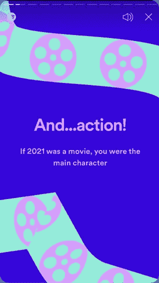

以下是 Spotify Wrapped 2021 上出现的一些其他有趣和非传统的颜色组合:

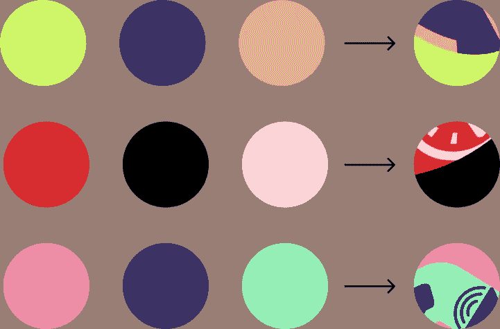

# 结论

最后，Spotify 的 Wrapped 在全球范围内引起了巨大兴趣。一大群音乐爱好者观看了他们这一年的音乐总结；这是公司的意图。然而，他们本可以以不同的方式实现他们的目标。

今年的版本有点太勉强了。作者试图赶上太多的趋势，并不总是成功的。如果一个设计必须被解释和证明，不管它有多好，多有思想，这意味着它没有达到目标受众。但由于这种误解，该行动在社交媒体上引起了很大的轰动。整个创意在设计方面并不完美，但确实是一个出色的营销举措。

*最初发表于*[*【https://www.itmagination.com】*](https://www.itmagination.com/blog/spotify-wrapped-2021-design-analysis)*。*