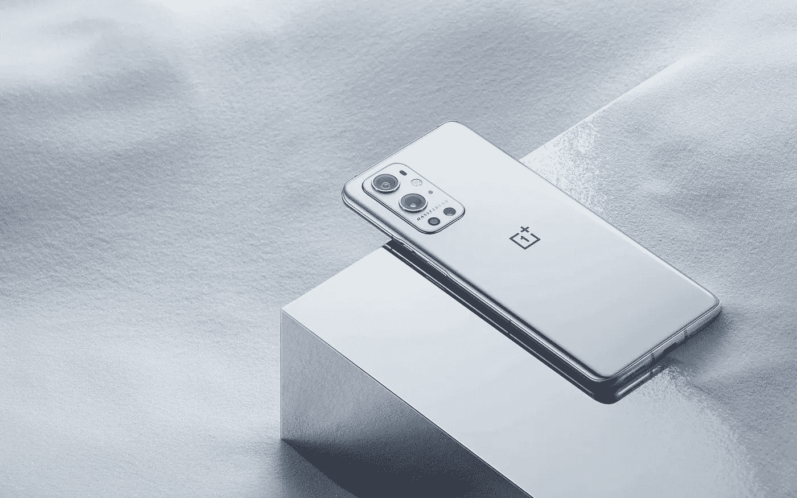

# 中国手机厂商和著名摄影品牌是怎么回事？

> 原文：<https://medium.com/geekculture/whats-with-chinese-phone-manufacturers-and-famous-photography-brands-2b3328f9887a?source=collection_archive---------12----------------------->

## 如果预期的结果不存在，营销伎俩不会削减它，这就是现在的情况

It seems that every year a major Chinese smartphone manufacturer works with a Western photography brand on… something. What that is, exactly, is — for the most part — unclear in practice. (Image: One Plus)

让我们面对现实吧:如今智能手机制造商之间的竞争如此激烈，以至于很难指责他们试图寻找潜在的优势，以努力…