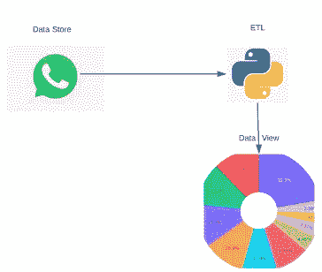
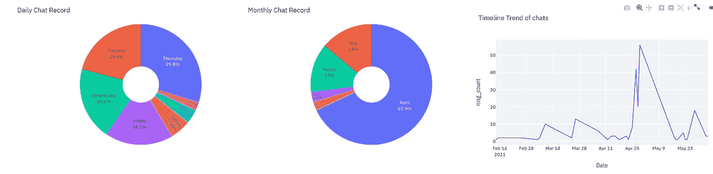

# WhatsApp 聊天分析

> 原文：<https://medium.com/geekculture/whatsapp-chat-analysis-a-data-view-built-with-streamlit-d7d94525beae?source=collection_archive---------10----------------------->

从任何形式的数据中提取信息和见解的能力被认为是一项有价值的技能。数据可以是各种形式，如结构化表格数据、文本数据等。WhatsApp 是一种社交媒体平台，允许 it 用户相互发送消息、图片、视频等。发送这些消息会生成文本数据，这些数据可以很容易地提取出来，并且可以利用 python 等编程语言的知识进行转换和分析。

在这篇文章中，我将解释如何使用 WhatsApp 聊天文本数据来提取见解并创建不同的图表。

Image by Author

目标:

阅读本文后，读者将能够:

1.  提取 WhatsApp 聊天数据
2.  使用正则表达式清理文本数据
3.  从文本数据中提取见解
4.  使用 Streamlit 构建仪表板

事不宜迟，让我们开始吧

大纲:

*   提取 WhatsApp 聊天数据
*   清理和转换文本数据
*   使用 Streamlit 构建视觉效果

## 提取 WhatsApp 聊天数据

WhatsApp 允许用户下载他们的聊天数据，无论是直接消息(DM)还是群聊。按照以下步骤下载您的聊天数据

*   打开您希望下载的聊天内容，它可以是您朋友的 DM 或群聊
*   点击 3 点垂直线
*   点击更多按钮
*   点击导出聊天按钮
*   单击无媒体—这将仅导出文本聊天数据，并排除所有媒体，如音频、视频等。
*   然后你可以把它送到任何你想去的地方。也可以邮寄给自己

## 清理和转换 WhatsApp 数据

为了从数据中提取任何有用的信息或见解，需要使用符合要提取的见解所需的方法对数据进行清理和转换。WhatsApp 聊天数据也不例外，很脏，需要清理。

*   移除系统生成的消息:WhatsApp 会生成一些消息，比如当有人新加入群组时，它会发送一条消息，比如“用户 1 刚刚加入群组”

*   移除表情符号

*   从每条消息中提取有用的特征:时间、日期、消息内容、消息发送者等信息。
*   将所有要素合并到一个数据框架中，以帮助可视化

这是一个提取特征并将所有特征转换成数据帧的函数。

## 使用 Streamlit 构建视觉效果

Streamlit-Streamlit 是一个面向机器学习和数据科学团队的开源应用框架。在数小时内而不是数周内创建漂亮的数据应用。全是纯 Python。streamlit 的目标是为您的数据创建交互式应用程序。

在清理和转换聊天数据之后，我有了一个如下所示的数据帧:

Image by Author

现在，我将构建视觉效果，传达我们现有数据中的见解。在这里，我将思考展示什么是重要的，以及传达这种见解的最有效方式。下面是一个生成单词云图像的函数

其他生成图表的功能可以在[这里](https://gist.github.com/Abuton)找到。整个代码库基于 streamlit for data view 和 plotly 的前端设计，提供图表交互性。我创建了多个图表来传达不同的见解，如单个用户发送的消息总数、发送消息最繁忙的日子、聊天中最常用的词等。下面是基于 WhatsApp 图表数据生成的图表快照。

Image by Author

Image by Author

该项目的全部代码可以在[这里](https://github.com/Abuton/Intermediate-DS-Projects/blob/main/app.py)找到。我会写关于部署应用程序，也增加了更多的功能，如；

*   下载按钮，用于为其他机器学习用例下载干净的聊天数据
*   加载附加数据和比较指标的侧栏
*   在评论部分添加您希望添加到应用程序中的内容

感谢您的阅读，干杯