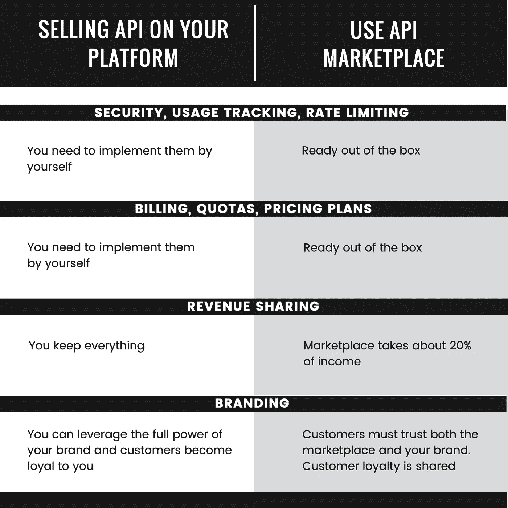

# 何时以及为什么你应该在原料药市场销售你的原料药

> 原文：<https://medium.com/geekculture/when-and-why-you-should-sell-your-apis-in-api-marketplaces-7c63c332accf?source=collection_archive---------14----------------------->

Photo by [Dennis Kummer](https://unsplash.com/@dekubaum?utm_source=unsplash&utm_medium=referral&utm_content=creditCopyText) on [Unsplash](https://unsplash.com/s/photos/connections?utm_source=unsplash&utm_medium=referral&utm_content=creditCopyText)

## 应用程序接口

## 在 API 市场权衡中做出正确的选择

在我最近开发了一个[文本主题标签模型](https://pub.towardsai.net/how-to-train-a-topic-tagging-model-to-assign-high-quality-topics-to-articles-46b7ebbf0ba8)之后，我想出了许多可能的商业用例，这让我认为将其作为 API 服务出售可能是一个好主意。因此，我开始探索 API 商业的世界，以了解最流行的 API 商业模式是什么，以及是否有平台可以让我的 API 商业化更快。我建议你[这篇文章](https://yalantis.com/blog/api-business-models-for-scalable-online-businesses/)多讲讲 API 商业模式。API 市场的例子有 [RapidAPI](https://rapidapi.com/hub) 和 [Prompt API](https://promptapi.com/) 。

事实证明，API 市场相当普遍，为开发者提供了大量工具来减少 API 开发和商业化之间花费的时间。那么，当你想卖一个 API 的时候，API 市场是正确的选择吗？

# API 市场权衡

对于 API 用户来说，API marketplace 是一个展示可供尝试和订阅的 API 的橱窗，加上搜索引擎功能，这使得使用相同凭证的不同 API 变得很容易。对于 API 提供商来说，API 市场是一个平台，旨在管理你的 API 商业化的一切。

对于 API 提供商来说，使用 API 市场的一些优势是:

*   **API 密钥和安全管理。为你的 API 提供的服务付费的用户希望它们是安全的。我不建议那些不是该领域专家的人自己去管理安全，因此让 API marketplace 去做是常识。**
*   **计费、配额和定价计划。**管理支付和实施不同的定价方案选项并不总是容易的(想想免费增值模式)。当市场上已经有现成的东西时，从头开始开发可能就不值得了。
*   **API 使用跟踪、指标和速率限制。**它们可能不是商业化所必需的，但是有某种形式的跟踪谁在使用你的 API 以及如何使用它是很好的。
*   **API 文档模板。**想用你 API 的人，一定要尽可能清楚的知道怎么做。整洁的文档是销售 API 的关键因素。此外，市场会自动提供许多流行编程语言的代码片段，展示如何使用您的 API。
*   **API 登陆页面创建和 SEO。**市场为您的 API 创建一个网页，其中包含您想要添加的文档和描述。然后，该页面将在主要搜索引擎和市场的内部搜索引擎上被索引。

这些都是所有待售 API 共有的特性，因此 API marketplaces 一劳永逸地实现了它们，并让每个人都可以使用它们。作为回报，他们收取一笔市场费用，通常是你的原料药销售总收入的 20%。当他们像你一样通过销售你的 API 赚钱时，他们的兴趣和你的一致，并做一些营销来试图让你销售。如果你要出售你的第一批 API，并且不确定出售它们能赚多少钱，至少从市场上开始出售是有意义的，因为你在佣金上损失的是没有花在开发上的时间。

***奖励提示*** *:了解更多不同类型的 API 市场和 API 策略。*

 [## API 市场的 5 种类型——新堆栈

### API 应该被设计成真正的数字产品——可复制的、可替换的、可靠的——而不仅仅是…

thenewstack.io](https://thenewstack.io/the-5-types-of-api-marketplaces/)  [## 使你的 API 策略与 API 市场保持一致

### 无论你是一个 API 发布者还是一个使用 API 的开发者，重要的是为你如何…

www.tiempodev.com](https://www.tiempodev.com/blog/aligning-your-api-strategy-with-api-marketplaces/) 

考虑到 API 市场为你做的所有工作，这似乎是一笔不错的交易。然而，像几乎所有的选择一样，它包含了权衡。当从市场而不是自己的平台销售 API 时，需要考虑以下一些事情:

*   **你的品牌的力量不太有效。拥有一个已经建立并为人所知的品牌当然有助于在市场上销售你的 API，但是在这种情况下，你仍然需要依赖市场品牌。直接从你的平台上销售你的 API 可以让你充分利用你所拥有的品牌。**
*   **忠诚更难实现。**通过在市场上销售 API，你可以在你和市场之间分享客户忠诚度。如果你销售大量的 API，在市场之外销售也是有意义的。
*   人们必须在市场上注册才能使用你的 API。假设你是一个用户，已经浏览了你的域名，并决定尝试你的 API。在这种情况下，要求他注册另一个你会把他/她重定向到的网站并不是一个好的用户体验。
*   **如果你的原料药卖得好，原料药市场费用可能不方便。**虽然这可能是真的，但是构建 marketplace APIs 所拥有的所有基础设施仍然需要大量的工作，并且需要合适的人员。

这里有一个表格概括了这种权衡。

Comparison of selling APIs on your platform or API marketplaces. Image by the author.

现在我们有了一个利弊列表，让我们试着解释在什么情况下在 API 市场上销售 API 是有意义的。

# 何时使用 API 市场

选择在市场上销售 API 并不排除也能在你的平台上销售，反之亦然。事实上，我找不到令人信服的理由说明为什么只在你的平台上销售 API 而不在 API 市场上销售，因为集成时间非常快。因此，我的建议如下。

> **在 API 市场销售 API**如果你是一家小公司，没有强大的品牌，并且你打算销售少量的 API，这对客户忠诚度没有什么意义。
> 
> **从您的平台销售 API**如果您是一家拥有知名品牌的公司，或者如果您打算销售大量不同的 API，而客户忠诚度对这些 API 是有意义的。此外，考虑在 API 市场上销售你的 API。

***额外提示*** *:将您的 API 托管在可伸缩的容器服务上，以便高效地管理流量的变化。*

 [## 公共云容器服务的比较

### 在过去的十年里，容器已经成为改变云计算游戏规则的技术。在…的帮助下

www.ek.co](https://www.ek.co/publications/comparison-public-cloud-container-services) 

# 结论

如果你开始销售你的第一批 API，并且你还没有一个确定的品牌，或者你想在开发你的 API 管理基础设施之前验证你的想法并获得一些动力，那么我强烈建议你从利用 API 市场开始。如果你已经有了一个强大的品牌，并计划构建多个 API，我建议你从你的平台上出售它们，但我认为你至少应该考虑使用 API 市场的利弊，即使它可能不是你特定情况下的最佳选择。

感谢您花时间阅读这篇文章。如果你喜欢这篇文章并想看更多，请一定要拍下这篇文章！