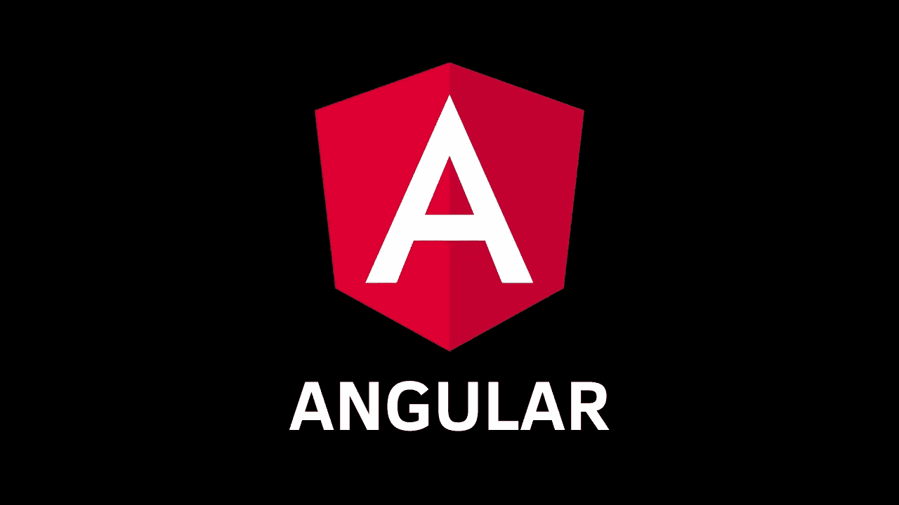

# 当角度失败时

> 原文：<https://medium.com/geekculture/when-angular-fails-a6ed45af8b6f?source=collection_archive---------6----------------------->

如果你看过我的其他帖子，你就会知道我是 Angular 的超级粉丝。我已经写了好几篇关于为什么我认为 Angular 很棒的文章。然而，我写这篇文章是为了挑战自己，看看 Angular 什么时候会让你失望。我用“失败”这个词是什么意思？对我来说，失败意味着框架本身的某些东西会阻碍我的产品开发，或者会妨碍我的产品开发。