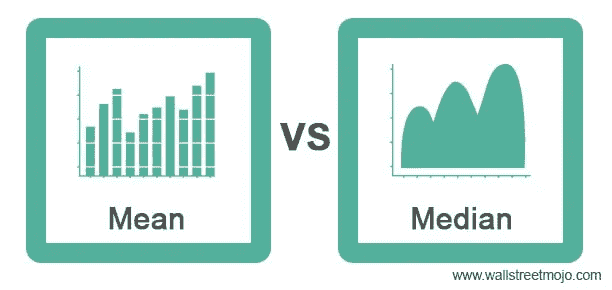

# 什么时候用均值 vs 中值？

> 原文：<https://medium.com/geekculture/when-do-you-use-mean-vs-median-af9131090b24?source=collection_archive---------10----------------------->

**统计学面试问题:第一部分**

我们将讨论一些统计面试问题，这些问题通常在数据科学家、数据分析师和业务分析师的面试中被问到。对于数据科学领域，统计涉及数据分析生命周期的每个阶段，无论是数据收集阶段、数据清理阶段、数据处理阶段、数据分析阶段，还是推动给定问题的解决方案。统计与数据分析的每个阶段都密切相关。因此，你应该对统计学的一些重要课题有非常清楚的了解。在与统计相关的采访中，有很多问题会被问到。我们将在这个系列文章中讨论一些面试问题。问题是:

**你什么时候用均值 vs 中位数？**

在回答这个问题之前，我们先了解一下什么是均值和中位数。

[https://cdn.wallstreetmojo.com/wp-content/uploads/2021/06/Mean-vs-Median.jpg](https://cdn.wallstreetmojo.com/wp-content/uploads/2021/06/Mean-vs-Median.jpg)

**均值 Vs 中值**

在数学和统计学中，整数列表的平均值或算术平均值是通过对列表的总数求和并除以项目总数来计算的。在检查对称分布时，平均值可能是确定集中趋势的最佳方式。平均值考虑了所有的数据点，给出了适度的采样稳定性。

在概率论和统计学中，中位数是将样本、总体或概率分布的上半部分与下半部分相除的值，即将数据分成相等的两半。Median 不采用整个数据进行计算。

假设班上有九个小学生，他们的测试结果是 **2，4，5，7，8，10，12，13，83** 。在这种情况下，所有分数的总和除以 9，以确定平均分数(或平均值)。这等于 144/9，或 16。虽然算术平均分是 16，但与其他分数相比，它受到了 83 的极高分数的影响，这一点可以看出。大多数学生的分数低于平均水平。因此，在这种情况下，平均值不能准确反映样本的集中趋势。

另一方面，中值是中点，即(9/2)的上限，即第五个点。因此，中值分数为 8，这是给定分数的更稳健的度量。

**什么时候应该用均值和中位数？**

平均值和中值用于使用单个值描述整个数据。例如，我们通常会问学生的平均分数是多少，一个月的平均销售额是多少，特定学生的表现更好，学生的百分比是多少，等等。

**对于正态分布来说，均值很好衡量**。正如我们在上面的例子中看到的，平均值很大程度上受异常值(数据集中过大或过小的值)的影响，因此当数据中存在异常值时，不应单独使用平均值。当给定的数据包含正态分布或没有异常值时，您应该使用均值。

**偏态分布一般用中位数来表示。**鉴于异常值对均值有重大影响，均值并不是一个可靠的工具。由于中位数更可靠、更容易理解，因此它更适合于偏态分布来得出集中趋势。

尽管中位数也是正态分布的稳健度量，但我们仍然使用平均值，因为正态分布的平均值和中位数是相等的。这背后的原因是中值的计算比平均值的计算更昂贵。对于中位数，我们需要按升序对数据进行排序，只有这样才能计算出来。

我的建议是始终使用平均值，如果数据是倾斜的，那么也提供中位数。

感谢您阅读这篇文章，并付出您宝贵的时间。如果你喜欢这篇文章，请鼓掌，评论，并在媒体上关注下一篇文章。

.