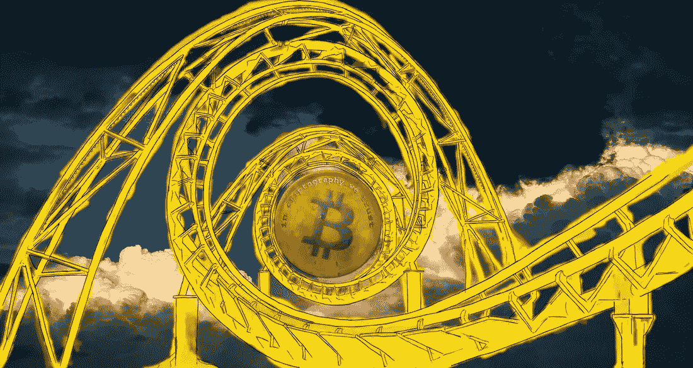

# 谈到比特币的价格，你会混淆“极端”和“正常”

> 原文：<https://medium.com/geekculture/when-it-comes-to-bitcoins-price-you-re-confusing-extreme-and-normal-10eb1325b9d?source=collection_archive---------5----------------------->

今年以来上涨了 22%，过去六个月上涨了 7%，自去年 10 月以来上涨了 6%的资产叫什么？

标准普尔 500。牛市。迈向新的历史高点。只有美联储能阻止它。准备起飞！

今年以来上涨 60%，过去六个月上涨 33%，自去年 10 月以来上涨 6%的资产叫什么？