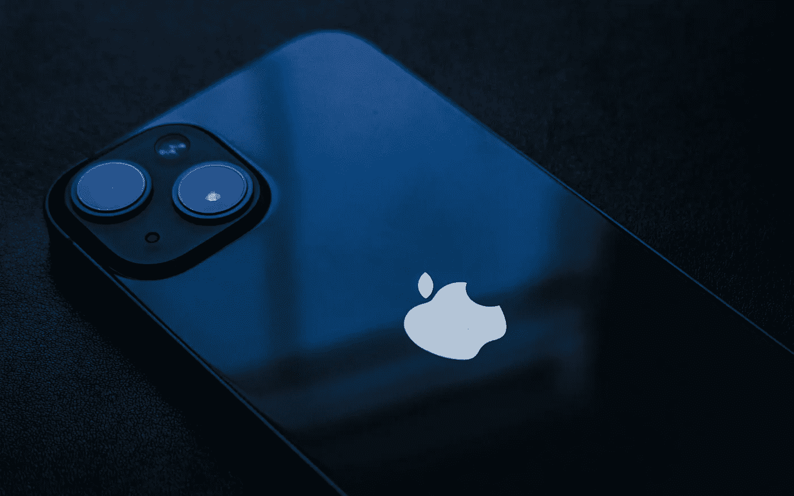

# 谈到高端智能手机，苹果仍然是输家

> 原文：<https://medium.com/geekculture/when-it-comes-to-premium-smartphones-its-still-apple-s-game-to-lose-3e0b9a33762b?source=collection_archive---------15----------------------->

## 越来越多的人将昂贵的设备视为投资，iPhones 准备充分利用这一趋势

Apple seems to have the premium segment of the smartphone market cornered all over the world nowadays, which may be well-deserved but not necessarily a good thing for consumers. (Image: 3Tan, Unsplash)

这些数字出现在中，尽管并不十分令人惊讶，但将其分解并放入背景中仍然很有趣:根据 Counterpoint Research 的市场脉搏…