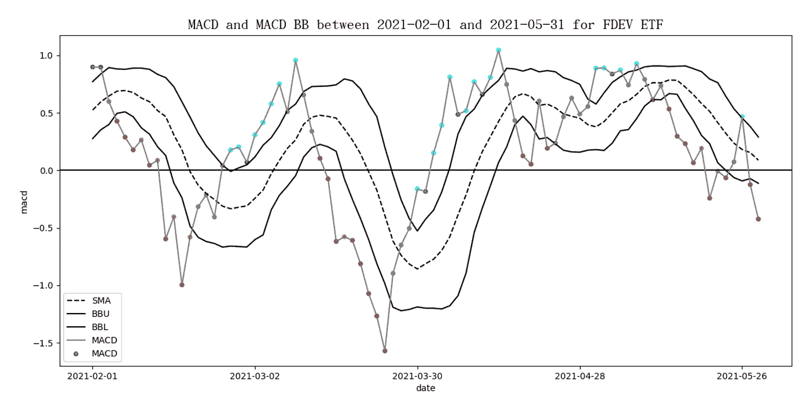
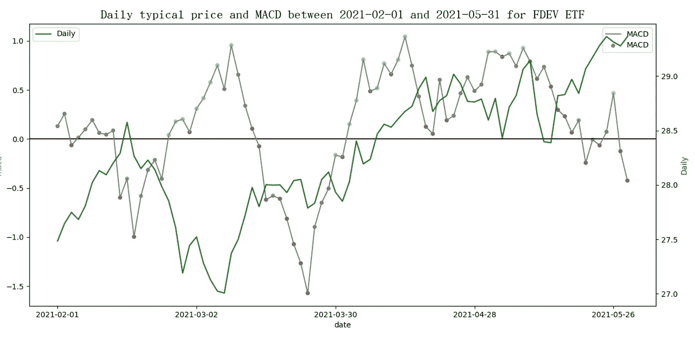

# 当 MACD 和 BB 在《弹性搜索》中搭档时，…

> 原文：<https://medium.com/geekculture/when-macd-couples-with-bb-in-elasticsearch-3cca987c0678?source=collection_archive---------36----------------------->

移动平均线收敛发散(MACD)是基于趋势和动量的指标，而布林线(BB)是基于波动的指标。当 MACD 和 BB 成双成对时，一些专业人士称之为 MACD BB，另一些人称之为 BB MACD。在这篇文章中，MACD BB 的名字被使用。两个技术分析指标的结合继承了两个指标的能力，并提供了对市场趋势的洞察力。从我密集的网络搜索来看，无处可说是谁发明了这个指标。如果有人知道，请分享出处。但是很多交易平台和论坛都提供这个指标作为高级功能。建议读者阅读我之前的两篇文章，以快速对这两个指标及其使用 Elasticsearch 的实现有一个基本的了解。
根据《[用弹性搜索构建 MACD 直方图](https://wtwong316.medium.com/construct-macd-histogram-with-elasticsearch-ecd6b627457e)》一文中描述的方程，MACD 涉及一个短期和一个长期的指数加权移动平均线(EWMA)。这两个术语的常见用法是 12 和 26。


在文章《[通过弹性搜索](https://wtwong316.medium.com/calculate-bollinger-band-width-through-elasticsearch-39f7f3a1ceff)计算布林线宽度》中，BB 是基于每日价格的简单移动平均线(SMA)和标准差(SD)来构造上波段(BBU)和下波段(BBL)。BB 的中线就是 SMA。从 MACD BB 的术语来看，它使用 MACD 而不是价格。BBL 和 BBU 的计算解释如下，其中滑动窗口(window)是 20 或 26，标准偏差(n)在通常实践中是 1 或 2。


基本上，MACD、BBU 和 BBL 将被绘制在一张图表上，用户可以观察 MACD 和这两个波段的交叉点。当 MACD 突破 BBU 时，它显示出强烈的上升信号。同样，当 MACD 突破 BBL 时，它显示了强烈的向下信号。用图表来描述意思要容易得多。在本文中，我们尝试将 MACD 和 BB 应用于免佣金的交易所交易基金(ETF ),并将弹性搜索作为分析工具。下面的例子随机选择“富达国际多因子 ETF”。它的股票代码是 FDEV。数据选自 IEX 投资者交易所提供的 2021 年 2 月 1 日至 2021 年 5 月 31 日的时间范围。MACD 最常用的参数短期为 12，长期为 26。根据很多互联网文章，计算 BB 时，SMA 的周期为 10，BB 的标准差为 1。在下图中，绘制了 MACD 及其 BBL、BBU 和 SMA。如果 MACD 值高于 BBU，并且与前面时间戳中的值相比是一个增量，则它是一个水蓝色的点。如果 MACD 值高于 BBU，并且是一个减量，它就是一个蓝点。如果 MACD 值低于 BBL，并且是一个减量，它就是一个红点。如果 MACD 值低于 BBL，并且是一个增量，则它是一个橙色点。对于其他情况，它是一个灰点。读者很容易观察到红色/橙色线在 BBL 下方，蓝色/水蓝色线在 BBU 上方。此外，当 MACD 值从零以下上升并穿过零时(考虑一个来自 MACD 的看涨信号)，在大多数情况下，有一个相应的蓝点紧随其后。同样，当 MACD 值从零以上下降并穿过零时(考虑 MACD 产生的看跌信号)，相应的红点也会随之出现。直线的斜率表示趋势的动量。



但是，当我们试图结合典型值解释 MACD 值从 BBU 或 BBL 突破的点时，它似乎与价格的上升或下降趋势不匹配，如下图所示。波动性增加的潜在迹象和未来可能的交易机会不容易捕捉，有时方向是相反的。



虽然大多数交易平台都提供了 MACD BB 指标，并给出了相同的评论“不适合新手交易者”，但其 Elasticsearch 实现显示了无缝集成，易于理解。假设有一个用数据填充的 Elasticsearch 索引，其使用的数据映射与上一篇论文中描述的相同。以下步骤演示了 REST API 请求体的代码。

> 通过搜索操作收集所有相关文件

使用带有“must”子句的“bool”查询来收集符号为 FDEV 且日期在 2021 年 2 月 1 日和 2021 年 5 月 31 日之间的文档。由于 26 个交易日移动平均线的计算，额外数据调整为 1.5 个月(从 2021 年 12 月 15 日至 2021 年 2 月 1 日)

```
{
    "query": {
        "bool": {
            "must": [
                {"range": {"date": {"gte": "2020-12-15", "lte": "2021-05-31"}}},
                {"term": {"symbol": "FDEV"}}
            ]
        }
    },
```

> 计算基金的每日典型价值

使用名为 MACD 的“date_histogram”聚合，其中参数“field”为“date ”,参数“interval”为“1d ”,以提取每天的基金价格。然后是名为 TP 的“scripted_metric”聚合，以计算典型价格，该价格等于最高价、最低价和收盘价的平均价格。

```
 "aggs": {
        "MACD_BB": {
            "date_histogram": {
                "field": "date",
                "interval": "1d",
                "format": "yyyy-MM-dd"
            },
            "aggs": {
                "TP": {
                    "scripted_metric": {
                        "init_script": "state.totals=[]",
                        "map_script": "state.totals.add((doc.high.value+doc.low.value+doc.close.value)/3)",
                        "combine_script": "double total=0; for (t in state.totals) {total += t} return total",
                        "reduce_script": "return states[0]"
                    }
                },
```

> 提取桶的日期

由于存在额外的数据，后续操作需要稍后过滤掉超出范围的部分。一个名为“DateStr”的“min”聚合将获取存储桶的日期。在 Elasticsearch 服务器中，日期以纪元时间存储。时间单位是毫秒，时区是 UTC。

```
 "DateStr": {
                "min": {"field": "date"}
            },
```

> 选择包含 1 个以上文档的存储桶

为了过滤掉空的时段(非交易日)，使用一个名为 STP 的“bucket_selector”聚合来选择文档计数大于 0 的时段。

```
 "STP": {
                "bucket_selector": {
                    "buckets_path": {"count":"_count"},
                    "script": "params.count > 0"
                }
            },
```

> 计算每日 12 个交易日和 26 个交易日 EWMA 的典型值

使用名为 EWMA12 的“移动 _fn”聚合，参数 window 为 12，参数“buckets_path”为 TP.value，计算典型值的 12 个交易日 EWMA。EWMA 是通过使用函数 MovingFunctions.ewma 和参数 alpha 为 2/(window+1)来计算的。EWMA26 聚合可以用同样的方式完成。

```
 "EWMA12": {
                "moving_fn": {"script": "MovingFunctions.ewma(values, 2/(12+1))", "window": 12, "buckets_path": "TP.value"}
            },
            "EWMA26": {
                "moving_fn" : {"script": "MovingFunctions.ewma(values, 2/(26+1))", "window": 26, "buckets_path": "TP.value"}
            },
```

> 计算 MACD

使用名为 macd 的“bucket_script”聚合和参数“buckets _ path”来指定来自 EWMA12 和 EWMA26 的结果。然后根据脚本中的等式计算 MACD 指标。

```
 "MACD": {
                "bucket_script": {
                    "buckets_path": {
                        "EWMA12": "EWMA12",
                        "EWMA26": "EWMA26"
                    },
                    "script": "params.EWMA12 - params.EWMA26"
                }
            },
```

> 计算每日 10 天简单移动平均值的典型值

使用名为 SMA10 的“移动 _fn”聚集，参数窗口为 10，参数“桶 _ 路径”为 MACD，来计算 MACD 值的 10 天 SMA。SMA 是使用未加权平均函数(MovingFunctions.unweightedAvg)计算的。

```
 "SMA10": {
                 "moving_fn" :{"script": "MovingFunctions.unweightedAvg(values)", "window":10, "buckets_path":"MACD"}
            },
```

> 计算典型值的每日 10 天标准偏差

使用名为 SD10 的“移动 _fn”聚合，参数窗口为 10，参数“桶 _ 路径”为 MACD，来计算 10 天的 MACD 标准差。SD 是使用标准差函数(MovingFunctions.stdDev)计算的。

```
 "SD10": {
                "moving_fn": {"script":"MovingFunctions.stdDev(values, MovingFunctions.unweightedAvg(values))", "window":10, "buckets_path":"MACD"}
            },
```

> 计算 MACD BB

使用两个名为 BBU10 和 BBL10 的“bucket_script”聚合，并使用参数“buckets _ path”来指定 SMA10 聚合和 SD10 聚合的结果。然后，BBL10 和 BBU10 通过 SMA10 加上或减去 SD10 的值来计算。

```
 "BBU10": {
                "bucket_script": {
                    "buckets_path": {
                        "SMA": "SMA10",
                        "SD": "SD10"
                    },
                    "script": "params.SMA + params.SD"
                }
            },
            "BBL10": {
                "bucket_script": {
                    "buckets_path": {
                        "SMA": "SMA10",
                        "SD": "SD10"
                    },
                    "script": "params.SMA - params.SD"
                }
            },
```

> 确定 MACD 值的类型

a)使用名为“MACD _ 差异”的“衍生”聚合，并使用参数“桶 _ 路径”来指定 MACD 的值，以确定它是从前面时间戳处的 MACD 增加还是减少。

```
 "MACD_Diff": {
                "derivative": {
                    "buckets_path": "MACD" 
                }
            },
```

b)使用名为 macdType 的“bucket_script”聚合，并带有参数“buckets_path”来指定 BBL10、BBU10、MACD 和 macd 迪夫聚合的结果，以对 MACD 值的类型进行分类。

➤类型 1 如果 macd_Diff 是减量和 macd 值< BBL
➤类型 2 如果 MACD_Diff 是增量和 MACD 值< BBL
➤类型 3 如果 MACD_Diff 是增量和 MACD 值> BBU
➤类型 4 如果 MACD_Diff 是减量和 MACD 值> BBU
➤类型 0 其他情况

```
 "MACDType": {
                "bucket_script": {
                    "buckets_path": {
                        "BBL": "BBL10",
                        "BBU": "BBU10",
                        "MACD": "MACD",
                        "MACD_Diff": "MACD_Diff"
                    },
                   "script": "(params.MACD > params.BBU) ? (params.MACD_Diff > 0 ? 3:4) : (params.MACD < params.BBL) ? (params.MACD_Diff > 0 ? 2:1):0"
                }
            },
```

> 筛选出要输出的附加文档

使用名为 SMACD_BB 的“bucket_selector”聚合，使用参数“buckets_path”作为“DateStr”来选择“script”语句中指定的正确存储桶。选择标准是那些日期在 2021 年 2 月 1 日或之后的存储桶(纪元时间 1612137600000 毫秒)。

```
 "SMACD_BB": {
                "bucket_selector": {
                    "buckets_path": {"DateStr":"DateStr"},
                    "script": "params.DateStr >= 1612137600000L"
                }
            }
         } 
      }
   },
   "size": 0
}
```

> 收集完结果后，我们就可以画出如图所示的图形了。类型 3 的点颜色是水蓝色，类型 4 是蓝色，类型 1 是红色，类型 2 是橙色，其他是灰色。

读者可以进一步参考 GitHub 上的开源项目( [MACD_BB](https://github.com/wtwong316/MACD_BB) )

备注:

一、感谢 IEX(投资者交易所)提供 ETF 数据，也感谢 GitHub 提供开源项目存储。

二。本文基于一种技术思路，不构成任何投资建议。读者在使用时必须承担自己的责任。

三。文章可能还有错误，恳请读者指正。

四。感兴趣的读者可以参考作者写的关于弹性搜索基本技巧的书。《高级弹性搜索 7.0》，2019 年 8 月，Packt，ISBN: 9781789957754。