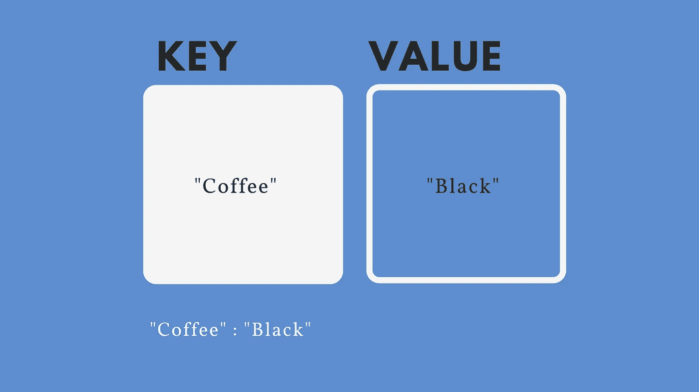
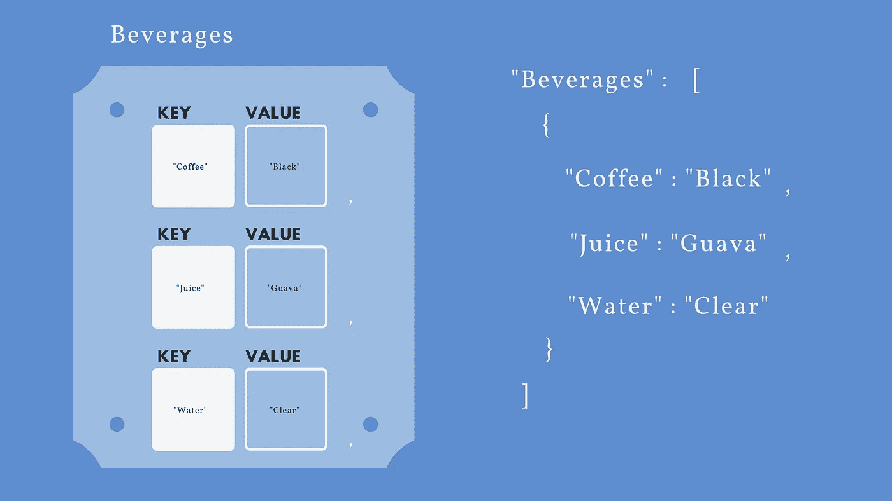
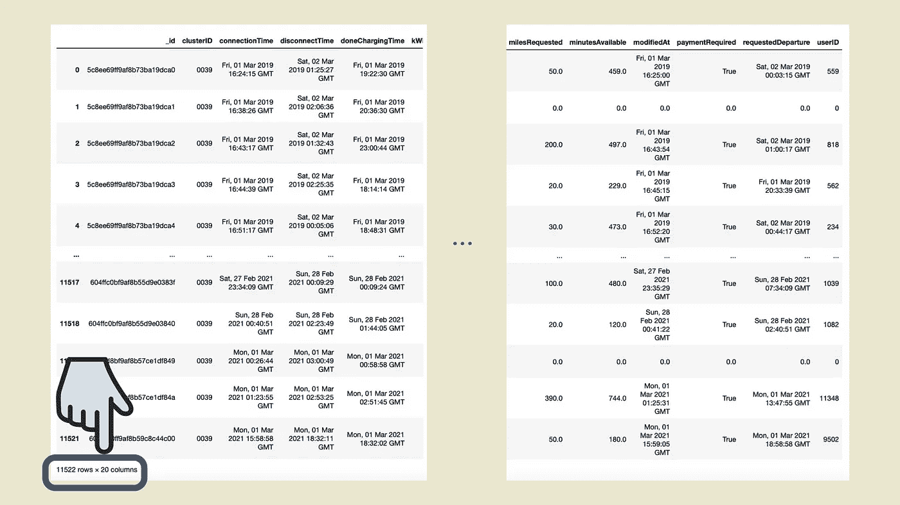

# pandas.json_normalize 不起作用时

> 原文：<https://medium.com/geekculture/when-pandas-json-normalize-doesnt-work-ff5f9a0abc7d?source=collection_archive---------8----------------------->

用 Jupyter-Notebook 将嵌套的 JSON 文件展平为 Pandas 数据框架的另一种解决方案。


Photo by [Author](https://boolxr.medium.com/)

*   数据集属于 [**ACN-Data**](https://ev.caltech.edu/dataset)
*   我的个人代码和 JSON 文件( *acndata_sessions* )可以在我的 [**GitHub**](https://github.com/jguev/nested-dataframe) 上找到

几个月前，我被指派从事一个机器学习项目，我发现了一个非常有趣的数据集。该数据集提供了对用户期望的洞察。它包括一系列可选的用户输入，提高了我可以训练的模型的质量。我被它的潜力所吸引，我把 JSON 文件添加到了我的 Jupyter 笔记本上。

为了感受前面繁琐道路的重量，我想快速描述一下什么是 JSON 文件。JSON (JavaScript Object Notation)文件是最常见的数据表示格式之一。它们是独立于语言的，遵循一种非常轻量级的直观结构，这种结构是为了方便人机之间交换数据而创建的。为了实现这一点，JSON 文件必须遵循一些语法规则:

1.  在名称/值对中存储数据



Photo by [Author](https://boolxr.medium.com/)

2.将数据存储在有序的值列表中



Photo by [Author](https://boolxr.medium.com/)

我在项目中使用的 JSON 文件包含了这两个规则，总共持续了 11，522 个会话。当时，我对 JSON 文件的经验非常少，在将它应用到我的工作空间之前，我忽略了对它的检查。如果我仔细检查过，我会承认我的 JSON 文件是嵌套的，需要一点操作。

*acndata_sessions* 文件有三个嵌套级别:

1.  " meta "，" items "
2.  " _id "、" clusterID "、" connectionTime "、" disconnectTime "、" doneChargingTime "、" kWhDelivered "、" sessionID "、" siteID "、" spaceID "、" stationID "、" timezone "、" userID "、" userInputs "
3.  " WhPerMile "，" kWhRequested "，" T12 "，" milesRequested "，" minutesAvailable "，" modifiedAt "，" paymentRequired "，" requestedDeparture "，" userID "

考虑到这些键最终会在数据帧中采用列，如果不进行任何操作，该文件应该总共有 23 列。然而，在我的应用程序中，我决定省略元数据。我还决定更进一步，使用“_items”通过第一个嵌套层直接填充我的 DataFrame。

```
df = pd.DataFrame(data[‘_items’])
```

这意味着我加载的数据将减少到 21 列。

1.  " _id "、" clusterID "、" connectionTime "、" disconnectTime "、" doneChargingTime "、" kWhDelivered "、" sessionID "、" siteID "、" spaceID "、" stationID "、" timezone "、" userID "、" userInputs "
2.  " WhPerMile "，" kWhRequested "，" T13 "，" milesRequested "，" minutesAvailable "，" modifiedAt "，" paymentRequired "，" requestedDeparture "，" userID "

不幸的是，事实并非如此，我的数据框架显示了 11，522 行 13 列。


Photo by [Author](https://boolxr.medium.com/)

# 问题是

我的 DataFrame 没有显示 JSON 文件表示的所有列。经过仔细检查，我注意到最后一列将丢失的钥匙存储为一个列表，而不是单独的列——于是开始了搜索。

幸运的是，JSON 文件本质上是嵌套的，有很多方法可以解决这个问题。我决定参考 pandas 文档并应用内置解决方案 **pandas.json_normalize** 。

```
df = pd.json_normalize(data[‘_items’])
```

尽管使用了额外的命令，我的数据框显示了相同的结果。

# 我的解决方案

*我将把这作为任何厌恶硬编码价值观的程序员的先驱:你可以在这个时刻自由离开，或者通过这个迭代暂时接受环境，你已经被警告了。*

我的方法是手动挖掘嵌套的第 13 列“userInputs”。

## 步骤 1:添加列名

我分配了一个变量 **column_names** 来存储嵌套在第 13 列中的未寻址列(“用户输入”)。这样做之后，我使用 [reindex](https://pandas.pydata.org/pandas-docs/stable/reference/api/pandas.DataFrame.reindex.html) 扩展了当前的 DataFrame，并为 **column_names** 中的每个值分配了一列。接下来，我用占位符 0 值填充每一行，这是我多年来采用的个人偏好。

```
column_names =[“WhPerMile”,”kWhRequested”,
 “milesRequested”,”minutesAvailable”,”modifiedAt”,”paymentRequired”,”requestedDeparture”,”userID”]# add hardcoded columns to the dataframe
df = df.reindex(columns = df.columns.tolist() + column_names).fillna(0) 
df = pd.DataFrame(df)
```

## 步骤 2:填充行

为了访问“userInputs”中的嵌套元素，我使用了直接遍历**数据[' _ items '][I][' user inputs ']**，其中的 **i** 表示每个单独的会话。因为总共有 11，522 个会话，所以我使用了代码中前面声明的变量 **bottom** 来建立我的 for 循环的范围。

事后看来，我要感谢我执行了第一步，避免了一个我有幸为之做好准备的问题。正如我在本文开头提到的:

“它包括一系列可选的用户输入，提高了我可以训练的模型的质量。”

该关键字是可选的。在 11，522 个会话中，只有一些会话包含此可选数据。如果我之前没有用 0 填充我的行，我可能会遇到一些问题。

完整的逻辑是这样的:

```
column_names =[“WhPerMile”,”kWhRequested”,
 “milesRequested”,”minutesAvailable”,”modifiedAt”,”paymentRequired”,”requestedDeparture”,”userID”]# add hardcoded columns to the dataframe
df = df.reindex(columns = df.columns.tolist() + column_names).fillna(0) 
df = pd.DataFrame(df)for i in range(bottom):
 nested = data[‘_items’][i][‘userInputs’]
 if nested:
 for n in column_names:
 df.loc[i, n]=nested[0][n]
 # i — row indexer
 # i iterates through every row recorded in bottom
 # n — column indexer
 # n iterates through the hardcoded column_names
```

## 步骤 3:删除不必要的行

```
df = df.drop(columns=’userInputs’) 
# this column was a reference to the columns we just flattened and therefore is no longer required
```

## 结果:



Photo by [Author](https://boolxr.medium.com/)

如果您想提交错误报告、问题或文档建议，请通过 [GitHub](https://github.com/jguev/nested-dataframe) 提交问题。感谢阅读！