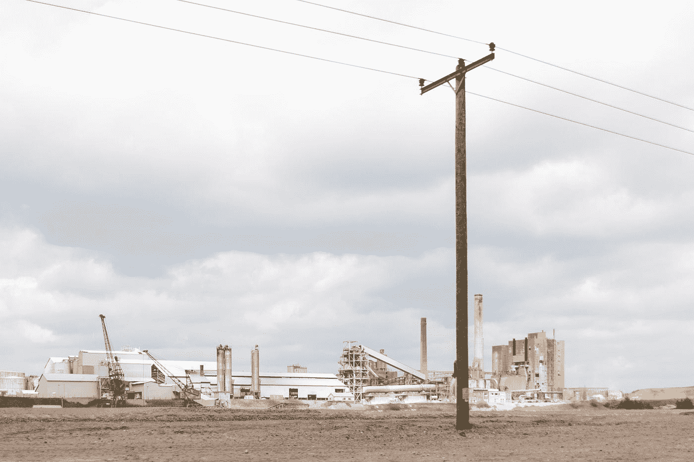

# 当电报线路着火时——卡林顿事件

> 原文：<https://medium.com/geekculture/when-the-telegraph-lines-caught-fire-the-carrington-event-866f9dcbcbf4?source=collection_archive---------36----------------------->

Photo by [Dimitry Anikin](https://unsplash.com/@anikinearthwalker?utm_source=medium&utm_medium=referral) on [Unsplash](https://unsplash.com?utm_source=medium&utm_medium=referral)

1859 年 8 月 28 日，美国各地的电报线路中断。匹兹堡的赛车场真的火了。在华盛顿特区，一位名叫弗雷德里克·w·罗伊斯的操作员感到非常震惊。文件着火了。

9 月 2 日，又发生了一次，只不过更糟。在波士顿，员工们不用电线就能把信息传送到波特兰。