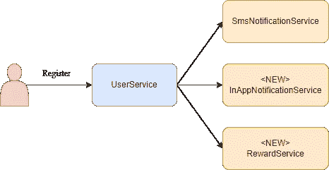

# 当他们谈论 MQ 时，他们指的是什么？

> 原文：<https://medium.com/geekculture/when-they-talk-about-mq-what-do-they-mean-343df82a89f6?source=collection_archive---------6----------------------->

我想你推出了一款新应用。

在你的努力下，这个应用吸引了越来越多的用户。一切顺利，你在应用程序中引入了更多功能。

例如，对于注册过程，您的应用程序调用 UserService 不仅发送 SMS，还向用户推送通知和奖励积分。

