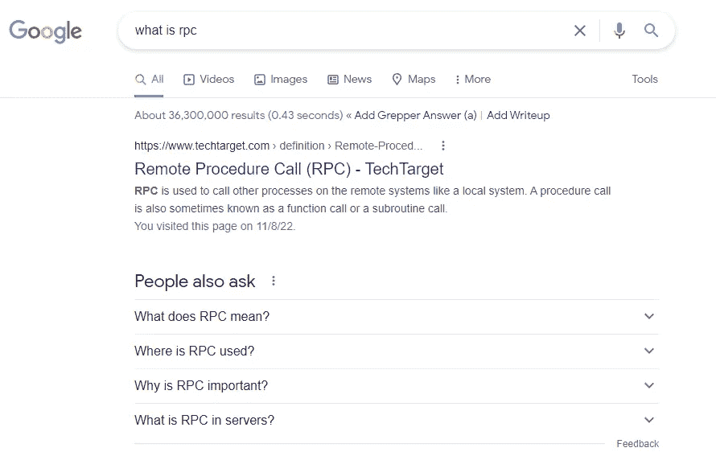

# 当他们谈论 RPC 时，他们指的是什么？

> 原文：<https://medium.com/geekculture/when-they-talk-about-rpc-what-do-they-mean-8c9f91b5089b?source=collection_archive---------7----------------------->

你点击进入这篇文章可能是因为你有和标题所说的一样的疑问。

当我听到同事谈论 RPC 时，我也有同样的问题。

我试图谷歌“什么是 RPC”，这是什么显示。

> 远程过程调用是一个软件通信协议，一个程序可以用它来从一个应用程序请求服务