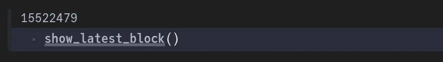
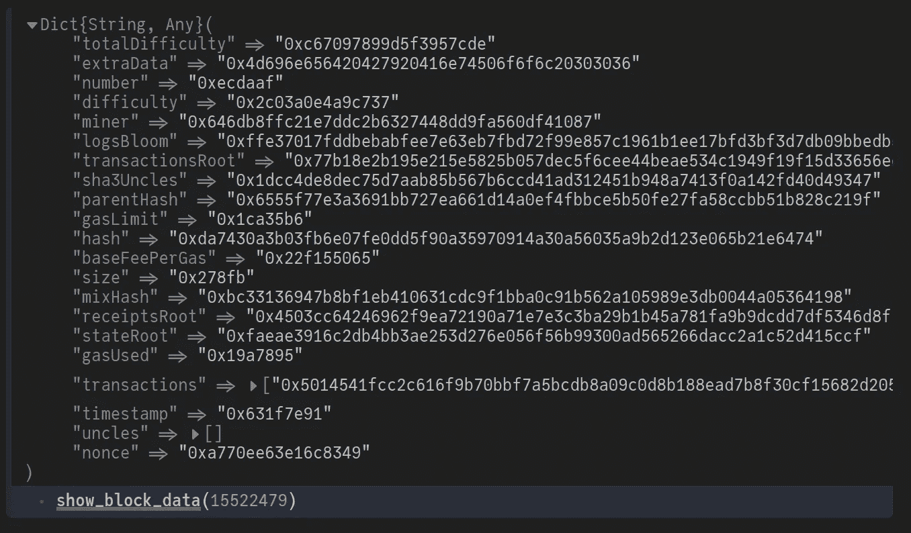
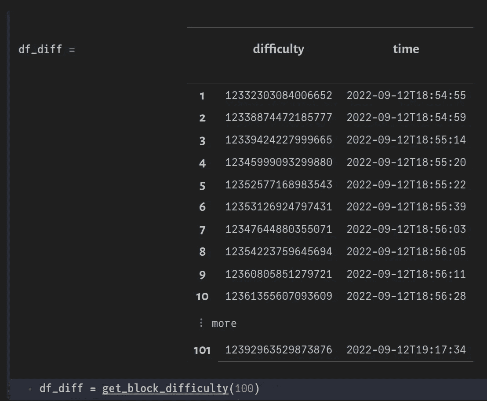
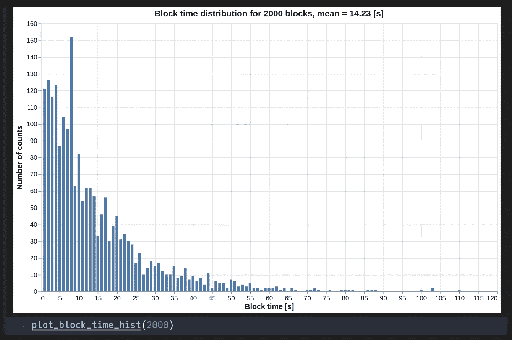
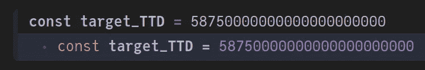
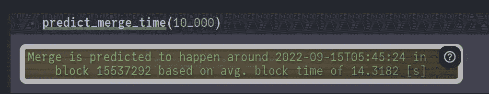

# 以太坊什么时候会“合并”？

> 原文：<https://medium.com/geekculture/when-will-the-ethereum-merge-happen-58b80babdf16?source=collection_archive---------13----------------------->

## 用几行 Julia 代码做出你自己的预测


Photo by [SpaceX](https://unsplash.com/@spacex?utm_source=medium&utm_medium=referral) on [Unsplash](https://unsplash.com?utm_source=medium&utm_medium=referral)

到这个时候，你们中的许多人可能已经[读过](https://cointelegraph.com/news/google-gets-in-on-ethereum-merge-excitement-with-nifty-easter-egg)或者至少听说过“[合并](https://www.coinbase.com/ethereum-merge)”。这被广泛认为是以太坊网络最重要的升级，对整个区块链生态系统具有潜在的深远影响。长话短说，在“合并”成功完成后，以太坊将从目前的工作证明(PoW)转向利益证明(PoS)共识机制。为了了解这一切意味着什么，我强烈建议你阅读以太坊基金会的详细的[博客](https://ethereum.org/en/upgrades/merge/#what-is-the-merge)。

我们怎么知道合并会在什么时候发生？一旦当前以太坊网络达到**终端总难度(TTD)**587500000000000000000，合并将被激活。这是一个巨大的数字！TTD 是网络中所有累积难度的度量。它是通过简单地将当前块之前的所有块难度相加来计算的。如果我们知道当前的 TTD，预测何时会发生合并只是外推当前数据的问题。当然，现实世界从来没有那么简单。然而，为了本文的目的，我们将做一个简单的线性外推。

# TL；速度三角形定位法(dead reckoning)

根据最后 10，000 个数据块的平均网络难度，预计合并将发生在 2022 年 9 月 15 日 05:45 UTC。

# 先决条件

和往常一样，我们将使用 Julia 对以太网进行 API 调用。最好运行我们自己的本地节点，然后通过 JSON-RPC 接口连接到它。我对比特币做过类似的事情，记录在下面这篇文章里:

[](/geekculture/connect-to-the-bitcoin-network-using-julia-418c76fed393) [## 使用 Julia 连接到比特币网络

### 一种访问实时区块链数据的简洁方法

medium.com](/geekculture/connect-to-the-bitcoin-network-using-julia-418c76fed393) 

然而，由于时间和资源的短缺(约 1 TB 空间的快速 NVMe SSD)，我决定利用来自 [Infura](https://docs.infura.io/infura/getting-started) 的商业 API 服务。设置起来出奇的容易！你所需要做的就是注册，之后你会自动加入“核心”计划。它是免费的，每天仅限 100，000 次请求。在我看来，这已经很慷慨了，对于我们这个有趣的项目来说已经足够了。

# 添加包

我用 Julia 1.8.0 在 Pluto 笔记本(v0.19.9)上写了这段代码，但是你可以随时使用任何你自己喜欢的支持的 IDE。Pluto 内置的包管理器将处理包及其依赖项的安装。我们将使用以下内容进行 API 调用、收集数据和创建图:

```
using HTTP, JSON, DataFrames, Statistics, Dates, VegaLite
```

# 证明

在 Infura 仪表板上，您应该能够找到 mainnet URL，它将具有附加到它后面的 API 键。这就是我们所需要的。

```
const URL = "[https://mainnet.infura.io/v3/](https://mainnet.infura.io/v3/ce5a9344b4a34df2877d6e38e5ec8ef6)YOUR_API_KEY"
```

# 创建一个 HTTP 请求

我们需要创建一个 HTTP 请求，它遵循一定的结构。请求需要一个带有特定参数的主体。下面的函数给出了一个物体通常是什么样子的例子:

“RPC_name”是一个定义方法的输入参数，它反过来控制我们想要获得的信息类型。“params”是附加参数，它也取决于我们使用的方法。上面的 URL 和正文被组合成一个请求，如下所示:

如果一切顺利，请求应该返回一个有效的响应，然后被解析成一个 Julia dict。让我们测试我们的 API！

# 测试 API

我们可以使用“eth _ block number”RPC 方法来找出最新的块号。在下面的函数中，我们发出一个 HTTP 请求来获取该信息:

注意，根据[约定](https://ethereum.org/en/developers/docs/apis/json-rpc/#eth_blocknumber)，数量(数字、整数)被编码为十六进制，并以“0x”为前缀。这意味着需要过滤块号十六进制字符串(删除前导“0x”)，然后将其解析为一个整数供我们读取。



Block number around 20:46, Sep 12, 2022

# 收集块数据

与前面的例子类似，我们可以使用“eth_getBlockByNumber”方法来获取特定块的数据。

注意，如前所述，块号需要转换成十六进制字符串，前缀为“0x”。生成的字典如下所示:



您可以验证所有十六进制编码的条目确实以“0x”为前缀。我们对“总难度”、“难度”和“时间戳”特别感兴趣。这些名字是不言自明的，但是要记住，这个程序块的 TTD 等价于总难度。

我们现在将收集给定块数的历史数据块数据。结果可以存储在数据帧中，如下所示:

注意，时间戳是 Unix 纪元，所以应该转换成 Julia 的 DateTime 对象。



Sample DataFrame with block difficulty and timestamps

因为我们知道时间戳，所以我们也可以计算连续块之间的间隔。

# 闭塞时间分布

以太坊网络中的平均块生成时间约为 14 秒。让我们看看最后 2000 个块的分布情况。我们将使用优秀的 [VegaLite.jl](https://www.queryverse.org/VegaLite.jl/stable/gettingstarted/tutorial/) 软件包绘制数据。



Checked around 21:14, Sep 12, 2022

平均阻塞时间确实是~ 14 s，这对我们文章的下一部分至关重要。

# 到达极限难度的时间(TTD)

到目前为止，我们已经了解了如何收集块难度数据和计算平均块生成时间。对于当前块，我们可以查询“总难度”，如下所示:

目标 TTD 也为我们所知。更多信息见[此处](https://ethmerge.com/)。



我们现在需要做的就是估计到达**目标 _TTD** 所需的时间。我们通过首先估计到达 TTD 所需的块数来得出这个结论。简单来说，那就是:

```
blocks_to_go = (target_TTD - current_TTD)/avg_block_diff
```

其中 **avg_block_diff** 可以通过收集历史难度数据来计算，如前所示。因此，到达目标 TTD 的时间是:

```
time_to_go = blocks_to_go * avg_block_time
```

其中 **avg_block_time** 也可以使用历史样本确定(通常约 14 秒)。所有这些都集中在以下函数中:

使用过去 10，000 个街区的历史数据，我们得到了以下结果:



时间以 UTC 表示。我们的合并块估计值(15，537，292)与另一个值(15，537，351)非常接近，详细信息可以在[这里](https://www.ethernodes.org/merge)找到。

在本文中，我们做了一个简单的线性外推来确定合并将在何时发生。实际上，准确的时间会有所不同，因为封锁的难度会根据网络哈希表进行调整。不过，我希望你今天学到了一些有趣的东西。感谢您的宝贵时间！在 LinkedIn 上与我联系，或者访问我的 Web 3.0 网站。

# 参考

1.  [https://ethresear.ch/t/predicting-ttd-on-ethereum/12742/1](https://ethresear.ch/t/predicting-ttd-on-ethereum/12742/1)
2.  [https://ethmerge.com/](https://ethmerge.com/)
3.  [https://ethereum.org/en/upgrades/merge/#what-is-the-merge](https://ethereum.org/en/upgrades/merge/#what-is-the-merge)