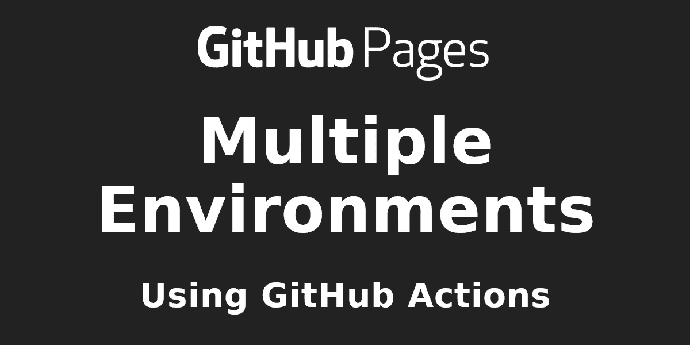
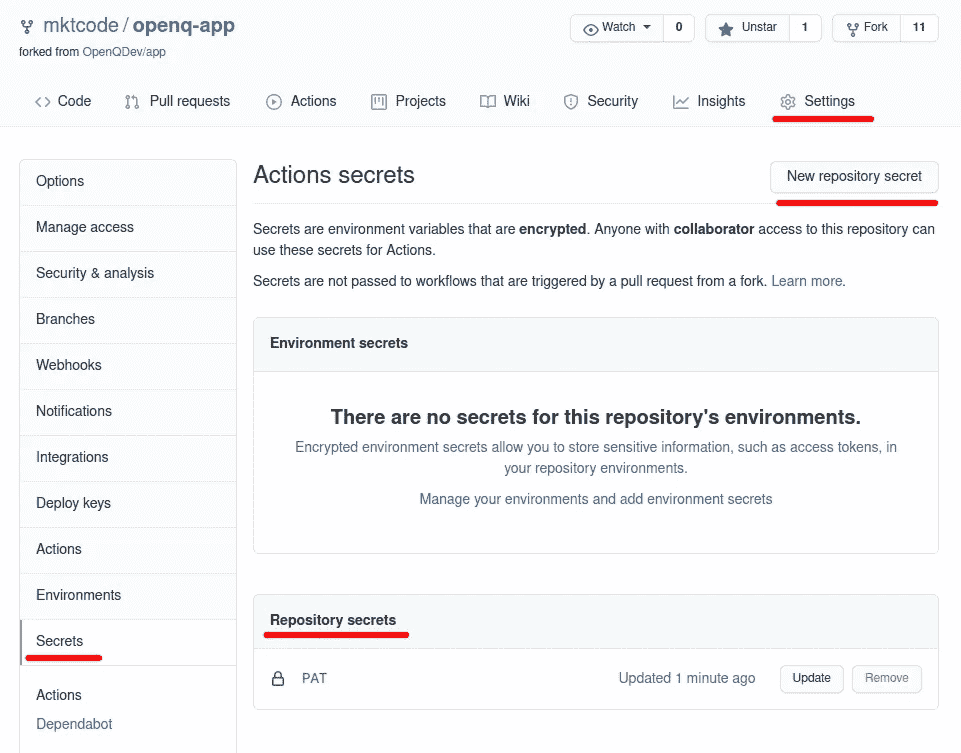
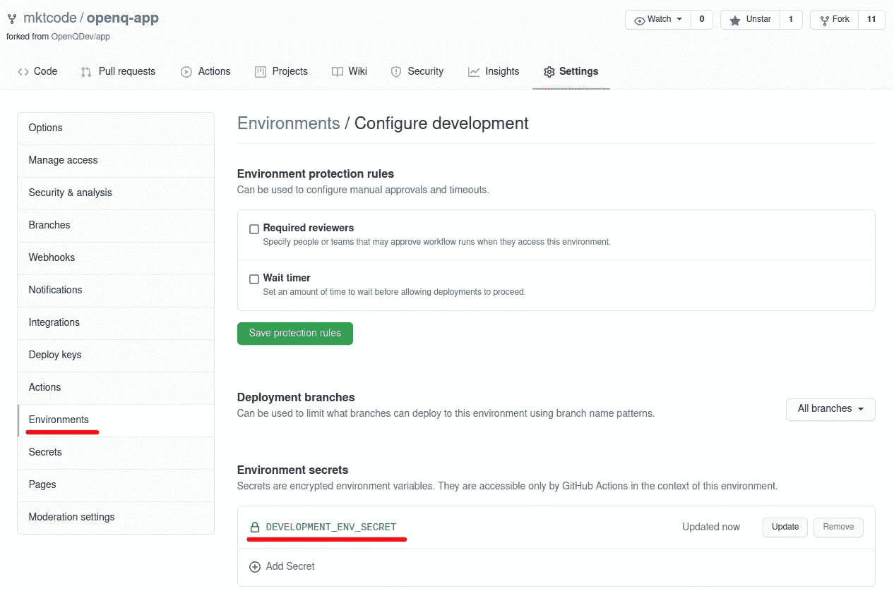
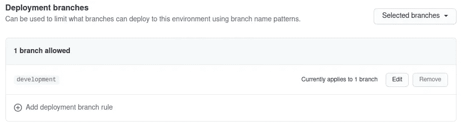
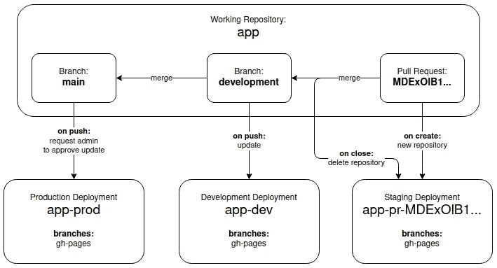
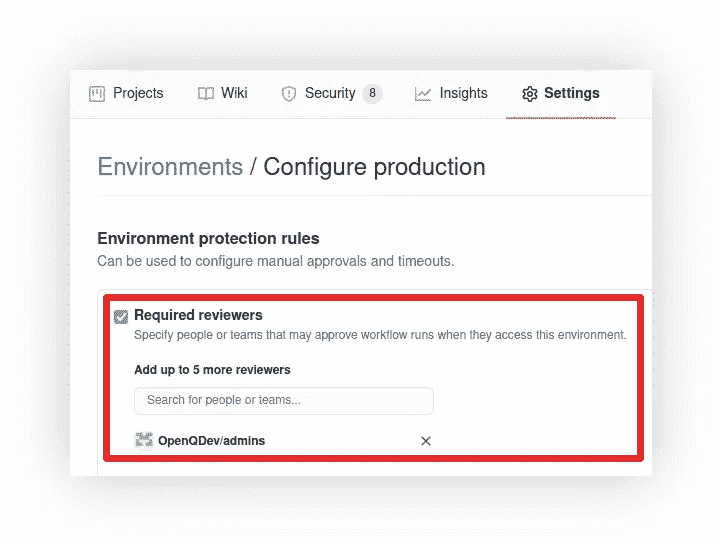
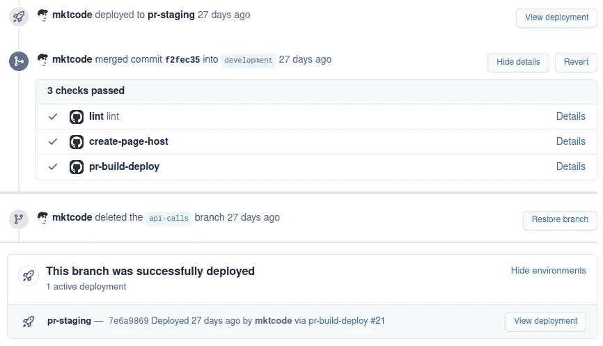

# 具有 GitHub 页面的多个环境

> 原文：<https://medium.com/geekculture/when-youre-working-on-a-static-site-and-github-pages-feels-like-the-perfect-hosting-solution-a41c37f4e326?source=collection_archive---------3----------------------->



# 或者…当你在一个静态网站上工作，GitHub Pages 感觉是完美的托管解决方案，因为你喜欢在一个地方拥有一切，然后你意识到你需要一个额外的环境，但你仍然不想使用除 GitHub 之外的任何东西…下面是你可以做的。

*这是一篇“特殊需求”的文章，但也是对 GitHub Actions 的一般介绍。*

**截至 2022 年，medium.com 要求您拥有至少 100 名粉丝才有资格加入合作伙伴计划。在写这篇文章的时候，我有 13 个。所以如果你觉得这篇文章有帮助或者有趣，请考虑关注我。谢谢！**

自从单页应用程序出现以来，对主机的要求已经降到了最低。任何可以服务于静态 HTML 文件的东西都可以很好地完成这项工作，而被 Javascript 狂轰滥炸的浏览器则承担了繁重的工作。当然，高可用性和安全性是一个完全不同的话题，但在这种情况下，我相信 GitHub 已经涵盖了您。

GitHub 为托管这样的应用程序提供了非常方便的服务。您推送到您的存储库，GitHub 会为您更新部署。你甚至可以得到一个类似`username.github.io`的漂亮的子域，或者你可以连接自己的域。只有一个缺点。

如果您的项目不仅仅是一个非常静态的网站，而是一个实际的“应用程序”，并且您正在与其他人一起工作，那么您可能希望有多个部署，比如开发和登台环境。问题是…GitHub 上的一个存储库只能有一个 GitHub 页面实例，你可能不想为你的每个环境维护一个镜像存储库，所以你最终会使用外部托管服务，然后你开始质疑 GitHub 页面作为你的首选托管解决方案。在这篇文章中，我将向你展示我是如何做到“留在 GitHub 上”的。

# GitHub 操作和工作流程

GitHub 不仅提供免费托管，还提供免费且非常灵活和强大的工作流自动化 [GitHub 操作](https://github.com/features/actions)。如果您还不熟悉 CI/CD 和 GitHub 操作，我建议您尽快更改。我忽略这个话题太久了，但现在我是一个超级粉丝。它只是给了你超能力。

我会试着给你一个简短而有效的介绍:

GitHub 运行[虚拟机](https://github.com/actions/virtual-environments)，作为你项目的任务运行器。这些任务既可以作为 cronjob 按计划运行，也可以由 GitHub 上发生的事件触发[，比如将提交推送到分支、打开或关闭问题或对它们进行评论，等等。这些任务可以由多个步骤组成，这些步骤可以链接在一起并且相互依赖，因此有了术语*工作流*。术语如下:*工作流*有一个或多个*作业*，每个作业有一个或多个*步骤*，可以利用一个*动作*，可以有*输入*和*输出*。](https://docs.github.com/en/actions/reference/events-that-trigger-workflows)

可以说，动作是组成工作流的“原子”。动作是 GitHub 上的一个存储库，包含一个`action.yml`文件，描述它的输入和输出。这意味着一个动作基本上可以做任何你想做的事情。值得一提的是，您实际上根本不需要在工作流中使用操作。您也可以在运行工作流的操作系统上运行任意命令，有时这就是您所需要的。你可以简单地把 GitHub 工作流想象成在 GitHub 按需为你生成的虚拟机上“执行东西”。

要添加新的工作流，您需要在存储库的`.github/workflows`目录中添加一个 YAML 配置文件。GitHub 会自动获取并根据您配置的条件运行它。下面这个`hello-world.yml`展示了可能是最简单也是最没用的工作流程:

```
name: Hello World
on:
  schedule:
    - cron: '0 0 * * *'
jobs:
  hello-world:
    runs-on: ubuntu-latest
    steps:
      - run: echo Hello World!
```

*(我不会在本文中讨论 YAML 格式，但我会告诉你破折号代表数组中的项目，如果没有破折号，你就在处理对象键。如果有破折号后面跟着…没有破折号…那就是一个对象数组。与普通的 JSON 不同，它支持单引号和注释。所有没有被引用的都被认为是一个字符串，除非它显然不是一个字符串。* [*YAML 是 JSON 的超集。*](http://yaml.org/spec/1.2/spec.html#id2759572) *等等…我刚才是不是…反正…)*

每天 0:00，这个工作流运行一次并输出“Hello World！”某个虚拟 Ubuntu 机器的 *stdout* ，GitHub 网络中的某个地方。它不使用任何动作，而是运行一个 *echo* 命令。一个单独的步骤既可以*运行*命令，也可以*使用*一个动作。

```
jobs:
  hello-world:
    runs-on: ubuntu-latest
    steps:
      - uses: hello-world/say-action@v1
        with:
          say: Hello World!
```

您可以通过使用带有关键字的*来设置动作的输入(如果有的话)。我本想称之为*输入*，但谁在乎呢。*

## 输出和从属作业

如果操作有输出，您可以在同一作业的连续步骤中使用它们。具有输出的步骤只需要一个被其他步骤引用的 *id* 。

```
jobs:
  hello-world:
    runs-on: ubuntu-latest
    steps:
      - id: get-name
        uses: hello-world/get-name-action@v1 # has a "name" output
      - uses: hello-world/greet-action@v1        
        with:
          name: ${{ steps.get-name.outputs.name }}
```

要使一个作业依赖于前一个作业，从而允许它使用自己的输出，您必须指定哪些输出是可用的，然后定义一个数组 *"needs"* 。

```
jobs:
  get-name:
    runs-on: ubuntu-latest
    outputs:
      name: ${{ steps.get-name.outputs.name }}
    steps:
      - id: get-name
        uses: hello-world/get-name-action@v1 # has a "name" output say-name:
    runs-on: ubuntu-latest
    steps:
      - uses: hello-world/greet-action@v1        
        with:
          name: ${{ steps.get-name.outputs.name }}
```

## 秘密与环境

有时您需要使用凭证，如 API 密钥，并且您不想在工作流文件中直接公开这样的值。在你的存储库设置中，你会发现一个叫做“秘密”的部分。



您可以在这里定义这些值，并在工作流程中使用它们，如下所示。

```
steps:
  - run: echo ${{ secrets.SECRET_STRING }}
```

还可以在 GitHub 上为整个组织定义秘密(转到它的设置，然后选择“秘密”)，在该组织的所有存储库中的所有工作流中都可用。另一方面，您也可以进一步限制对机密的访问。这就是[环境](https://docs.github.com/en/actions/reference/environments)的作用。把它们想象成某个知识库中的秘密“类别”。



您可以[告诉工作流作业它可以访问什么环境的秘密](https://docs.github.com/en/actions/reference/workflow-syntax-for-github-actions#jobsjob_idenvironment)。假设您已经在存储库的设置中创建了一个名为 *development 的环境。*

```
jobs:
  hello-world:
    runs-on: ubuntu-latest
    environment: development
    steps:
      - run: echo ${{ secrets.DEVELOPMENT_ENV_SECRET }}
```

在环境设置中，您将看到访问权限也可以限制在某些分支，因此只有由与匹配分支相关的事件触发的工作流才能访问环境的机密，并且您还可以要求管理员在这些工作流实际运行之前批准它们。



我们将在本文后面使用它。

在消化了这些浓缩的信息后，你应该对这些工作流程的功能和灵活性有所了解，你基本上可以做任何你能想象到的事情。例如，我正在使用它们将加密货币支付集成到 GitHub 上的部署管道中，但这是一个绝密项目，你最好现在就从你的记忆中抹去这些信息。好吗？很好。谢了。

如果你想自己更深入地研究 GitHub 动作，浏览[文档](https://docs.github.com/en/actions)，如果你想开始尝试，我建议你在书签中添加 GitHub 动作的[工作流语法和触发工作流](https://docs.github.com/en/actions/reference/workflow-syntax-for-github-actions)的[事件。](https://docs.github.com/en/actions/reference/events-that-trigger-workflows)

## 注意:在非官方/未经证实的行动中使用秘密时，请注意安全！

如前所述，动作可以接受输入。这些输入可以是秘密。一个常见的例子是 Docker:

```
jobs:
  build-and-push-docker-image:
    runs-on: ubuntu-latest
    steps:
      - name: Login to DockerHub
        uses: docker/login-action@v1 
        with:
          username: ${{ secrets.DOCKERHUB_USERNAME }}
          password: ${{ secrets.DOCKERHUB_TOKEN }}
```

这里使用的动作是[*docker/log in-action*](https://github.com/marketplace/actions/docker-login)*，*这是一个已验证的动作:


您使用的操作版本由末尾的`@v1`指定，它是一个分支或标记名。现在，Docker 可能是一个值得信任的作者，但即使是值得信任的组织也可能不时会有新的团队成员，有时新的团队成员不如他们刚加入的组织的其他成员值得信任，安全策略有时更像是一种理论。无论如何…至少在处理未验证的动作时，你需要注意一件事(如果你还不知道的话):

## **标签引用的编码可以改变！**

这意味着:一个行动，你把你的一个秘密，今天可能是你最好的朋友，明天窃取你最秘密的秘密，甚至在你不知道的情况下，把它们透露给你最大的敌人，他们正在浏览黑暗的网络，寻找最新的黑客和泄漏！

如果有任何疑问，请通过提交哈希引用操作，如下所示:

```
- name: Login to shady service
  uses: trustme/spy-action@172239021f7ba04fe7327647b213799853a9eb89
  with:
    password: ${{ secrets.SUPER_SECURE_PASSWORD }}
```

**和**确保提交散列所引用的代码实际上做了自述文件所说的事情。如果你不…好吧…那就用标签名。你已经被警告过了(医生也警告过了)。

# 我的 GitHub 页面场景

现在，您应该已经熟悉了 GitHub 的动作和工作流以及其他一切，我将最终进入我的具体现实场景，其中几个工作流管理多个 GitHub Pages 实例，代表我正在开发的应用程序的不同环境。

我需要三种表现如下的环境:

*   **制作**:用户会实际使用的 app。在推送到主分支机构时更新，需要管理员批准。
*   **开发**:最新开发进度预览。关于推进发展处的最新情况。
*   **暂存**:“凤凰”部署，为来自功能分支的拉请求创建，并在关闭时删除，包括合并。

主库名为“*app”*，没有自己的 GitHub 页面。取而代之的是两个额外的存储库，“*app-prod”*和“*app-dev”*。我在开头提到过，你肯定不想维护任何镜像存储库，这就是为什么这些存储库只保存应用程序的一个版本，并启用它们的 GitHub 页面。这是他们唯一的目的。此外，开发分支上的每个拉请求都会产生一个名为*“app-pr-<ID of pull request>”的新存储库。*这里有一个可视化的例子:



Changes flow from pull requests to the development branch to the main branch.

## 工作流:开发构建和部署

让我们从开发部署开始，因为它是最直接的，没有任何额外的东西。看一下[这个工作流程文件](https://github.com/OpenQDev/app/blob/715573cd6ceebe87e7e235180510eaacacb7d74a/.github/workflows/deploy-dev.yml)，然后我会一步一步地指导你。事情的要点是，我们检查存储库，构建应用程序，并将该构建推送到 *app-dev* 存储库。

**1。)**当新的提交被推送到开发分支时，工作流运行，但不针对仅影响工作流文件本身或任何 markdown 文件的更改:
[https://github . com/open qdev/app/blob/715573 CD 6 CEE be 87 e 7 e 235180510 e aacacb 7d 74 a/。github/workflows/deploy-dev . yml # L2-L7](https://github.com/OpenQDev/app/blob/715573cd6ceebe87e7e235180510eaacacb7d74a/.github/workflows/deploy-dev.yml#L2-L7)

**2。)**我们将连接到 *app-dev* 存储库的 GitHub 页面的 URL 设置为全局环境变量，以便稍后在工作流中使用:
[https://GitHub . com/open qdev/app/blob/715573 CD 6 CEE be 87 e 7 e 235180510 e aacacb 7d 74 a/。github/workflows/deploy-dev . yml # L8-L9](https://github.com/OpenQDev/app/blob/715573cd6ceebe87e7e235180510eaacacb7d74a/.github/workflows/deploy-dev.yml#L8-L9)

**3。)**实际上只有一个作业，有很多步骤，运行在一个 *ubuntu-latest* 虚拟机上，使用我们在存储库设置中为我们的开发环境配置的秘密:
[https://github . com/open qdev/app/blob/715573 CD 6 CEE be 87 e 7 e 235180510 ea cacb 7d 74 a/。GitHub/workflows/deploy-dev . yml # L11-L16](https://github.com/OpenQDev/app/blob/715573cd6ceebe87e7e235180510eaacacb7d74a/.github/workflows/deploy-dev.yml#L11-L16)

**4。)**我们使用[一个官方动作](https://github.com/actions/setup-node)(动作由*动作* GitHub 组织提供)在 VM 上准备 node . js:
[https://GitHub . com/open qdev/app/blob/715573 CD 6 CEE be 87 e 7 e 235180510 e aacacb 7d 74 a/。github/workflows/deploy-dev . yml # L18-L19](https://github.com/OpenQDev/app/blob/715573cd6ceebe87e7e235180510eaacacb7d74a/.github/workflows/deploy-dev.yml#L18-L19)

**5。)**我们使用普通的 Git 命令将 GitHub Actions bot 设置为提交作者，因为稍后我们将提交和推送更改到一个存储库:
[https://GitHub . com/open qdev/app/blob/715573 CD 6 CEE be 87 e 7 e 235180510 e aacacb 7d 74 a/。github/workflows/deploy-dev . yml # L22-L25](https://github.com/OpenQDev/app/blob/715573cd6ceebe87e7e235180510eaacacb7d74a/.github/workflows/deploy-dev.yml#L22-L25)

6。)我们使用[官方检出动作](https://github.com/actions/checkout):
[https://github . com/open qdev/app/blob/715573 CD 6 CEE be 87 e 7 e 235180510 ea cacb 7d 74 a/，将存储库检出到一个*构建*目录。github/workflows/deploy-dev . yml # L27-L30](https://github.com/OpenQDev/app/blob/715573cd6ceebe87e7e235180510eaacacb7d74a/.github/workflows/deploy-dev.yml#L27-L30)

7 .**。)**我们进入这个*构建*目录，在设置了一些环境变量之后，实际构建 app(顺便说一下，是一个 [Nuxt.js](https://nuxtjs.org/) app)。然后我们再移回父目录:
[https://github . com/open qdev/app/blob/715573 CD 6 CEE be 87 e 7 e 235180510 ea cacb 7d 74 a/。github/workflows/deploy-dev . yml # L32-L41](https://github.com/OpenQDev/app/blob/715573cd6ceebe87e7e235180510eaacacb7d74a/.github/workflows/deploy-dev.yml#L32-L41)
**参考消息:**导出的环境变量在作业/步骤之间不是持久的，不要与[工作流的环境变量](https://docs.github.com/en/actions/reference/workflow-syntax-for-github-actions#env)(第 9 行)混淆，后者在整个工作流中都可用。

**8。)**现在，我们将 *app-dev* 存储库签出到 *deploy* 目录，这一次还提供了一个个人访问令牌作为密码。这允许 as 在下一步将更改推送到那个存储库:
[https://github . com/open qdev/app/blob/715573 CD 6 CEE be 87 e 7 e 235180510 aacacb7d 74 a/。github/workflows/deploy-dev . yml # L43-L48](https://github.com/OpenQDev/app/blob/715573cd6ceebe87e7e235180510eaacacb7d74a/.github/workflows/deploy-dev.yml#L43-L48)

9。)然后我们简单地将文件从 *build* 目录复制到 *deploy* 目录，导致我们需要提交和推送的存储库中的更改:
[https://github . com/open qdev/app/blob/715573 CD 6 CEE be 87 e 7 e 235180510 aacacb 7d 74 a/。github/workflows/deploy-dev . yml # L50-L58](https://github.com/OpenQDev/app/blob/715573cd6ceebe87e7e235180510eaacacb7d74a/.github/workflows/deploy-dev.yml#L50-L58)
**FYI:**[第 54 行和第 55 行](https://github.com/OpenQDev/app/blob/715573cd6ceebe87e7e235180510eaacacb7d74a/.github/workflows/deploy-dev.yml#L54-L55)添加 GitHub 页面正常工作所需的文件。我们禁用 Jekyll 作为 GitHub 的默认静态站点生成器(我们自己使用 Nuxt 来处理)，并配置我们希望连接到开发部署的域。

**搞定！**

这不是超级简单和直观吗？:D，我并不是说这是最聪明和最有效的方法。但我希望它足够容易理解。让我们继续生产部署。

## 工作流:生产构建和部署

看一看[工作流文件](https://github.com/OpenQDev/app/blob/715573cd6ceebe87e7e235180510eaacacb7d74a/.github/workflows/deploy-prod.yml)，你会注意到它……非常相似。唯一的区别是[这个工作流的分支“监听”](https://github.com/OpenQDev/app/blob/715573cd6ceebe87e7e235180510eaacacb7d74a/.github/workflows/deploy-prod.yml#L4)，[部署 URL](https://github.com/OpenQDev/app/blob/715573cd6ceebe87e7e235180510eaacacb7d74a/.github/workflows/deploy-prod.yml#L9) ，[环境](https://github.com/OpenQDev/app/blob/715573cd6ceebe87e7e235180510eaacacb7d74a/.github/workflows/deploy-prod.yml#L15)，两个[在构建应用程序时使用的 env 变量](https://github.com/OpenQDev/app/blob/715573cd6ceebe87e7e235180510eaacacb7d74a/.github/workflows/deploy-prod.yml#L37-L38)和[部署存储库](https://github.com/OpenQDev/app/blob/715573cd6ceebe87e7e235180510eaacacb7d74a/.github/workflows/deploy-prod.yml#L46)。然而，更重要的区别是存储库设置中的环境配置。它将允许此工作流仅在管理员批准后运行。



我认为这就是关于生产部署的全部内容，我们可以看一下所有这些内容中最有趣的部分。拉请求。

## 工作流:拉式请求构建和部署

同样，首先浏览[工作流文件](https://github.com/OpenQDev/app/blob/715573cd6ceebe87e7e235180510eaacacb7d74a/.github/workflows/deploy-pr.yml)，试着自己理解它，然后我会解释这里有什么不同。

最重要的是，这个部署还没有存储库。我们必须从工作流程中创建它。为了让存储库有一个惟一的名称，我们获取拉请求的 graph QL ID:
[https://github . com/OpenQDev/app/blob/715573 CD 6 CEE be 87 e 7 e 235180510 ea cacb 7d 74 a/。github/workflows/deploy-pr . yml # L9-L10](https://github.com/OpenQDev/app/blob/715573cd6ceebe87e7e235180510eaacacb7d74a/.github/workflows/deploy-pr.yml#L9-L10)
**参考消息:**`github`变量允许您访问工作流运行的上下文，例如触发它的事件，包括拉请求对象本身。

有一个单独的作业创建存储库，使用我创建的特殊操作:
[https://github . com/OpenQDev/app/blob/715573 CD 6 CEE be 87 e 7 e 235180510 aacacb 7d 74 a/。github/workflows/deploy-pr . yml # L13-L21](https://github.com/OpenQDev/app/blob/715573cd6ceebe87e7e235180510eaacacb7d74a/.github/workflows/deploy-pr.yml#L13-L21)

你可以看一下动作本身，看看到底发生了什么:
[https://github . com/mkt code/create-repository-action/blob/B1 DD 3 b 3 DCD cc 491795 AE 189 db 97383 a 47 f 04808 e/index . js # L6-L29](https://github.com/mktcode/create-repository-action/blob/b1dd3b3dcdcc491795ae189db97383a47f04808e/index.js#L6-L29)

下一个作业依赖于正在创建的存储库，并使用 *pr-staging* 环境:
[https://github . com/open qdev/app/blob/715573 CD 6 CEE be 87 e 7 e 235180510 ea cacb 7d 74 a/。github/workflows/deploy-pr . yml # L23-L28](https://github.com/OpenQDev/app/blob/715573cd6ceebe87e7e235180510eaacacb7d74a/.github/workflows/deploy-pr.yml#L23-L28)

从那以后，它与开发和生产工作流程非常相似。唯一缺少的是删除存储库，一旦拉请求被合并/关闭。这在[一个单独的工作流程](https://github.com/OpenQDev/app/blob/715573cd6ceebe87e7e235180510eaacacb7d74a/.github/workflows/delete-deploy-pr.yml)中处理。它使用了我创造的另一个特殊动作。

现在，您可以让 pull 请求[像这个](https://github.com/OpenQDev/app/pull/134)一样使用它们自己的自动部署来测试合并前的变更。



**事实上就是这样！我们完了。**我们现在有一个静态站点项目，有多个环境，完全位于 GitHub 上。这只是一种可能的配置，我敢肯定这种配置远非完美。事实上，我正在做一些改进。所以也许我会很快更新这篇文章。但是我希望你对 GitHub 动作和工作流的可能性有所了解，并且现在开始为你自己的目的试验和创建你自己的动作和工作流。

## **感谢阅读！**

*可以关注我的* [*Twitter*](https://twitter.com/@thecodelander) *和*[*GitHub*](https://github.com/mktcode)*。如果你打算成为中等会员，可以使用我的推荐页面支持我:*[*https://markus-kottlaender.medium.com/membership*](https://markus-kottlaender.medium.com/membership)