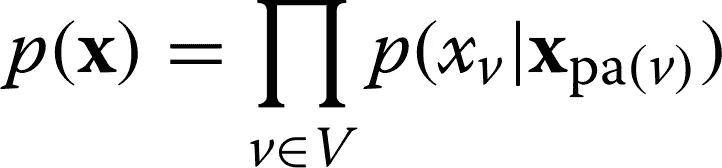
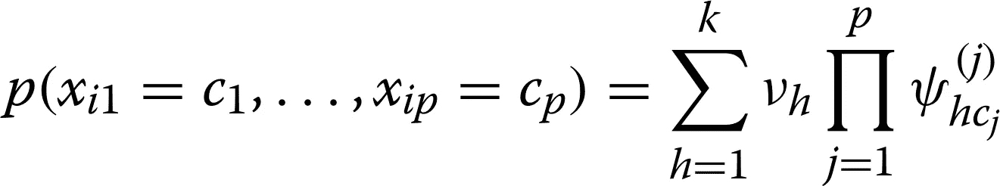

# 当你不得不假装的时候

> 原文：<https://medium.com/geekculture/when-youve-got-to-fake-it-2e78169fa617?source=collection_archive---------27----------------------->

用于合成患者数据生成的常用方法

hoto by [**Teona Swift**](https://www.pexels.com/@teona-swift?utm_content=attributionCopyText&utm_medium=referral&utm_source=pexels) from [**Pexels**](https://www.pexels.com/photo/ball-of-thread-on-blur-textile-6850496/?utm_content=attributionCopyText&utm_medium=referral&utm_source=pexels)

任何东西都会有替代品——一句印度尼西亚谚语

我们每个人都经历过不愉快的经历，按照医生的命令去医院或诊所，或者健康恐慌，或者纯粹的偏执狂。除了焦虑和思考最坏的情况，这个过程的一个主要部分是我们成为他们记录的一部分。我们的姓名、出生日期、病史、职业或性史(因地点和健康问题而异)、身体统计数据，有时还有种族成为他们记录中的一项。虽然所有这些信息都有助于未来的顺利访问，但你也应该记住，这些信息现在可以被分析师用于研究。如果对你的身体统计数据或种族的分析可以帮助识别针对你的人口统计学的常见健康问题，这不是很好吗？或者，您可能会收到个性化的健康检查建议，因为您的属性被确定为需要它们，例如，一位 35 岁左右的女性可能想知道巴氏涂片的可能折扣。

虽然您出于信任或有时出于无知将您的信息用于此类用途，但保护您的隐私是您数据的新所有者的责任。您在健康记录中的隐私非常重要，因为它可能涉及不应与非预期方共享的敏感信息。此外，您的数据不一定由所有者自己处理和分析，而是由保管人和分析师处理和分析。还记得[在数据隐私生态系统中扮演不同角色的利益相关者](/geekculture/where-do-you-stand-in-the-data-privacy-ecosystem-2e499d94a67d)吗？

数据所有者通常会在将敏感的患者数据提供给其他人之前对其进行去识别或匿名处理。这些措施可能包括删除姓名和地址等可识别特征，向出生日期等属性添加噪声，或将变量分组为更广泛的类别，以确保每个类别中有不止一个人，如将年龄转换为几十年的年龄组。虽然仅包含在适当匿名化的数据中的剩余信息可能无法用于重新识别个人身份，但一旦与其他数据集(如社交媒体平台)相关联，这些信息可能包含足以识别特定个人的信息。由于攻击者掌握了更好的技术和计算资源，很难保证在发布的数据中防止对单个患者的重新识别。

研究人员一直在研究合成生成的数据，以便作为数据主体的你可以在晚上睡得更好(至少在涉及到你的健康记录的隐私时)。虽然**合成数据**又名代理或虚假数据**在保护个人隐私方面具有巨大潜力**，但它也提供了其他好处。当真实数据昂贵、稀缺或根本无法用于研究时，它可能是一个有价值的工具。最近的疫情·新冠肺炎事件就是这样一个不为人知的例子。合成数据还可以用于各种次要用途，例如教育或培训目的、软件测试、机器学习和统计模型开发。

如果合成数据生成引起了数据科学家的兴趣，请继续阅读。

高质量合成数据的三个标准是:

*   个体样本水平的保真度，例如，合成数据不应包括男性患者的妊娠状态/历史，
*   群体层面的保真度，例如特征的边缘和联合分布，以及
*   隐私披露

既然我们已经对预期进行了分类，让我们看看合成数据是如何生成的。**合成数据生成大致可以分为两类:过程驱动方法和数据驱动方法**。过程驱动的方法从基础物理过程的计算或数学模型中获得合成数据。示例包括数值模拟、蒙特卡罗模拟、基于代理的建模和离散事件模拟。另一方面，数据驱动的方法从已经在真实数据上训练过的生成模型中导出合成数据。

三类数据驱动的生成方法是概率模型、基于分类的插补模型和生成式对抗性神经网络。如果您希望生成合成患者数据，那么**一些常用技术包括**:

# **从独立边缘取样**

独立边际(IM)方法基于从观察数据中每个变量的经验边际分布中取样。

*优点:*

*   这种方法计算效率高，不同变量的边际分布估计可以并行进行。

*缺点:*

*   IM 不能捕捉变量之间的统计相关性，因此生成的合成数据可能无法捕捉真实数据的底层结构。

# 贝叶斯网络

贝叶斯网络(BN)是概率图形模型，其中每个节点代表一个随机变量，而节点之间的边代表相应随机变量之间的概率依赖性。对于使用 BN 的合成数据生成，图结构和条件概率分布是从真实数据中推断的。在 BN 中，全联合分布分解为:

其中 v 是代表分类变量的随机变量的集合，xₚₐ(ᵥ是 v 的父变量的子集，其被编码在有向非循环图中。

学习过程包括两个步骤:(I)从数据中学习有向无环图，该有向无环图表达了变量之间的整个成对条件依赖，以及(ii)通过最大似然估计每个变量的条件概率表(CDP)。

*优点*:

*   BN 在计算上是高效的，并且与数据集的维度很好地成比例
*   从真实数据推断的图形结构编码了变量之间的条件依赖
*   有向非循环图也可以用于探索变量之间的因果关系

*缺点:*

*   对图形结构所做的简单假设可能无法表示更高阶的依赖性。

# 多项式乘积的混合

任何多元分类数据分布都可以表示为多项乘积的混合( **MPoM**

其中 xᵢ = (xᵢ₁，。。。xᵢₚ)表示 p 个分类变量的向量，k 是混合成分的数量，νₕ是与第 h 个混合成分相关联的权重，ψₕcⱼ是给定个体 I 到聚类 h 的分配时 xᵢⱼ = cⱼ的概率，其中 zᵢ是聚类指示符。

*优点:*

*   该方法为任何多元分类数据的建模提供了理论保证。
*   多项式乘积的狄利克雷过程混合物是完全共轭的模型，并且可以通过吉布斯采样器进行有效的推断。

*缺点:*

*   基于采样的推理在高维问题中可能非常慢。
*   虽然将模型扩展到混合数据类型(如连续数据和分类数据)相对简单，但理论上并不保证这种类型。

# 分类潜在高斯过程

分类潜在高斯过程(CLGP)是一种多元分类数据的生成模型。为了生成分类值，CLGP 使用低维连续潜在空间和非线性变换，通过 softmax 将潜在空间中的点映射到概率。为了对与癌症相关的临床数据进行建模，该模型可以将每个患者记录假设为包含一组分类变量的数据向量，该分类变量具有连续的潜在低维表示。

*优点:*

*   像 BN 和 MPoM 一样，CLGP 是一个完全生成的贝叶斯模型，但具有更丰富的潜在非线性映射，允许非常复杂的完全联合分布的表示。
*   推断出的 CLGP 低维潜在空间可用于数据可视化和聚类。

*缺点:*

*   CLGP 捕捉到的低维潜在空间的推论仍然比其他模型更复杂。
*   CLGP 的推论不适用于大数据量。

# 生成对抗网络

生成对抗网络(GANs)已经被证明在生成复杂的合成数据，如图像和文本方面非常成功。在 GANs 中，两个神经网络以竞争的方式联合训练:第一个网络试图生成真实的合成数据，而第二个网络试图区分第一个网络生成的真实和合成数据。在培训过程中，每个网络都会推动另一个网络表现得更好。

虽然这种生成使用了 gan 的固有特性，但是它们的一个众所周知的局限性是它们不能直接用于生成分类合成数据集。这是因为不可能通过反向传播来计算训练所需的潜在分类变量的梯度。由于临床患者数据通常在很大程度上是分类的，medGAN 特别应用了自动编码器来将分类数据转换到连续空间。从而使 GANs 适用于生成合成电子健康记录(EHR)。然而，就目前而言，medGAN 适用于二进制和计数数据，而不适用于多分类数据。

*优点:*

*   medGAN 是一种生成方法，不需要严格的概率模型假设，因此与 BN、CLGP 和 POM 相比，它更灵活。
*   基于 GAN 的模型可以很容易地扩展到处理混合数据类型，如连续和分类变量。

*缺点:*

*   gan 是深度模型，有非常多的参数。正确选择超参数既困难又耗时。
*   众所周知，gan 很难训练，因为求解相关的最小-最大优化问题的过程可能非常不稳定。

# 多重插补

在合成数据生成方面，基于多重插补的方法非常流行，特别是在部分数据被视为敏感的应用中。在现有的插补法中，**链式方程多元插补法(MICE)** 是一种公认的屏蔽隐私约束数据集中敏感内容的方法。关键思想是将敏感数据视为缺失数据。这种“缺失”的数据可以用随机抽样值进行估算，这些随机抽样值是根据非敏感变量训练的模型生成的。

*优点:*

*   MICE 的计算速度很快，可以扩展到非常大的数据集，包括变量和样本的数量。
*   通过为给定变量的条件概率分布适当选择 Softmax 或高斯模型，它可以很容易地处理连续值和分类值。

*缺点:*

*   虽然 MICE 是概率性的，但不能保证生成的模型是对数据的潜在联合分布的良好估计。
*   MICE 强烈依赖于条件概率分布模型的灵活性以及有向无环图的拓扑排序

现在，我们已经权衡了各种流行的方法来生成合成患者数据，希望您已经找到了最适合开始的方法。

来源:

[合成患者数据的生成和评估](https://bmcmedresmethodol.biomedcentral.com/articles/10.1186/s12874-020-00977-1)