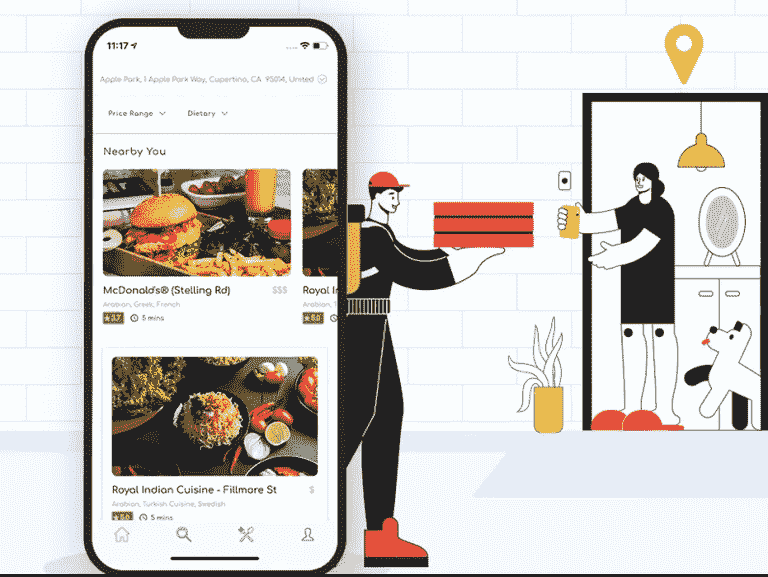

# 我在哪里可以获得 UberEats 克隆版的免费源代码？

> 原文：<https://medium.com/geekculture/where-can-i-get-the-free-source-code-for-an-ubereats-clone-app-b13b6f671b64?source=collection_archive---------13----------------------->

你可能会得到免费的源代码，但是你想过你的产品的质量吗？免费不代表就是质量。

我建议找一家已经有按需定制的 UberEats 克隆产品的移动开发公司。

WooberlyEats — UberEats Clone App

# 什么是 UberEats？

UberEats 是一个在线食品交付平台，具有令人兴奋的商业模式，将用户与餐厅联系起来，并提供用户友好的订购和交付体验。

这种商业模式被许多应用程序开发公司采用，通过克隆 UberEats 让企业家开始自己的按需食品交付市场业务。

UberEats 连接用户和服务提供商，并在配送合作伙伴的帮助下将产品和服务送到用户家门口。

此外，你难道不应该了解 UberEats 克隆应用的工业性能，以进一步思考这个商业想法吗？

# UberEats 是如何工作的？

让我们了解一下 UberEats 的工作流程；

*   用户可以在给出当前位置后使用该应用程序找到附近的餐馆。然后，从菜单中选择食物，选择必要的附加项目，并下订单。
*   一旦用户下了订单，餐馆将在他们的 web 面板中收到订单，在那里他们必须根据可用性接受/拒绝订单。
*   订单准备好后，餐馆老板将点击“准备提货”按钮。
*   点击“准备提货”按钮后，订单将被分配给最近的交货合作伙伴进行提货。
*   送货伙伴必须接受订单，然后他们会收到订单细节和指示餐厅地址的地图。
*   一旦从餐馆拿到订单，送货合作伙伴的应用程序将在他们的应用程序中显示用户的地址和联系方式。
*   订单交付后，交付合作伙伴可以对用户进行评级。
*   同时，用户可以对送货伙伴的服务进行评级并给小费。

## 查看我们的[免费演示](https://www.rentallscript.com/schedule-a-free-demo/)，亲身体验我们的产品！

# 如何创建一个像 UberEats 这样的 app？

作为一个按需送餐市场的未来所有者，你有必要了解创建 UberEats 克隆应用程序的规范。

先学习，再投资！

# 1.要考虑的业务和收入模式

聚合器商业模式被认为是按需送餐业务中运营功能的恰当形式。

这种特殊的商业模式有助于将用户与服务提供商联系起来，配送合作伙伴将食物送到顾客家门口。

基于佣金的收入流补充了聚合器商业模式的功能。对客户的账单收取佣金，平台的管理员分配交付合作伙伴和服务提供商的收入。

行政收入包括用餐者服务费、送货伙伴服务费和餐厅服务费。

# 2.包括在 UberEats like 应用程序中的特性和功能

这些是一些值得注意的特点，包括在您的按需食品交付业务；

用户应用—(食者)

*   使用*高级搜索过滤器*搜索附近的餐馆。
*   通过*内置钱包*支付。
*   在*和*无接触交付选项之间进行选择。
*   使用*促销代码*获得折扣。
*   为您订单中的商品选择*附件*。
*   使用*订单通知*发出订单指令。

驱动程序应用—(交付合作伙伴)

*   查看*每周收益报告*和总收益。
*   使用*在线/离线开关*通知驾驶员的活动。
*   司机可以给用户*评分*。
*   司机可以使用 *RTL 支持*将他们的应用程序翻译成阿拉伯语。
*   司机可以添加多个银行账户，从管理员那里获得收入。

餐厅面板—(服务提供商)

*   餐厅老板可以为餐厅设定*营业时间*。
*   *准备时间*可由餐厅老板设定。
*   餐馆老板可以为每个项目或整个菜单设置*修改组*。
*   餐馆老板可以管理订单。(接受/拒绝)
*   餐馆老板可以检查和*管理已完成的和未来的交易*。

管理面板—(您)

*   管理员可以向送货伙伴和餐馆自动支付。
*   管理员可以使用单独的标签*管理所有用户*(用户、送货伙伴和餐馆)。
*   管理员可以*管理给用户的促销代码*。
*   管理员可以设置和管理必须出现在用户应用程序中的菜肴。
*   管理员可以设置和*管理平台中用户、配送合作伙伴和餐厅老板的服务费*。

# 构建 UberEats 克隆应用的最佳技术是什么？

使用像 Flutter 这样的跨平台技术可以帮助您增强为您的企业创建的按需交付应用程序的性能。

Flutter 是 Google 创建的开源软件开发工具包。它在使用现有代码构建桌面和移动应用程序方面效率很高。Flutter 是一个为 Android 和 iOS 构建 2D 应用的绝佳资源。

1.  开发者只需一段代码就可以开发 Android 和 iOS 应用。
2.  Flutter 中的热重新加载功能可以帮助开发人员同时查看和修复应用程序中的问题。
3.  Flutter 为 Android(材质设计)和 iOS (Cupertino)提供了不同的部件库，这使得用户界面的输出更具创造性。

使用 Flutter 创建像 UberEats 这样的应用有更多的好处——主要是测试和开发时间比使用原生技术少 3 倍。

# 结论:

你对开始按需送餐业务有信心吗？对选择市场上最好的解决方案来创业感到困惑？

不用再担心了！了解 [WooberlyEats](https://www.rentallscript.com/ubereats-clone/) ，一个 UberEats 克隆脚本——一个现成的解决方案，具有 100%的定制和业务可扩展性。