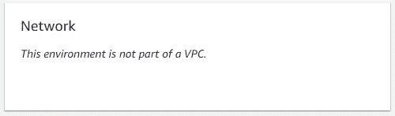
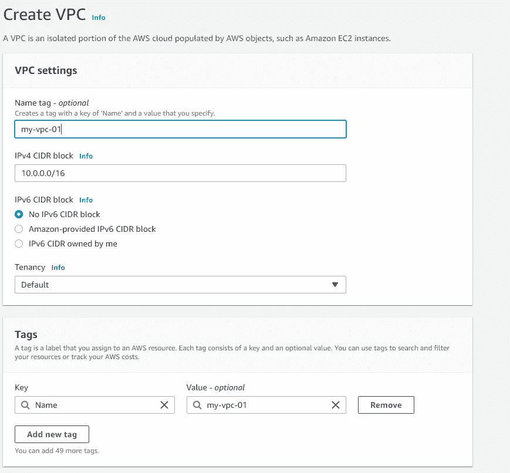

# 在哪里可以获得弹性 beanstalk 负载平衡应用程序的 IP 地址？

> 原文：<https://medium.com/geekculture/where-can-i-get-the-ip-address-of-an-elastic-beanstalk-load-balanced-application-a2279d323dac?source=collection_archive---------8----------------------->

**TL；DR:** 我们成功地为 VPC 设置了公共和私有子网，在新 VPC 创建了新的 EB 环境，公共子网中有负载平衡器，私有子网中有实例。

这是我的第一篇文章，所以请原谅我写得不好。我会尽量开门见山。

本周，我们的邮件服务出现了一个问题。我们的邮件服务帐户被封锁，因为它已达到每月发送 25，000 的限制。原来，其中一个 API 密钥遭到破坏，并被用于发送垃圾邮件。

其中一个解决方案是通过将一个 IP 地址列入白名单来限制 API 键，在本例中，是一个弹性 beanstalk 负载平衡应用程序。

现在，请记住，到今天为止，我处理 AWS 服务的经验正好是一个月。我的“另一个”解决方案是将 EC2 实例的所有 IP 地址列入白名单。我认为这可能不是一个好的实践，因为我们需要跟踪随着时间的推移产生和销毁的所有实例。我刚刚想到，这是一个常见的情况，弹性 beanstalk 应用程序可能有一个静态 IP 地址。于是谷歌搜索开始了。

从 google 搜索结果中，我了解到我们必须首先配置环境的网络才能看到它。但是，当我去我的应用程序的配置中检查它时，它被写为“此环境不是 VPC 的一部分”。没有显示编辑按钮，这应该是谷歌搜索结果中提到的。



Elastic Beanstalk environment Network configuration

基本上，在创建环境的过程中，如果我们没有在网络配置中选择任何子网，那么 Elastic Beanstalk 会在环境的默认 VPC 中启动实例，但是不幸的是，它不允许我们在以后编辑它。

**现有环境中的问题是**:

1.  如果我们在创建过程中没有选择 VPC，那么 Elastic Beanstalk 不允许我们在以后编辑任何网络配置。
2.  如果我们在创建过程中选择了 VPC(甚至是默认的 VPC)，那么我们可以在以后修改 Elastic Beanstalk 和 EC2 的子网，但是不改变 VPC 本身。

在与我的上级反复沟通之后，我们决定联系 AWS 支持部门。长话短说，在支持会话结束后，要获得静态 IP 地址，我们需要大致遵循以下步骤:

1.  有一个 **VPC** 与**私有**和**公有**子网。
2.  在公共子网中有一个 **NAT 网关，在私有子网路由表中，增加一条 NAT 网关规则( **0.0.0.0/0 - > NAT 网关**)。**
3.  当创建弹性 beanstalk 环境时，选择此 VPC 和**作为实例子网，只检查私有子网**以便 ec2 只在私有子网中。
4.  该设置将通过 NAT 网关路由来自 EC2s 的所有传出流量。现在这个 **NAT 网关有了一个静态弹性 IP** ，这将是弹性 beanstalk 的输出 IP。

我将在下面演示 VPC 的步骤。

1.  去创造一个新的 **VPC** 。至于 **IPv4 CIDR 块**，你可以设置为 **10.0.0.0/16** 。有一个信息按钮可以获取更多信息。



VPC Creation

2.创建后，单击 VPC id。然后，点击操作和**编辑 DNS 主机名**。检查 DNS 主机名的**启用**。

3.转到**子网**并创建 4 个子网。例如，您可以将其命名为 public-subnet-1、private-subnet-1，以区分公共子网和私有子网，这在下一节中会很方便。对于**可用性区域**，为每种类型的子网选择不同的区域。对于 **IPv4 CIDR** ，您可以在下面查看。

```
+-------------------+----------------------+-------------+
|      **Subnets** |   **Availability Zone**  |  **IPv4 CIDR** |
+-------------------+----------------------+-------------+
| public-subnet-1   | ap-southeast-1a      | 10.0.1.0/24 |
| public-subnet-2   | ap-southeast-1b      | 10.0.2.0/24 |
| private-subnet-1  | ap-southeast-1a      | 10.0.3.0/24 |
| private-subnet-2  | ap-southeast-1b      | 10.0.4.0/24 |
+-------------------+----------------------+-------------+
```

4.创建子网后，您应该会看到每个子网中只有一条针对本地的路由表记录。现在转到**互联网网关**并创建一个新的。

5.在新的互联网网关内部，您应该看到**状态**被**分离**。你必须把它装在新的 VPC 上。点击动作并**连接到 VPC** 。选择新的 VPC。此操作将为 VPC 中的所有子网添加到 internet 网关的路由。您可以通过查看子网**路由表**中的路由表来验证。

6.转到 **NAT 网关**和**创建 NAT 网关**。对于子网，选择任何公共子网，如果你遵循我的命名惯例。为**连接类型**选择**公共**。**没有就分配弹性 IP** 。需要弹性 IP。

7.现在我们需要为应该指向 NAT 网关的私有子网创建一个新的路由表。转到**路由表**并创建路由表。例如，您可以将其命名为私有路由表 1。

8.在新路由表中，点击**编辑路线，再添加一条路线。**使用新的 NAT 网关 ID 作为目标。

```
+-------------+--------+
| **Destination** | **Target** |
+-------------+--------+
| 0.0.0.0/0   | nat-id |
+-------------+--------+
```

9.添加新路由后，进入**子网关联**和**编辑子网关联。检查 2 个私有子网**并保存。这将使子网成为私有子网。您可以通过查看所选子网的**路由表**来验证它，您应该看到目的地 0.0.0.0/0 - > nat-id。

这应该结束了 VPC 的最低设置。现在对于弹性豆茎部分，我们需要创建一个新的环境。

# **环境的网络配置**

1.  创建环境后，在**网络配置**中，选择**新 VPC** 。
2.  **对于负载平衡环境**，也就是我的情况，我们应该看到一个**负载平衡器设置和实例设置**。**选择公共可见性**和**检查公共子网。**在我的例子中，我们使用应用负载平衡器，这要求**在不同的可用性区域中至少有 2 个公共子网。**
3.  对于实例设置，**取消选中公共 IP 地址**和**检查所有私有子网**。
4.  应用并继续环境创建。

这应该包括为弹性 beanstalk 负载平衡应用程序实现静态 IP 地址所需的步骤。

正如我提到的， **NAT 网关有一个静态弹性 IP** ，这是我需要的 IP 地址，用于限制邮件服务提供商中的 API 密钥。

另外，我确实验证了流出的流量是通过 IP 地址的。

使用 bastion host，我 ssh 到一个私有实例并运行:

```
$ curl ifconfig.me
```

IP 地址应该与 NAT 网关弹性 IP 地址相同。

结束了。