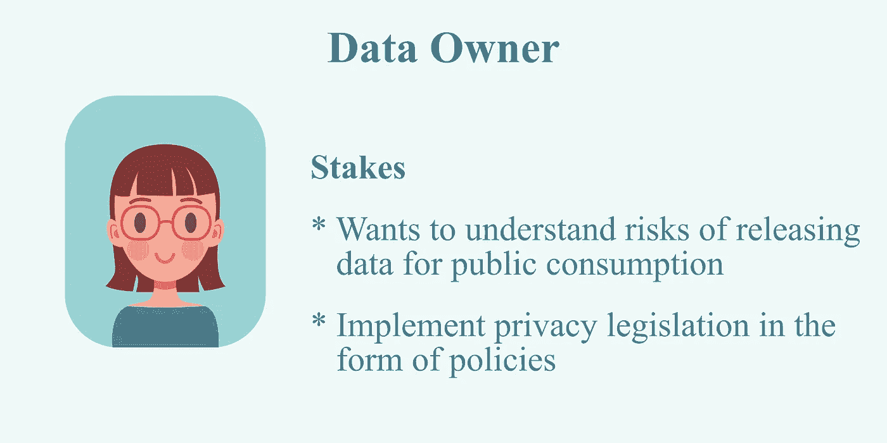
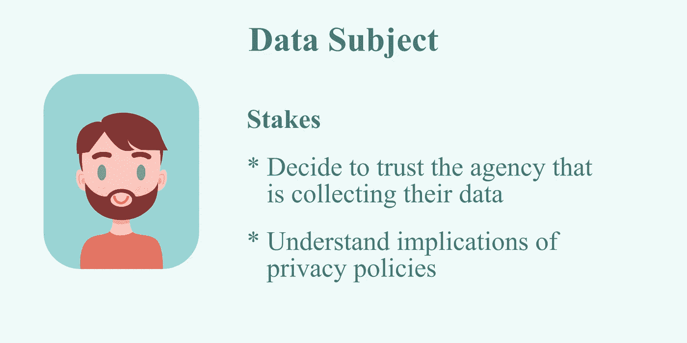
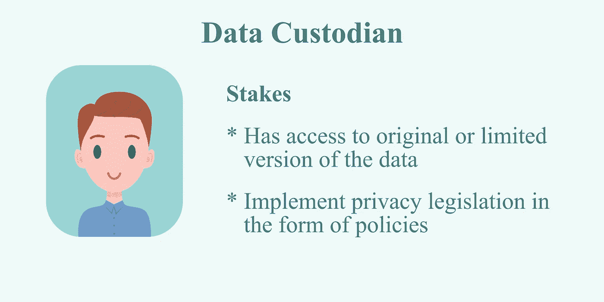
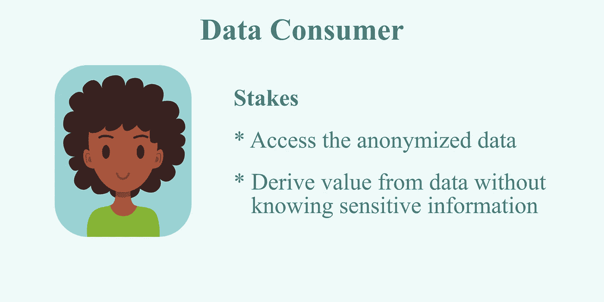
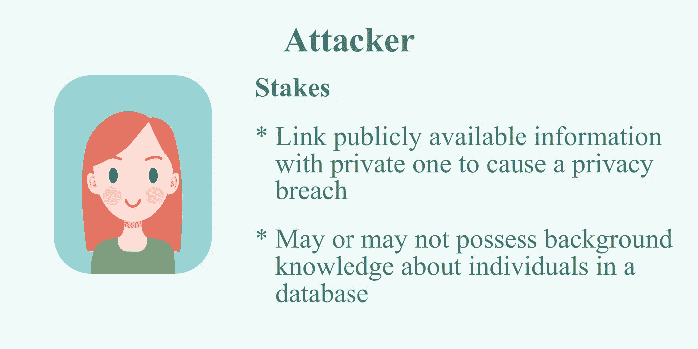

# 你在数据隐私生态系统中处于什么位置？

> 原文：<https://medium.com/geekculture/where-do-you-stand-in-the-data-privacy-ecosystem-2e499d94a67d?source=collection_archive---------29----------------------->

第 3 部分，共 3 部分:隐私:为人民，由人民。还有，反对他们？

Photo by [**Tom Fisk**](https://www.pexels.com/@tomfisk?utm_content=attributionCopyText&utm_medium=referral&utm_source=pexels) from [**Pexels**](https://www.pexels.com/photo/bird-s-eye-view-of-swimming-pool-and-slides-1291448/?utm_content=attributionCopyText&utm_medium=referral&utm_source=pexels)

我们扮演的仅仅是角色。在叫做生活的舞台上。要勇敢，要欢喜！

在本系列的前两部分中，我已经揭示了系统的内部工作原理，这些系统将隐私放在一个叫做差分隐私(DP)的银盘中。[我们已经看到，尽管这是最强有力的隐私条款之一，但它在现实世界中却很容易陷入困境](/geekculture/can-differential-privacy-hide-your-love-for-hawaiian-pizza-3b5cf78612d9)。我们还看到了作为服务用户的不同方面，如[您的会话活动或更长时间的行为，也可以通过 DP](/geekculture/the-finer-aspects-of-your-privacy-based-on-actions-and-time-cee864af4ee) 得到保护。因此，我们有用户级别的隐私保证和动作级别的保证，并且前者被发现是两者中更强的规定。亲爱的读者，我现在将把重点放在您在数据获取、维护和消费领域所扮演的角色上，来结束这个系列；以及每个角色如何具有不同的隐私要求。

利益相关者的识别不仅定义了数据的社会技术维度，还决定了他们保护或破坏数据隐私的动机。现在我将向您介绍第一个确定的数据涉众，即数据所有者

Avatar pic source: Business vector created by freepik

这个名字是不言自明的，并且将**标记为拥有其他个人**的记录数据的利益相关者。数据所有者可以是医院或样本收集中心，它们接受人们的个人信息和样本用于诊断目的。它们也可以是社交媒体平台，在数据库中存储用户资料和活动。数据所有者通常需要控制对专有数据的访问，并保护其免受公司内部人员的侵害。

第二个利益相关者是数据主体。**此人是上述角色拥有的数据记录**中维护的条目。如果您曾经参加过调查或在使用应用程序之前勾选了“*我同意条款和条件*”复选框，那么您已经选择成为数据主体。需要保护的是数据主体的敏感信息(姓名、性别、职务等)和准标识符，如年龄、邮政编码、种族(可用于实施入侵的次要信息)。

**拥有访问私有数据库证书的实体或受托进行数据分析的第三方被称为数据保管人**。他们可能是使用社交媒体数据的分析师，使用医疗数据进行研究的科学家，或者使用健身追踪器数据的外行人。虽然数据所有者需要对数据进行匿名化，制定访问控制，并确保潜在数据消费者的责任，但接收限制披露数据的数据保管人也需要制定政策形式的隐私保护。虽然只有在发布数据集时才考虑隐私问题，但面对新发布的数据集或其他攻击场景，数据保管人通常没有工具来重新评估风险。

数据保管人需要有适当的检查和平衡，以确保人们的身份不会因为使用人口统计数据而暴露。此外，我们从过去的事件中了解到，保管人应该以符合道德的方式使用数据。以[为例，剑桥分析公司如何滥用从脸书网络](https://en.wikipedia.org/wiki/Facebook%E2%80%93Cambridge_Analytica_data_scandal)挖掘的个人信息，为特德·克鲁兹和唐纳德·川普的 2016 年总统竞选提供分析帮助。

**数据消费者可以是共享数据或分析的预期受众**，包括但不限于数据分析师、科学家和决策者。当诸如疫苗接种数字和图表的信息被共享以供他们查看时，它甚至可以是普通公众。对于像社会科学家这样试图了解一个地区的人口统计数据和经济指标之间的相关性的数据消费者来说，他们需要从匿名数据中获取价值，并克服由于隐瞒或遗漏敏感信息而造成的潜在价值损失。那么他们对数据生态系统的主要贡献是什么呢？这是他们从缺乏敏感识别细节的匿名数据中获取相关信息的能力。

这是数据生态系统中最可怕但又不可或缺的部分。任何以侵犯隐私和了解他人为目的的人都可能被贴上攻击者的标签。这样的描述让人想起黑客和勒索软件组织，但一些攻击者也包括黑客行动主义者和白帽黑客。自称为黑客行动主义者和无政府主义革命者的[菲尼亚斯·菲舍尔](https://en.wikipedia.org/wiki/Phineas_Fisher)瞄准了那些因侵犯人权而受到批评的公司，发布了被攻破的信息和相关源代码，甚至公布了她用来实施攻击的漏洞。因此，攻击者可以使用随机方法来侵犯隐私，或者使用一些背景信息来提取受限信息。攻击通常由一系列渐进的动作组成，建立在不断增加的知识基础上。攻击者可能从很少的知识开始，通过观察步骤中传达的信息，攻击者可能试图识别特定的记录。

我们生活在一个充斥着不同粒度的隐私泄露的世界，我们每个人都是这样或那样的利益相关者。作为数据驱动的数字时代的一部分，隐私保护技术领域的一个关键机会是开发以数据主体为主要利益相关者的新颖解决方案。这些主体中有许多往往是复杂隐私政策的接收方，或者由于来自社会弱势群体而面临更大的隐私风险。

来源

*   [隐私保护数据可视化:对技术现状和研究机会的思考](https://onlinelibrary.wiley.com/doi/abs/10.1111/cgf.14032)