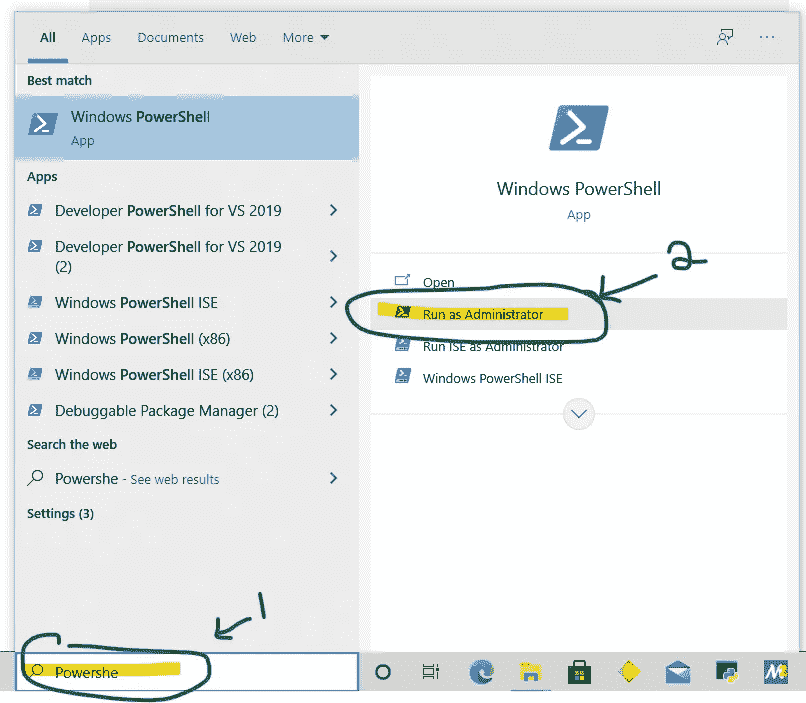

# 我的 WindowsApp 安装在哪里？

> 原文：<https://medium.com/geekculture/where-is-my-windowsapp-installed-to-c634cee6a7f5?source=collection_archive---------45----------------------->

```
Get-AppxPackage -AllUsers
```

我在作为管理员启动的 Powershell 中运行这个，但是你也可以在 cmd.exe 上运行这个，我没有测试过。



查看电脑上安装的所有软件包(Windows 应用商店应用)。

这里你需要记住的是，一个 Windows 应用程序并不完全像一个正常安装的 Windows 程序。Windows 有这些应用程序…