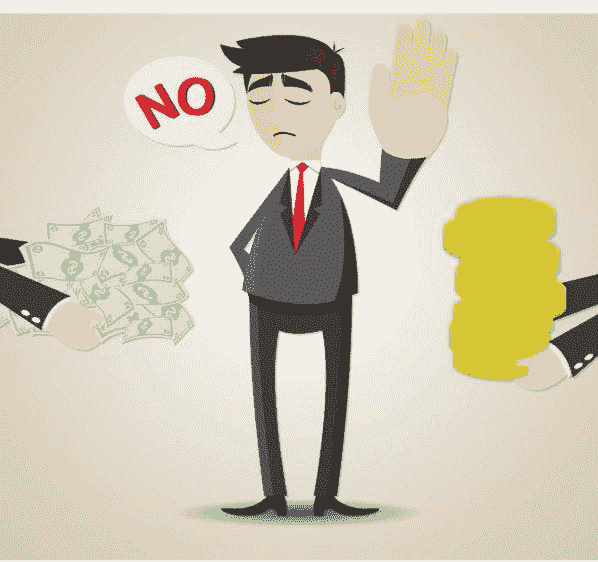
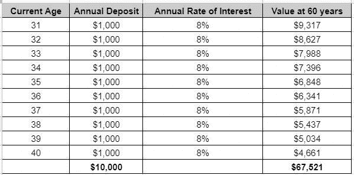

# 哪里不投资？

> 原文：<https://medium.com/geekculture/where-not-to-invest-e604654f139d?source=collection_archive---------35----------------------->

虽然我们很多人喜欢投资和增加我们的钱(这没什么错)，但重要的是要小心你把辛苦赚来的钱放在哪里。货币增长在几乎每个人的生活中都是一个非常有趣的话题，以至于有些个人/组织承诺虚假的增长(或用糖衣营销噱头来展示回报)，并特别针对那些金融投资领域的新手。

现在，你脑子里的问题可能是:应该避免哪种投资？下面是几个例子:

**1)糖衣回报:**假设你目前 30 岁。如果一家金融机构的顾问向你提出以下提议，你会说什么:在未来 10 年内，你每年给他们 1000 美元。在你退休的时候(比如 60 岁)，他们会将原始资本翻一番，给你 20，000 美元(相比之下，你 10 年的存款总额为 10，000 美元)。听起来很划算，对吧？不对！

让我们看看，如果你将同样的钱投资于一只指数基金，年回报率为 8%，会发生什么

与 20，000 美元的报价相比，低风险指数基金投资可以获得超过 67，000 美元的收益。你的顾问实际上提供给你的年回报率要少得多，但如果你不做基本的数学计算，你就无法理解这一点。

**2)庞氏骗局/金字塔骗局:**如果有人向你提出，他们将“保证”你的回报高于正常的市场回报(大多数情况下超过 8-10%)，那么要小心。在某些情况下，那些提供如此高回报的人玩弄金钱的轮换，并会向像你这样的人承诺同样的高回报故事。这是一种典型的金字塔方法(也称为庞氏骗局)，其中没有进行真正的基础投资，一个投资者的存款用于将钱返还给另一个想要退出的投资者。这种业务的成功取决于让越来越多的人存款。一旦高比例的人开始退出，整个商业模式就会崩溃，那些在链条末端退出的人就会失去控制。每当有人向你提出过高的回报时，一定要问他们潜在的商业模式，以及他们如何能够提供如此高的回报。你会经常看到那些人要么不能给你答案，要么用你听不懂的方式回答。

在投资之前，我总是喜欢回到最基本的东西，并牢记沃伦巴菲特的以下建议:“**永远不要投资于你无法理解的业务”。**小心你的投资地点和方式！

*原载于*[*https://getmoneyinsights.com*](https://getmoneyinsights.com/start/f/where-not-to-invest)*。*