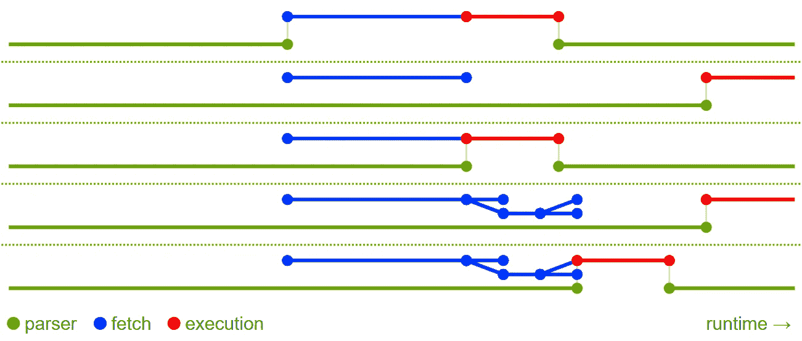

# 脚本标签应该放在哪里——头还是体？

> 原文：<https://medium.com/geekculture/where-to-put-a-script-tag-into-head-or-body-end-b5b063058e0b?source=collection_archive---------1----------------------->

让我们做一些简单的测试，看看什么地方最适合放置一个`script`标签。

在浏览器中，JavaScript 可以用来做很多事情，但通常 JavaScript 的主要任务是生成交互式内容，或者换句话说，动态构建 DOM。考虑到这一点，HTML 文件中的什么地方最适合放置一个`script`标签？有两个合理的选择…