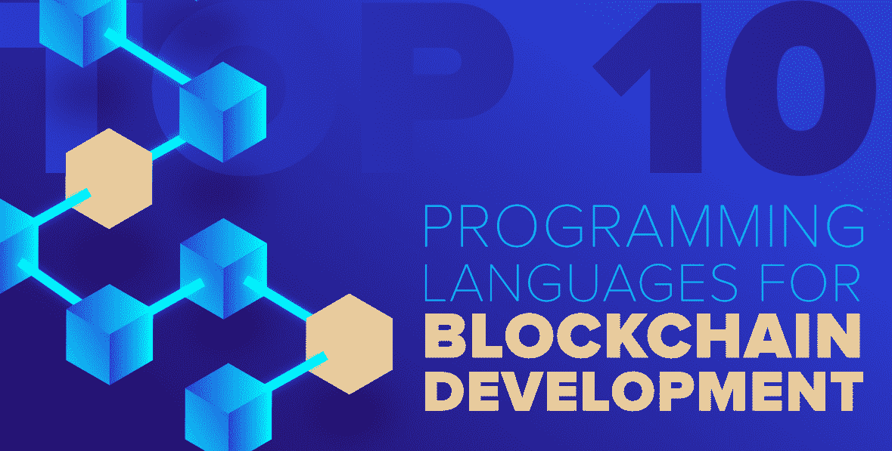
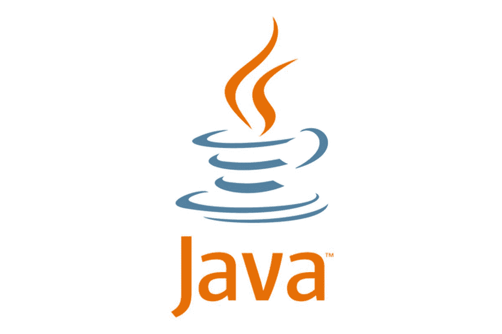
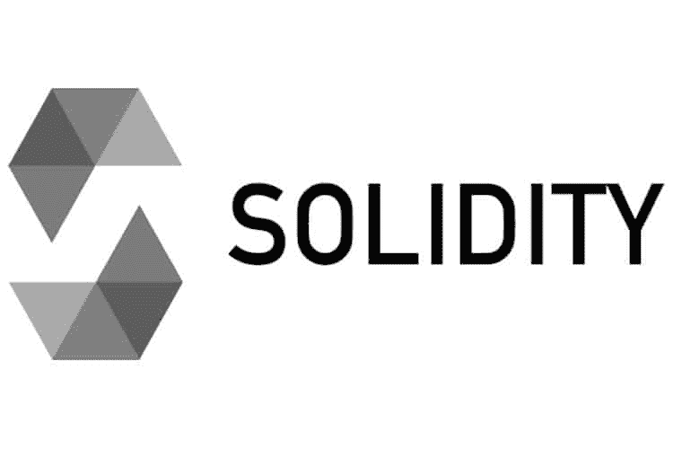
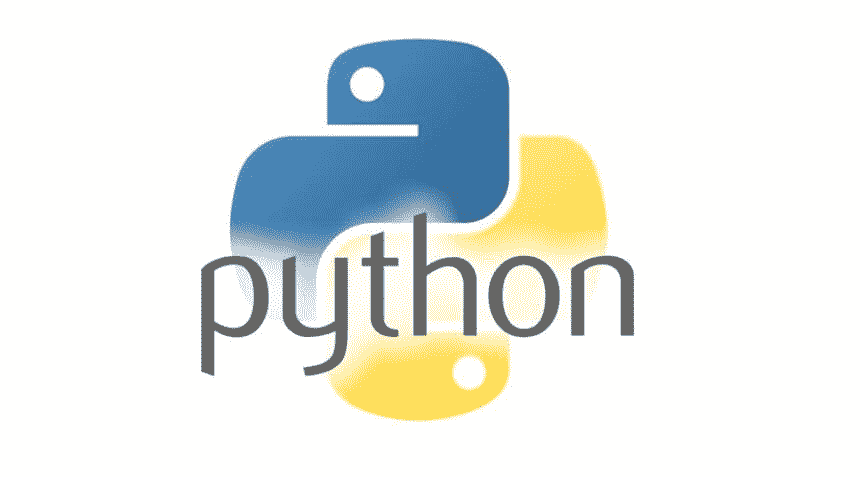
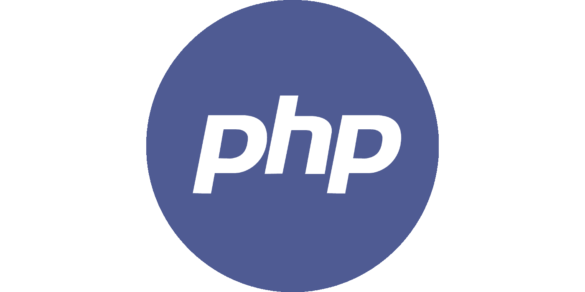
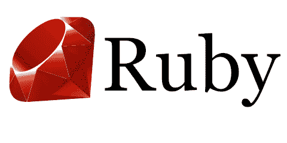
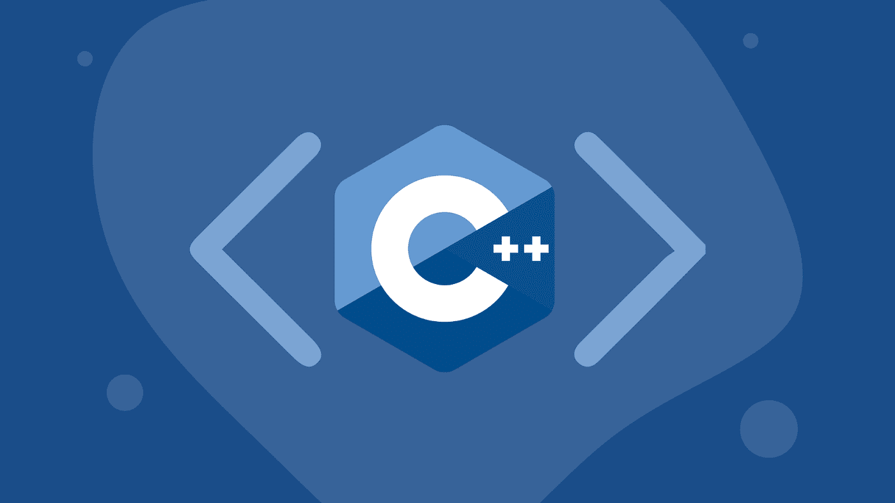
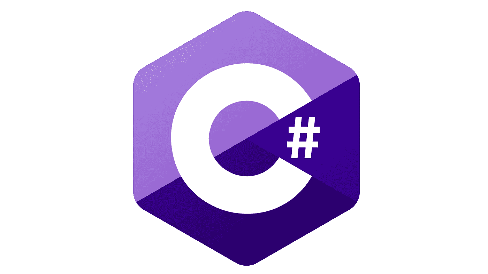
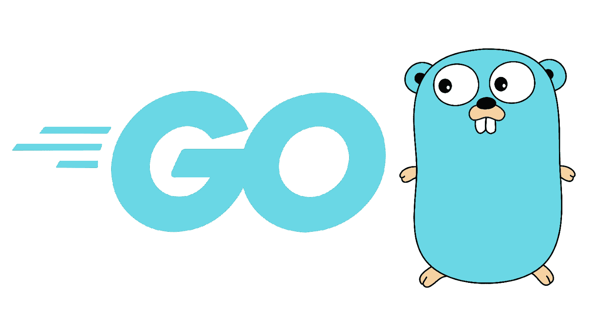
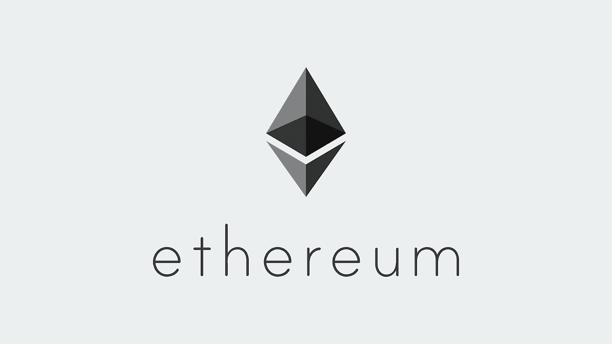

# 区块链用的最好的 10 种编程语言是哪几种？

> 原文：<https://medium.com/geekculture/which-are-the-10-best-programming-languages-used-for-blockchain-54c07fd83da6?source=collection_archive---------15----------------------->

来源:GeeksforGeeks

你知道吗？预计到 2026 年，全球区块链市场规模将达到 674 亿美元(CAGR 为 68.4%)。

区块链技术已经席卷全球，彻底改变了行业，并帮助企业以多种方式发展业务。

事实上，这项创新技术具有改变我们经营方式的巨大潜力。但是为了利用区块链提供的所有优势，你需要选择最适合区块链开发的**编程语言。**

虽然这个问题没有一个确定的答案，但有几种语言特别适合区块链开发。

在这篇博文中，我们将看看区块链最流行的一些编程语言，并讨论是什么让它们成为这个领域的好选择。我们还将帮助您决定哪种语言适合您。

让我们开始吧！

# 找出区块链开发的 10 大编程语言

*   **Java**

Java 是一种通用而强大的编程语言，已经使用了二十多年。它是面向对象的、独立于平台的，用于开发从小型脚本到大型企业系统的各种应用程序。

IBM、Oracle 和 Google 等企业使用 Java 开发企业级应用程序。借助 Corda 和 Ethereum 等框架，您可以使用 Java 开发区块链应用程序。

# 使用 Java 的优点

*   **可扩展功能**

Python 一行一行地执行，这使得检测和调试错误变得容易多了。

*   **OOP 方法**

它帮助开发人员对现实世界的实体进行建模。

*   **平台独立**

编译后的 Java 代码可以在所有支持 Java 的平台上运行，无需任何重新编译。

*   **跨平台支持**

Java 程序可以在多种平台上运行。

*   **丰富的 API**

Java 为开发高效的区块链应用程序提供了丰富的 API。

**使用 Java 的缺点**

*   **性能缓慢**

解释和执行一行代码比编译它花费更多的时间。

*   **高内存消耗**

JVM 比解释器消耗更多的内存。

*   **坚实度**

Solidity 是一种面向契约的高级语言，用于开发运行在以太坊虚拟机上的智能契约。稳健以其简单和灵活著称。

**使用坚固性的好处**

*   **契约导向**

Solidity 是一种面向契约的语言，使得开发智能契约变得容易。

*   **高电平**

Solidity 是一种高级语言，它使编写可读和可维护的代码变得更加容易。

*   **灵活**

Solidity 是一种灵活的语言，允许开发人员轻松地修改他们的代码。此外，你还可以**雇佣一个区块链应用开发者**来利用 Solidity 语言构建动态的区块链应用。

**使用坚固性的缺点**

*   **安全漏洞**

过去，Solidity 编译器本身就存在一些安全漏洞。

*   **未经测试的**

Solidity 是一种相对较新的语言，还没有像其他语言一样经过实战检验。

*   **Python**

Python 是一种广泛使用的高级解释语言，以其易用性和可读性而闻名。Python 是一种通用语言，企业可以使用它来开发各种各样的区块链应用程序。

您还可以利用区块链应用开发服务为您的企业构建高效的应用。

**使用 Python 的好处**

*   **简单易学**

Python 的语法和结构简单，对于初学者来说很容易学习。

*   **多才多艺**

Python 可用于开发广泛的应用程序，包括区块链应用程序。

*   **丰富的库和框架**

Python 拥有大量丰富的库和框架，可用于开发区块链应用程序。

**使用 Python 的缺点**

*   **缓慢的表现**

Python 的解释性质使它比 C++等编译语言慢。

*   **安全漏洞**

过去在 Python 解释器本身中已经报道了一些安全漏洞。

*   **PHP**

PHP 是一种广泛使用的脚本语言，非常适合开发 web 应用程序。它是开源的，有一个庞大的开发者社区。

许多企业使用 PHP，包括脸书、WordPress 和 Tumblr。你可以[雇佣 PHP 开发人员](https://www.valuecoders.com/hire-developers/hire-php-developers?utm_source=hire_php&utm_medium=Guest_Blog&utm_campaign=medium&utm_id=NKY)在以太网和 Hyperledger Burrow 等框架的帮助下开发区块链应用。

**使用 PHP 的好处**

*   **易用性**

PHP 是一种易于使用的语言，这使得它在初学者中很受欢迎。

*   **大型社区**

PHP 社区很大而且很活跃，很容易找到帮助和支持。

*   **丰富的生态系统**

PHP 生态系统拥有丰富的库和框架。

使用 PHP 的缺点

*   **安全漏洞**

PHP 由于其流行性，容易出现安全漏洞。

*   **性能**

与其他编程语言相比，PHP 没有那么快。

*   **红宝石**

Ruby 是一种关注简单性和生产力的动态语言。它有一个优雅的语法，读起来很自然，写起来很容易。Ruby 是一种通用语言，可以用于许多不同的目的，从 web 开发到区块链开发。

**雇佣一家使用 Ruby 的区块链 app 开发公司**可能是你区块链开发项目的一个不错的选择。

**使用红宝石的利弊**

*   **高效简洁的代码**

因为 Ruby 被设计成最小化代码，所以它非常高效。与其他语言相比，使用 Ruby 可以用更少的代码完成更多的工作。这使得你的代码更容易阅读和维护。

*   **灵活**

Ruby 是一种非常灵活的语言。无需重写整个程序，就可以轻松地更改现有代码或添加新功能。

*   **成熟的库和工具**

多年来，Ruby 社区已经产生了许多高质量的库和工具。这使得开发更快更容易。

*   **大型社区**

Ruby 社区很大而且很活跃。这使得在需要时很容易找到帮助和支持。

**使用 Ruby 的缺点**

*   **需要更多资源**

Ruby 不是一种轻量级语言。它比其他一些语言需要更多的资源来运行。对于硬件资源有限的应用程序来说，这可能是一个缺点。

*   **不如其他语言流行**

Ruby 不像其他语言那样出名，所以寻找精通 Ruby 的开发人员是一个挑战。这可能会使开发项目更加昂贵。

*   **C++**

C++是一种强大的面向对象语言，已经使用了三十多年。C++是一种多功能语言，可以开发各种应用程序，包括区块链应用程序。

此外，C++被谷歌、脸书和亚马逊等企业用于开发大规模应用程序。您可以使用 C++借助 EOSIO 和 Hyperledger Fabric 等框架来构建区块链应用程序。你也可以雇佣区块链开发者来构建高效的区块链应用。

**使用 C++的好处**

*   **性能**

C++是一种编译语言，这使得它比像 Python 这样的解释语言更快。

*   **面向对象**

C++支持面向对象的编程，这有助于在现实世界中建模实体。

*   **平台独立**

C++代码可以被编译成在多种平台上运行。

**使用 C++的缺点**

*   **复杂语法**

C++复杂的语法对初学者来说是一个挑战。

*   **安全漏洞**

据报道，C++编译器本身存在一些安全漏洞。

*   **C#**

C#(读作“C-sharp”)是一种多功能的编程语言，可以用于许多不同的目的。它有一个简单的语法，易于学习，并与其他语言很好地集成。C#是区块链开发项目的绝佳选择。

**使用 C#的好处:**

*   **富有表现力和可读性的代码**

C#代码易于阅读和理解。这使得开发更快更容易。

*   **跨平台**

C#代码可以编译成在多种平台上运行。这使得开发可以在不同操作系统上使用的高效应用程序变得容易。

*   **大型社区**

这个社区很大，很活跃。这使得在需要时很容易找到帮助和支持。

**使用 C#的弊端**

*   **微软依赖关系**

C#由微软开发，与。NET 框架。这使得它很难在非 Windows 平台上使用。

*   **开始**

Go 是 Google 开发的一种静态类型的编译编程语言。它是开源的，旨在为系统编程提供一种易用、高效和可靠的语言。

Go 具有简单的语法，并为并发性提供了出色的支持。它也是内存安全和垃圾收集的。这些特性使得 Go 成为开发区块链应用程序的理想语言。

**使用 Go 的好处**

*   **出色的并发支持**

Go 通过其 goroutines 通道特性为并发编程提供了出色的支持。

*   **内存安全**

Go 是内存安全的，并通过其垃圾收集器提供自动内存管理。

*   **静态类型化**

Go 是一种静态类型语言，使得在编译时检测错误更加容易。

**使用 Go 的缺点**

*   **有限的库支持**

标准库很小，不提供太多功能。

*   **慢编译**

编译围棋程序需要很长时间。

*   **总账**

Hyperledger 是一项旨在推进跨行业区块链技术的合作项目。这是一个 Linux 基金会支持的开源项目。

Hyperledger Fabric 是一个许可的区块链平台，允许开发人员构建分散式应用程序(dapps)。IBM 最初开发了 Hyperledger Fabric。

**使用 Hyperledger 的好处**

*   **允许**

Hyperledger Fabric 是一个许可的区块链平台，只有授权用户才能访问网络。

*   **灵活**

Hyperledger Fabric 是一个灵活的平台，允许开发人员快速构建和部署分散的应用程序。

*   **可扩展**

Hyperledger Fabric 是一个可扩展的平台，可以处理大规模部署。

**使用总账的弊端**

*   **复杂性**

Hyperledger 平台的复杂性使得初学者很难使用。

*   **以太坊**

以太坊是一个不断发展的去中心化平台，允许开发者创建智能合约和去中心化应用(dapps)。

这些程序建立在以太坊区块链之上，可以完全按照编程运行，没有任何欺诈或第三方干扰的可能性。

以太坊不同于比特币，因为它支持智能合约。此外，智能合约是在以太网上运行的程序，可用于创建分散应用程序(dapps)。

**使用以太坊的好处**

*   **分散式**

以太坊是一个分散的平台，这意味着没有单点故障。

*   **安全**

以太坊是一个安全的平台，因为它使用区块链技术。

*   **灵活**

以太坊是一个灵活的平台，允许开发人员构建和部署分散的应用程序。

**使用以太坊的弊端**

*   **复杂性**

以太坊平台的复杂性可能会使初学者难以使用。

*   **可扩展性**

以太坊网络在过去因其可扩展性问题而受到批评。

# 结论

如上所述，许多不同的平台允许开发人员使用区块链技术创建分散式应用程序(dapps)。

每个平台都有自己的优点和缺点，因此选择一个适合您项目需求的平台非常重要。

最终，最适合您项目的区块链平台将取决于您的具体需求和要求。

在做出决定之前仔细研究每个平台是相对重要的，因为错误的选择可能会对未来产生重大影响。

你也可以雇佣印度的区块链开发公司来高效地开发区块链应用程序。