# 对于您的工作负载，哪种企业数据仓库性能更好？

> 原文：<https://medium.com/geekculture/which-enterprise-data-warehouse-performs-better-for-your-workloads-fe4ecb018760?source=collection_archive---------26----------------------->

Article originally posted at [Grid Dynamics Blog](https://blog.griddynamics.com/?utm_source=medium&utm_medium=referral&utm_campaign=Which_Enterprise_Data_Warehouse_performs_better_for_your_workloads?)

## 由[卡拉琴采夫](https://blog.griddynamics.com/author/dmitry/) & [科托夫](https://blog.griddynamics.com/author/nikita/)

本文详细介绍了我们使用流行的基准对流行的基于云的企业数据仓库进行性能比较的结果。调查的目的不是对它们进行最全面的比较，而是发现有用和有价值的信息，帮助您选择最适合您需求的系统。

# 1.1.什么是 EDW？

企业数据仓库(EDW)是一个分析数据库，从不同来源收集数据，如 CRM、IoT、ERP、用户交互记录等。它还为数据分析提供了一个接口。

下面提供了基本概念的概述:

*   结构化存储——与存储大量非结构化数据的数据湖相反，EDW 允许以更方便的方式查询数据；
*   非易失性存储—最终用户通常不会更新或删除数据。在定期维护期间，有时可能会清除不相关的数据；。
*   面向主题—结构化的数据，以反映特定领域的业务模型。
*   时间相关-仓库通常存储历史数据，如事件。

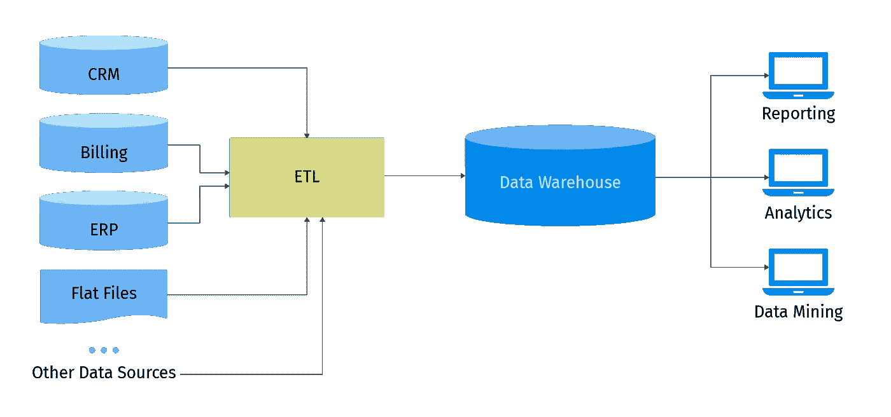

# 1.2.亚马逊红移

Redshift 是一个云数据仓库，它通过大规模并行处理、列数据存储和目标数据压缩编码方案的组合来实现高效存储和最佳查询性能。Redshift 具有基于节点的体系结构，您可以根据需要配置节点的大小和数量。可伸缩性随时可用。

Redshift 查询引擎基于 PostgreSQL 8.0.2，具有相同的 SQL 语法和以下受支持的功能:

*   SQL 或 Python(2.7)UDF；
*   存储过程；
*   自动压缩；
*   视图和物化视图；
*   查询外部数据；
*   还有很多[更有](https://docs.aws.amazon.com/redshift/latest/dg/welcome.html)。

但是，需要注意的是，Redshift 不支持某些数据类型。不支持的特性、数据类型和函数的完整列表在[这里](https://docs.aws.amazon.com/redshift/latest/dg/c_redshift-and-postgres-sql.html)可以找到。

Redshift 支持通过 ODBC、JDBC 驱动程序和来自 PostgreSQL 的基于 psql 终端的前端工具连接到集群。

红移架构:

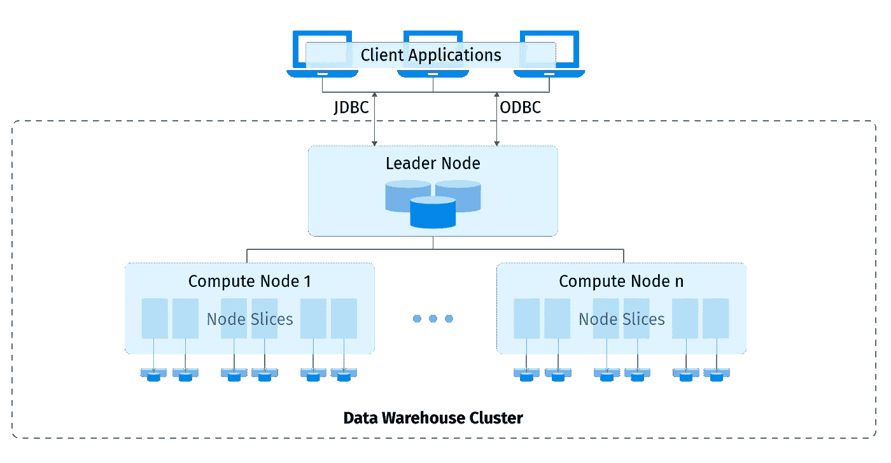

Amazon Redshift 集群中的领导者节点管理所有外部和内部通信。它负责准备查询执行计划。一旦查询执行计划准备就绪，领导者节点就在计算节点上分发查询执行代码。此外，它还向每个计算节点分配数据片。

计算节点依次负责查询的实际执行。一个计算节点保存 2 到 32 个切片。每个片由计算节点中的一部分内存和磁盘空间组成。

下图显示了 Amazon Redshift 数据仓库的内部组件和功能的高级视图:

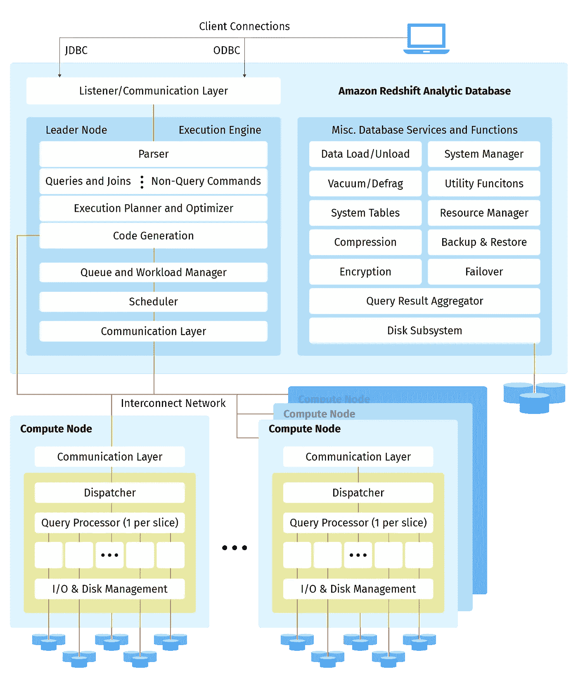

出于耐用性目的，Redshift 在 1 天的保留期内维护数据的三份拷贝，不收取额外费用。但是，该期限可以延长至 35 天。

该架构有以下缺点:

*   表中的列数限制为 1600，这是与竞争架构相比的最低值。
*   并发查询的数量被限制在 50 个，这是与竞争对手相比的最低值。
*   在调整大小操作期间，群集变为只读。
*   插入和删除操作会严重影响整体查询性能(尽管 EDW 不是为 OLTP 设计的)。
*   需要手动运行 VACUUM 命令来对行进行重新排序并重新申请空间以获得更好的性能。
*   数据的可用空间受到群集大小的限制。
*   不支持半结构化数据类型。

Redshift 提供了一个工作负载管理器(WLM ),允许您灵活地管理工作负载中的优先级。自动 WLM 确定查询所需的资源量，并根据工作负载调整并发性。当查询需要系统中的大量资源时，并发性就会降低。相比之下，手动 WLM 使您能够为多达 50 个并发查询以及内存分配指定查询并发值。手动 WLM 的默认并发是五个查询，内存在这五个查询之间平均分配。

以下设计决策会严重影响整体查询性能:

*   排序关键字:确定表中行的存储顺序。它通过过滤掉大部分数据，使查询优化器能够读取较少的数据块。
*   分发方式:
*   EVEN:数据以循环方式存储(当表上不需要连接时使用)；
*   KEY:在指定列中具有匹配值的行存储在相同的片上(当表相当大并用于连接时很有用)；
*   ALL: leader 节点在所有计算节点上维护表的完整副本(用于不经常更改的小表)。
*   缓存结果:Redshift 将某些类型的查询结果缓存在 leader 节点的内存中 24 小时。
*   VACUUM 命令:对行进行重新排序，并回收集群中的空间。在对表执行插入或删除操作后使用。
*   分析命令:更新查询规划器的统计元数据。Redshift 会自动更新元数据，但是您可以手动运行它以确保元数据得到更新。

计算资源和存储的定价是结合在一起的:您只需为每小时提供的节点付费，在这段时间内执行的查询数量不受限制。

在运行性能比较时，我们注意到 Redshift 通过图表提供了关于集群中每个节点的 CPU 利用率、打开的连接数、磁盘空间使用情况等有用信息。同样值得注意的是，曾经有一个集群卡住了。我们正在执行来自“inner and left join”类别的查询，并注意到排队查询的数量增加到了 500。根本原因是群集过载，系统查询无法执行。为了解决这个问题，我们减少了指定类别中所有数据仓库的并发查询数量。

# 1.3.雪花

雪花是作为软件即服务提供的分析数据仓库。持续的维护、管理和调优都由雪花处理。它驻留在 AWS、谷歌云平台或微软 Azure 上的有限数量的可用区域中。除了一些新推出的功能和服务之外，它的功能和服务在各个地区都是相同的。

雪花 EDW 使用专为云设计的新 SQL 数据库引擎。查询在虚拟仓库上执行，虚拟仓库是一个计算资源集群。雪花提供预定义大小的虚拟仓库，具有自动暂停和自动恢复功能。为了满足用户并发需求，可以使用多集群虚拟仓库。调整大小使您能够随时试验最合适的性能，而无需停止整个仓库。数据分布在集群中的节点上。

雪花支持标准 SQL，包括 ANSI SQL:1999 和 SQL:2003 分析扩展的子集。

支持的功能:

*   SQL 或 Javascript UDF。
*   存储过程。
*   自动压缩。
*   视图、物化视图和安全视图。
*   查询外部数据。
*   还有很多[更有](https://docs.snowflake.com/en/index.html)。

除了特定函数的名称之外，SQL 查询的语法与 Redshift 中的语法相同。您可以使用 Python、Spark 或 Kafka 连接器或 JDBC、ODBC 和连接到雪花。NET 驱动程序或 SnowSQL CLI 客户端。

与竞争对手相比，雪花具有独特的架构:

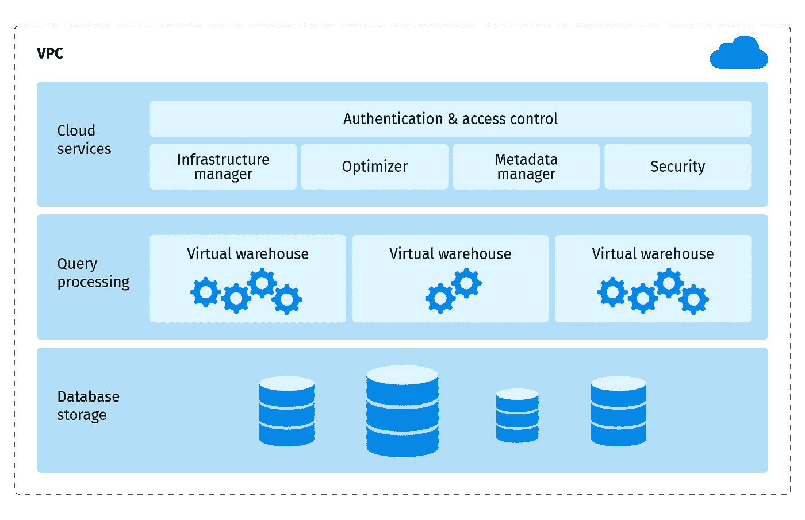

它有三个主要组成部分:

*   云服务:表示跨雪花协调活动的服务集合。
*   查询处理:使用虚拟仓库执行查询。您可以为不同的目的创建多个虚拟仓库。例如，加载数据和查询数据可能在不同的仓库中分开。每个虚拟仓库的资源是相互独立的。
*   数据库存储:雪花在数据存储中以内部优化的压缩列格式存储数据，数据存储被划分为微分区。微分区是大小为 50 到 500MB 的未压缩数据的存储单元。它能够避免不成比例大小的分区。

该体系结构提供了经济高效地调整容量需求的灵活性，但它也有一些缺点。例如，INSERT、UPDATE、MERGE、COPY 和 DELETE 等操作的最大并发限制是 20。其他操作没有硬并发限制，由 MAX_CONCURRENCY_LEVEL 参数调整。雪花还引入了计算价格的“积分”。信用成本取决于您选择的云提供商和地区。

雪花提供两种类型的数据加载—批量和连续。为了获得最佳性能和成本效益，官方文档建议将较大的文件拆分为较小的文件，压缩数据大小在 10 到 100MB 之间。使用 Snowpipe，您可以在一分钟内从外部存储器持续加载新数据，前提是您遵循此处列出的[建议。](https://docs.snowflake.com/en/user-guide/data-load-considerations-prepare.html)

时间旅行和故障安全是雪花最独特的功能。时间旅行使你能够执行诸如查询过去已经更新或删除的数据之类的操作。您可以在过去的特定时间点或之前创建整个表的克隆，也可以还原已删除的表、模式和数据库。这些操作最多允许 90 天。一旦定义的时间段过去，数据将被转移到 Snowflake Fail-Safe 中，这些操作将无法再执行。

故障保护是一个 7 天的时间段，在此期间，任何系统故障后，历史数据可由雪花恢复。这里不允许用户操作。雪花通过只维护恢复被更新或删除的单个表行所需的信息，最大限度地减少了历史数据所需的存储量。因此，存储使用量是以发生更改的表的百分比来计算的。只有在删除或截断表时，才会维护表的完整副本。

为了提高性能，您可以启用一个聚集键，该聚集键旨在根据指定列中的匹配值来共同定位相同微分区中的数据。因此，优化器将读取更少的微分区。

缓存分为以下几部分:

*   远程缓存:长期存储。
*   本地磁盘缓存:数据存储在 SSD 和内存中，可供查询。
*   结果缓存:保存过去 24 小时内每个查询的结果。

存储、计算资源和云服务的定价是分开的。存储费用是从数据更改之时起每 24 小时计算一次。计算资源按每秒计费，最低每秒 60 英镑。只有当云服务的每日消耗量超过计算资源每日使用量的 10%时，才会对云服务的使用收费。

雪花提供了用户友好的图表，并附有账单条款的解释。查询历史使您能够使用图表和舒适的 SQL 编辑器来了解特定查询的整体性能。与 BigQuery 相比，Snowflake 的 SQL 语法很差。例如，没有像“select * except (col1，col2…) from table_name”这样的语句从结果中排除一个或多个列。

值得注意的是，我们的一个客户面临一个有趣的问题:由于内部错误，查询失败。这是因为设置了太多的 SQL 变量。在 Snowflake 文档中没有任何关于这个问题的描述，只有 Snowflake support 能够最终澄清查询失败的原因。这就是为什么在 SQL 查询结束时取消设置所有变量是一种好的做法。

# 1.4.谷歌大查询

和雪花一样，BigQuery 也是一个无服务器仓库。您不必配置集群或考虑它们的正常运行时间，它完全可以自我扩展和自我管理。你需要做的就是选择合适的定价方案。

尽管 BigQuery 的 SQL 功能是竞争对手中最有限的，但它支持您可能需要的所有基本 SQL 构造。除了那些使用 UNION 的查询，我们不需要修改太多的查询来适应 BigQuery，因为 BigQuery 只支持 UNION ALL。

支持的功能:

*   SQL 和 JavaScript UDF。
*   存储过程。
*   视图和物化视图。
*   外部数据源。
*   给桌子、工作等贴标签。
*   还有很多[更有](https://cloud.google.com/bigquery/?utm_source=google&utm_medium=cpc&utm_campaign=emea-gb-all-en-dr-skws-all-solutions-trial-b-gcp-1008073&utm_content=text-ad-none-any-DEV_c-CRE_335630920539-ADGP_Hybrid+%7C+AW+SEM+%7C+SKWS+~+BMM_1:1_GB_EN_Data+Warehousing_bigquery-KWID_43700053279032269-kwd-47616964923-userloc_9047071&utm_term=KW_%2Bbigquery-NET_g-PLAC_&ds_rl=1242850&ds_rl=1245734&gclid=EAIaIQobChMI9ofTj-mA6QIVyeeaCh3WRgilEAAYASAAEgKx4_D_BwE#section-9)。

BigQuery 可以以两种模式运行查询:交互式或批处理。批处理模式用于常规应用。这意味着每个查询都被添加到一个队列中等待资源。以交互模式运行的查询被标记为最高优先级，通常会尽快启动。这对分析师来说非常方便:CLI 和 GCP 控制台默认配置为交互模式。这个特性有一个限制:不能运行超过 100 个并行交互式查询。

BigQuery 支持 DML 以及插入、更新和删除操作。所有的 DML 查询都是事务性的，所以您永远不会得到部分更新的表。

BigQuery 没有 JDBC 或 ODBC 接口。相反，它为最流行的编程语言提供了库，如:C#、Go、Java、NodeJS、PHP、Python 和 Ruby。如果您在列表中没有看到您的语言，您可以直接使用 REST API，或者检查第三方工具。

BigQuery 拥有独创的架构:

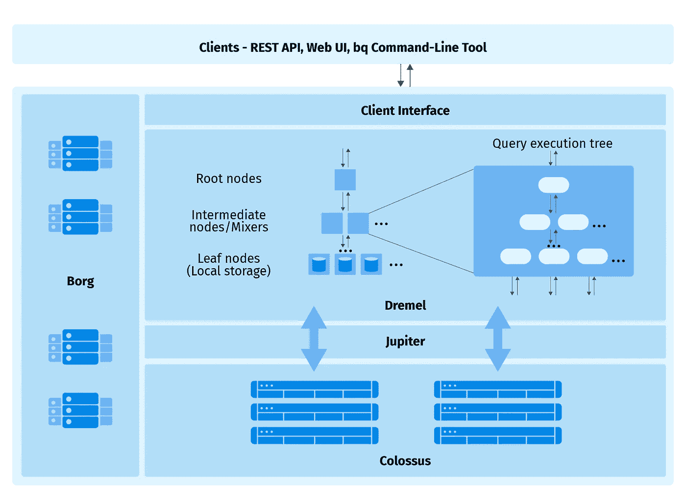

Dremel 是 BigQuery 的核心，它构建了一个作业的查询执行树。Dremel 可能会动态优化查询:停止一些作业并准备其他作业。 [Borg](https://static.googleusercontent.com/media/research.google.com/en//pubs/archive/43438.pdf) 是一个集群管理器，它在硬件上执行 Dremel 的任务。巨像以名为[电容器](https://cloud.google.com/blog/products/gcp/inside-capacitor-bigquerys-next-generation-columnar-storage-format)的柱状格式存储文件。 [Jupiter](https://cloudplatform.googleblog.com/2015/06/A-Look-Inside-Googles-Data-Center-Networks.html) 提供千万亿比特网络，获得最大 IO 速度。这种设计考虑到了 BigQuery 作业的高性能和灵活性。你可以在这里查看 BigQuery 如何工作的更多细节。

这种设计也有缺点。例如，您不能在运行查询之前构建执行计划。并且只有当完整的查询完成时才知道所有三层。在我们看来，BigQuery 执行计划不是很有用。

我们也注意到 BigQuery 不擅长连接和分组。一些查询，如大表的 inner_join 和 q72，即使在按需定价模式下也无法在 6 小时内完成。BigQuery 不允许查询运行时间超过 6 小时。由于资源限制，ORDER BY 为的查询 q67 失败。在文档中，您可以找到一个将“LIMIT”子句与“ORDER BY”一起使用的常见建议，但是 q67 已经有了它，但仍然失败。

BigQuery 定价有其自身的特点，Google 提供了两种类型的定价:

*   按需定价—您只需为查询读取的未压缩 TB 数据付费。你没有其他限制，比如计算资源。但是它非常昂贵并且不可预测，因为您不知道一个查询将读取多少字节。
*   统一费率定价—在此计划中，您无需为读取的字节数付费，而是为计算资源付费。不管你是否使用这些资源，你总是要支付一个固定的价格。该计划揭示了限制计算资源使用量的预留 API 的使用情况。计算资源的计算非常简单:您可以购买插槽，每个插槽都有一个专门的工作人员。对于大多数应用程序来说，这是最有用的计划。

另一种支付方式是存储。但是您可以对超过 90 天没有更新的表享受折扣。我们发现 BigQuery 是最贵的 EDW。

我们测试了两个计划。在按需模式下，查询消耗多达 10k 个片段。在统一价格的情况下，我们将插槽的数量限制为 500 个，以便在价格上与亚马逊红移相当。即使 500 个插槽更贵，但这是允许的最低购买量。

# 基准概述

为了测试和比较性能，我们决定使用广泛使用的 TPC-DS 基准。TPC-DS 对数据仓库进行建模，并专注于在线分析处理任务。下面的实体关系图显示了 TPC-DS 模式的摘录:

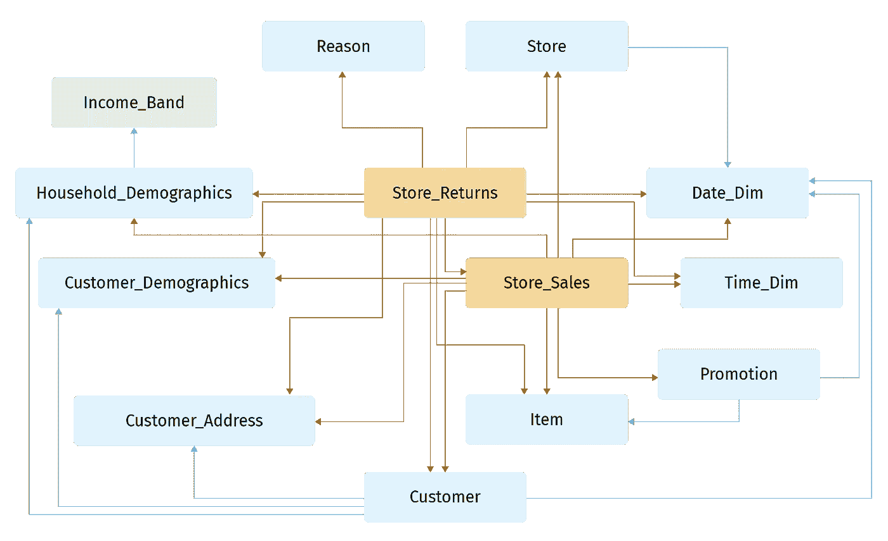

它包含两个事实表:Store_Sales 和 Store_Returns，以及相关的维度表，如 Customer 和 Store。

Benchmark 还包含表:Web_sales、Web_returns、Catalog_sales 和 Catalog_return，但是与维度表的关系与 Store_Returns 和 Store_sales 之间的关系大致相同。

简要概述:

*   大小:1TB。
*   桌子数量:24。
*   列数:从 3 到 34。
*   表中的最大行数:大约 30 亿。

TPC-DS 性能指标评测的完整描述可在[这里](http://www.tpc.org/tpc_documents_current_versions/pdf/tpc-ds_v2.8.0.pdf)获得。

TPC-DS 基准测试提供了 99 个查询，我们将其分为以下几类:

*   交叉连接。
*   完全外部联接。
*   内连接和左连接。
*   低水平。
*   中等水平。
*   使用同一个表的多重连接。
*   并集和交集。
*   条件在哪里。
*   窗口功能。
*   习俗。

“低级”类别包含 where 子句中少于三个连接和简单其他条件的查询。

“中级”类别包含在 where 和 group by 子句中有两个以上连接和许多其他条件的查询。

“where condition”类别包含在“where”子句中有许多条件的查询。他们使用各种可用的关键字，如 IN、EXIST、BETWEEN 等。

自定义类别包含我们为比较特定案例而创建的查询。例如，我们创建了一个包含一个长字符串列的表，并用大约 55，000 个字符填充它。然后，我们创建了一个查询，使用 LIKE 关键字在该列中查找特定的单词。

# 性能和计费比较图表

为了比较性能，我们使用 50 个连接对 Redshift、Snowflake 和 BigQuery 并行运行查询，数据仓库的配置如下:

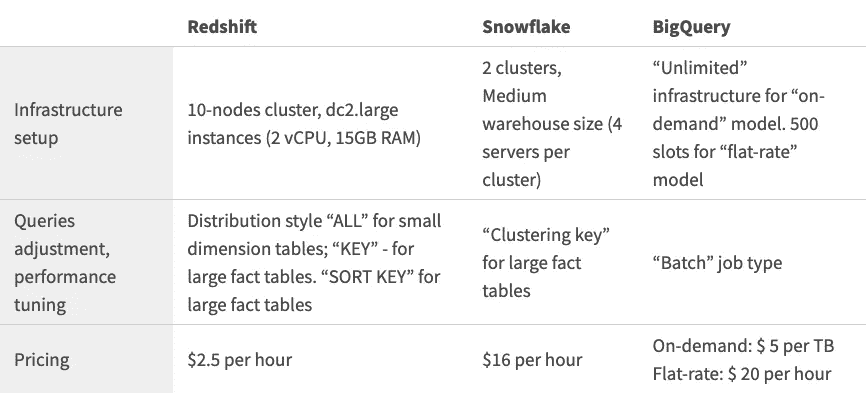

为了展示比较结果，我们创建了几个图表。为了更好地可视化，我们将查询类别分成两个子集。

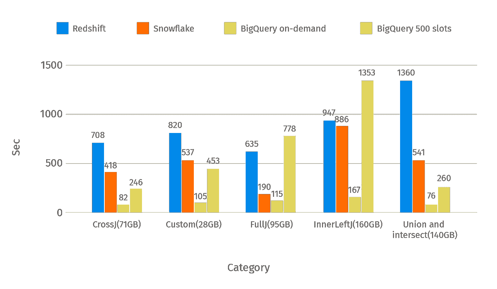

This chart shows the average time of the queries by category from the first part.

在类别名称旁边，您可以看到扫描数据的平均大小。BigQuery 中的按需定价使您能够非常快速地执行查询，但费用也很高。

*图表 1。平均响应时间(秒)，第 1 部分*

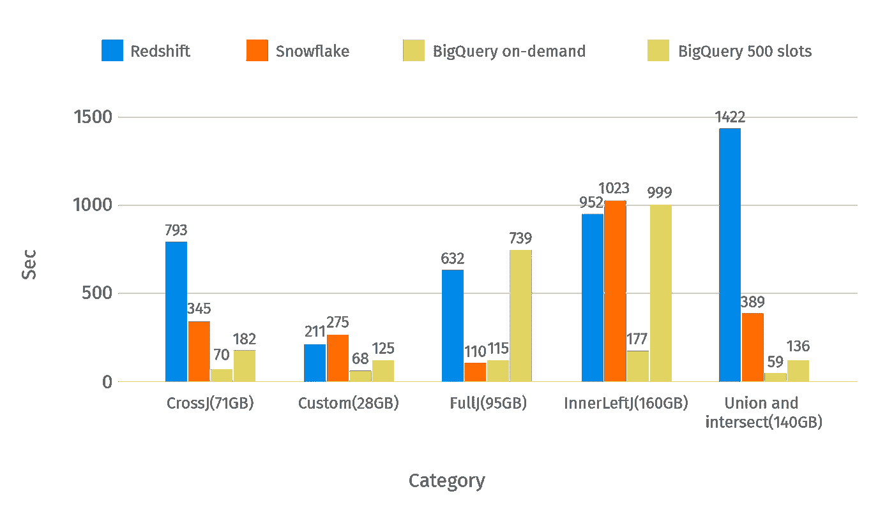

The median time of the same categories of the queries from the first part

*图表二。中值响应时间(秒)，第 1 部分*

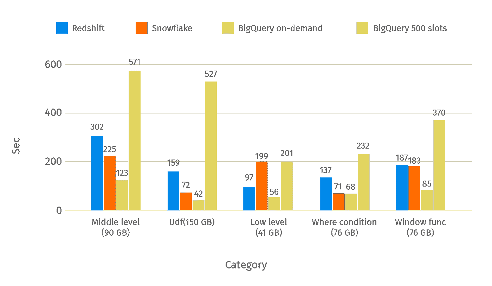

The average time of the remaining categories of the queries.

*图表 3。平均响应时间(秒)，第 2 部分*

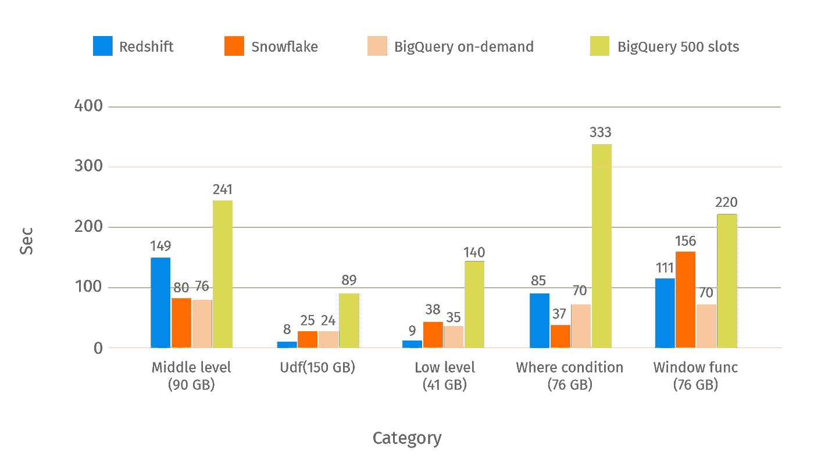

This chart shows the median time of the same categories

*图表 4。中值响应时间(秒)，第 2 部分*

为了更好地可视化性能，我们计算了红移、雪花和 BigQuery 在 500 个插槽时的相对比较。为此，我们将红移/雪花响应时间除以 BigQuery。结果分为两部分。为了在定价方面有一个类似的设置，我们不会在以后的图表中使用带有按需定价策略的 BigQuery。

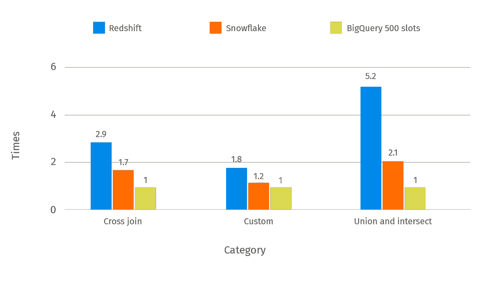

Categories where BigQuery with 500 slots is faster than Redshift/Snowflake in a specified number of times

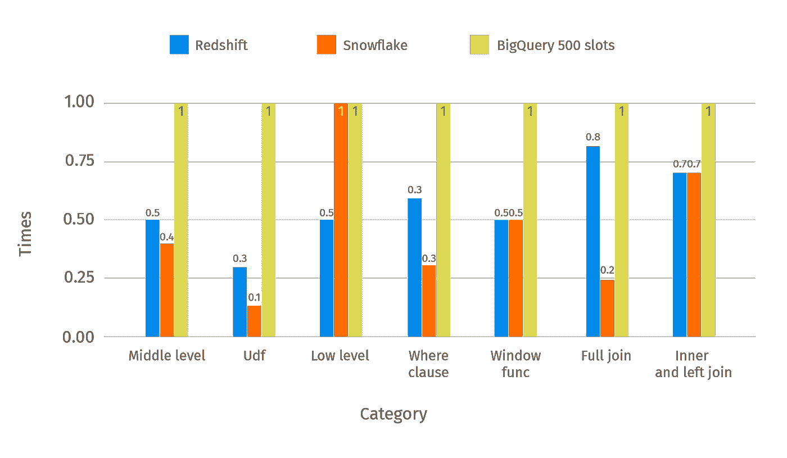

The categories where BigQuery is slower than Redshift/Snowflake

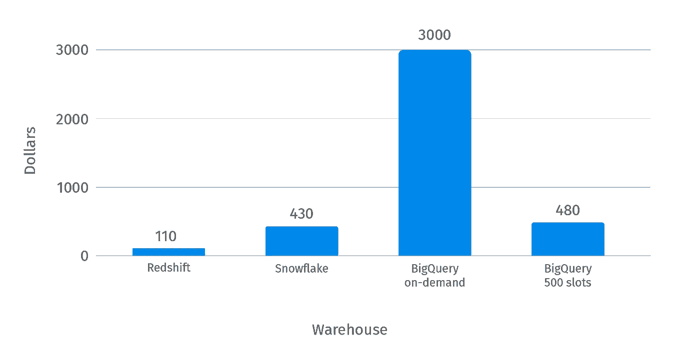

Expenses by EDW

我们要注意的是，采用按需策略的 BigQuery 非常昂贵，但是在性能方面表现出了最好的结果。

# 结论

下表综合了 EDW 的性能和成本比较结果。从我们的评估实验中可以看出，带有按需定价模型的 BigQuery 是最昂贵的设置。但另一方面，它显示出比竞争对手更好的性能，并在几乎所有的查询类别中胜出。如果我们要在价格方面比较相对类似的设置，那么考虑前三列(红移、雪花、BigQuery 500 槽)是有意义的。

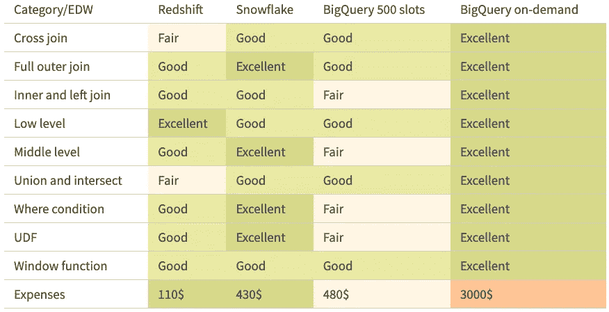

每个数据仓库都满足我们关于并发性和打开连接数的要求，但是一般来说，它们都有限制。在 Redshift 中，并发级别被限制为 50 个查询，但是官方文档建议不要将其设置为大于 15。雪花没有与并发相关的硬性限制。您可以使用内部参数来管理它。为了满足并发性需求，雪花建议使用具有自动伸缩或最大化模式的多集群仓库，而不是增加仓库的大小。BigQuery 在交互式查询中有 100 个并发查询的限制，但是批处理没有限制。

从开发人员的角度来看，我们希望注意每个数据仓库都提供了 Web SQL 编辑器。BigQuery 拥有最先进的编辑器，能够共享 SQL 代码、自动完成和预先计算的扫描数据大小。红移和雪花没有这个功能。雪花有一个很好的支持团队，我们在社区里找到了很多关于你的问题的答案。

如果你对 EDW 的预算非常有限，红移是你最好的选择。然而，为了达到良好的查询性能，红移需要开发人员付出额外的努力。就所提供的特性而言，雪花是最先进的数据仓库。它性能很好，但价格相当昂贵。BigQuery 是一个易于使用的数据仓库，但可能会变得昂贵。您只需要将数据加载到表中。

就性能而言，具有按需定价策略的 BigQuery 使您能够非常快速地执行查询，但是在这种情况下，费用也很高。在安全性方面，每个数据仓库都提供了一套全面的功能来保护您的数据安全。这包括自动数据加密、用户角色和数据丢失预防工具。

欢迎[联系我们](https://www.griddynamics.com/contact?utm_source=medium&utm_medium=referral&utm_campaign=Which_Enterprise_Data_Warehouse_performs_better_for_your_workloads?)了解更多信息