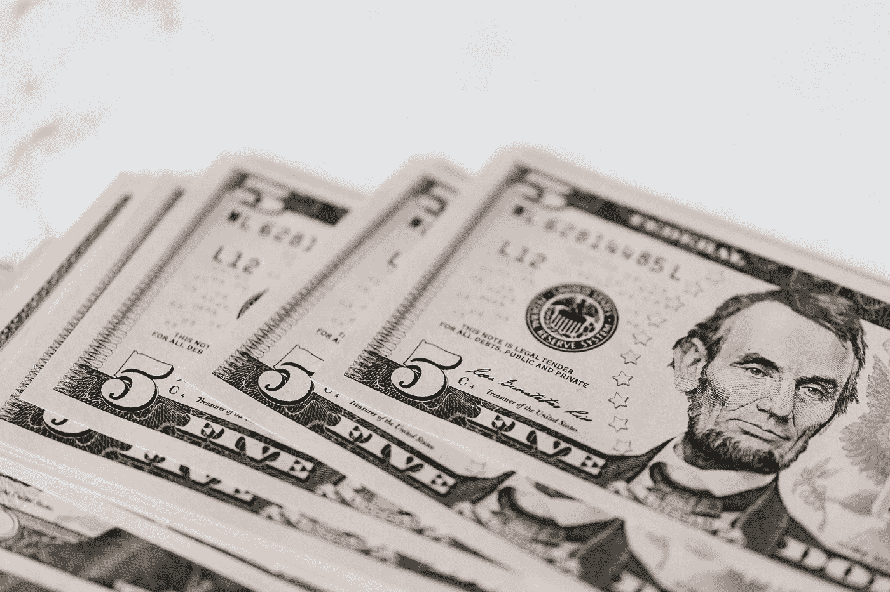

# 哪个行业分红收益最好？

> 原文：<https://medium.com/geekculture/which-industry-pays-the-best-dividend-income-cf751e2e824f?source=collection_archive---------0----------------------->

如何赚取不同行业的分红收益？

Photo by [Karolina Grabowska](https://www.pexels.com/@karolina-grabowska?utm_content=attributionCopyText&utm_medium=referral&utm_source=pexels) from [Pexels](https://www.pexels.com/photo/stack-of-us-dollar-banknotes-on-marble-board-4386474/?utm_content=attributionCopyText&utm_medium=referral&utm_source=pexels)

股息收入，这是大多数人的目标，不是吗，获得被动收入？股息收入投资的最大好处之一是，你几乎不需要做后续工作。然而，需要关注的一个关键部分是，确保你购买的股票会支付股息，而且股票会被认为…