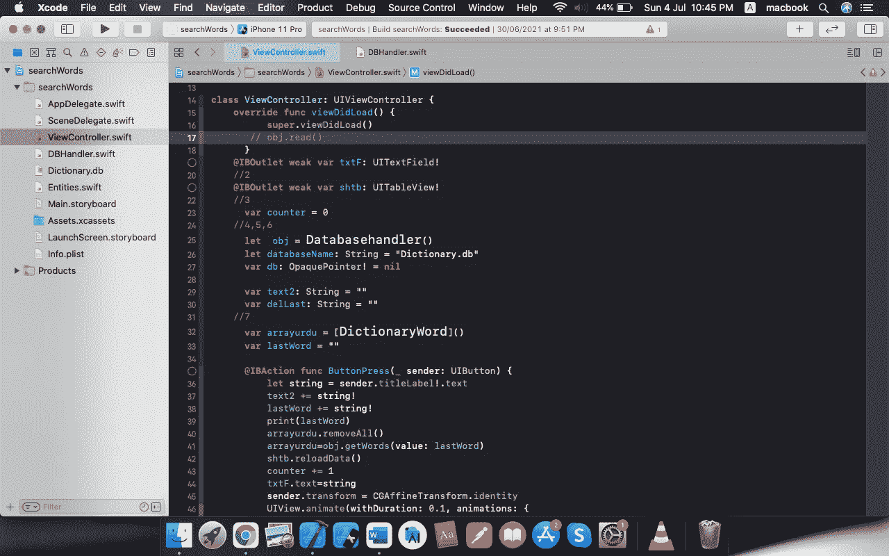
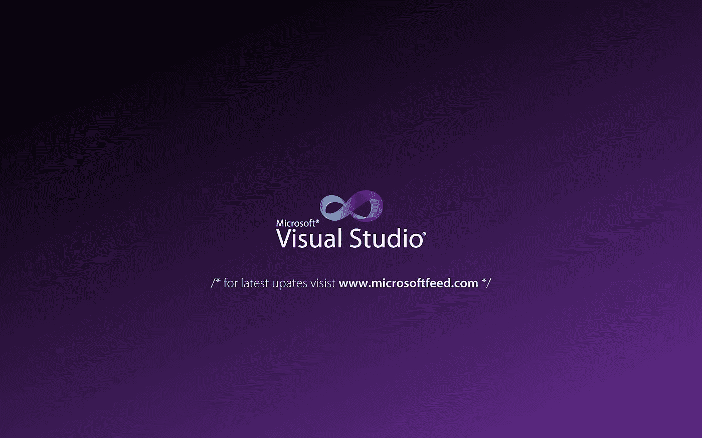

# 2021 年手机 App 开发用哪种语言最好？

> 原文：<https://medium.com/geekculture/which-language-is-best-for-mobile-app-development-in-2021-f44d52a84af4?source=collection_archive---------27----------------------->

你有没有想过学习如何编写移动应用程序开发的代码？你需要做的第一件事是弄清楚学习哪种编程语言。

几年前，只有两种方法来建立一个移动应用程序:iOS 和 Android。但是今天，开发者有如此多的选择。

我写这篇文章是为了帮助你找到选择哪种语言和哪个平台是流行的。下面的信息是为那些想编码的人准备的。从低级到高级的编码、混合应用和本地开发，这个指南包含了你需要知道的关于应用开发编程语言的一切。让我们开始吧。

…

# 移动应用的类型

在我们继续之前，我只想从编码的角度快速介绍一下不同类型的应用程序开发。一般来说，移动应用程序开发人员可以开发以下三种类型的应用程序:

*   原生应用——用特定设备的操作系统原生支持的语言编码。(例如:原生 iOS 应用程序与原生 Android 应用程序)。
*   混合应用程序—跨平台开发。应用程序用一种语言编写，可以在多种平台上运行。
*   渐进式 web 应用程序(PWA) —在设备的 web 浏览器 URL 中运行的轻量级应用程序。它看起来和感觉上都像一个移动应用程序，但它不是在设备上原生交付的。

我们将仔细研究每个平台，并讨论每个平台的优缺点。

## 构建 iOS 应用程序的语言:

Ios 平台由苹果公司创建，ios 应用程序开发使用的语言是 Objective_C，swift。Objective_C 是第一种用于开发 iOS 应用程序的语言。Swift 是 Objective_C 和 iOS 应用程序开发的最新升级，Swift 5 是 Swift 的最新更新(截止日期)。任何已经知道如何使用 Objective_C 进行构建的 Apple 开发人员在切换到 Swift 时应该不会有任何问题。

对我来说，swift 语言是最好的。如果你读它的代码，你会发现它比所有其他语言都要简短易读。

## 用于 Ios 应用程序开发的 IDE

swift 和 Objective_C 使用的 IDE 是 XCode。Xcode 附带了为所有 Apple 设备创建应用程序所需的一切。这个开发工具包有一个代码编辑器、模拟器、调试器和 SDK。

…

# Android 应用程序开发语言

安卓 App 在全球范围内广泛使用。安卓用户的比例比其他任何平台都多。Android 应用程序是使用 java 或 kotlin 语言创建的。

## Java:

Java 最初开发于 1995 年。截至 2021 年 3 月，最新版本是 [Java 16](https://en.wikipedia.org/wiki/Java_version_history) 发布。它是一种通用编程语言，旨在让应用程序开发人员*编写一次，在任何地方运行*。

## 科特林

谷歌宣布将于 2017 年开始支持 Kotlin 编程语言。它是用于 Android 开发的传统 Java 的替代语言。即使作为一门新语言，它也很受欢迎。

Kotlin 和 Java 是可互操作的，这意味着它们可以利用相同的信息。你所有的 Java 库都可以用 Kotlin 访问。从执行的角度来看，Kotlin 语言符合 Java 字节码。总的来说，它被认为是一个更整洁的 Java 版本。

…

## 用于 Android 应用程序开发的 IDE

要构建一个 Android 应用程序，您需要获得包含调试器、仿真器和所需 SDK 的 Android 开发工具包。Android 应用程序开发的最佳集成开发环境(IDE)是 Android Studio。还有其他选择，但 Android Studio 肯定是最受欢迎的。

Android IDEs 通常可以在任何操作系统上运行，包括 Windows、Mac 和 Linux。

在编程中，本机代码是为在特定进程上运行而编写的代码

…

本机编程优势:

*   对设备的大部分控制
*   添加到设备上的尖端技术的低级编码
*   通过您的语言最快地访问最新和最强大的功能
*   最快的执行底线

本机编程缺点:

*   发展最慢
*   最昂贵的开发方法
*   需要最高技能和专业的应用程序开发人员来为 iOS 和 Android 构建
*   高准入门槛

## 反应自然

React Native 是一个 JavaScript 框架，用于为 iOS 和 Android 编写真实的、本地呈现的移动应用程序。它基于 React，脸书用于构建用户界面的 JavaScript 库，但它的目标不是浏览器，而是移动平台。换句话说:web 开发人员现在可以编写看起来和感觉上都真正“原生”的移动应用程序，所有这些都来自我们已经熟悉和喜爱的 JavaScript 库。此外，因为您编写的大部分代码可以在平台之间共享，React Native 使同时为 Android 和 iOS 开发变得很容易。

React Native 是一个令人兴奋的框架，它使 web 开发人员能够使用他们现有的 JavaScript 知识创建健壮的移动应用程序。它提供了更快的移动开发，以及跨 iOS、Android 和 Web 的更高效的代码共享，而不会牺牲最终用户的体验或应用质量。代价是它是新的，仍然是一项正在进行的工作。如果您的团队能够处理新技术带来的不确定性，并希望为多个平台开发移动应用程序，您应该考虑 React Native。

## 用于 React 本机应用程序开发的 IDE

## 1): Visual studio

这是一个由微软提供的编程平台，它有一些很棒的特性。这个工具中的许多功能使得它非常适合大多数开发人员。

…

## 2):崇高的文本

这是另一个文本编辑器，用于不同技术的开发。最棒的是使用这个平台的广大社区，它也被认为是开发人员最喜欢的文本编辑器之一。

…

## 摆动

Flutter 是谷歌的 UI 工具包，用于从单一代码库为[移动](https://flutter.dev/docs)、[网络](https://flutter.dev/web)、[桌面](https://flutter.dev/desktop)和嵌入式设备构建漂亮的本地编译应用。

Flutter 是谷歌创建的免费开源移动 UI 框架，于 2017 年 5 月发布。简而言之，它允许你创建一个只有一个代码库的本地移动应用程序。这意味着您可以使用一种编程语言和一个代码库来创建两个不同的应用程序(适用于 iOS 和 Android)。

…

颤振包括两个重要部分:

*   SDK(软件开发工具包):帮助你开发应用程序的工具集合。这包括将你的代码编译成本机代码(iOS 和 Android 的代码)的工具。
*   框架(基于小部件的 UI 库):可重用 UI 元素(按钮、文本输入、滑块等)的集合，您可以根据自己的需要对其进行个性化设置。

## 颤振的优点

1.一次编写，随处部署

2.热重装

3.更快的发展

4.得益于 Android 和 iOS 的同步更新，应用维护变得非常简单

5.支持 Fuchsia，面向未来

## 颤振的缺点

1.获得特定于平台的外观和感觉

2.颤振是一项新技术

3.它可能没有用户界面设计，需要改进

## 用于 FlutterApp 开发的 IDE

*   安卓工作室
*   智能理念
*   可视化工作室

对于任何想在 2021 年选择正确的编程语言职业道路的人来说，这是最权威的指南。

**这是对 2021 年初 IT 行业的现状、趋势和安全的近期预测的客观而实用的回顾。**

它基于各种可靠来源的统计数据，是为期两周的深入研究的结果。

这篇文章的目的是帮助你做出明智的决定…