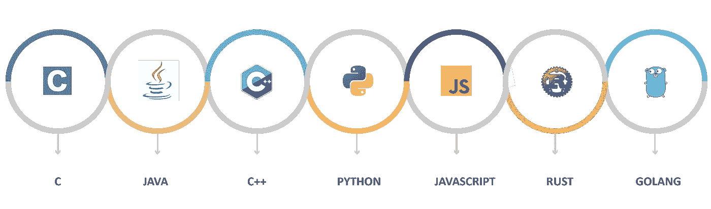
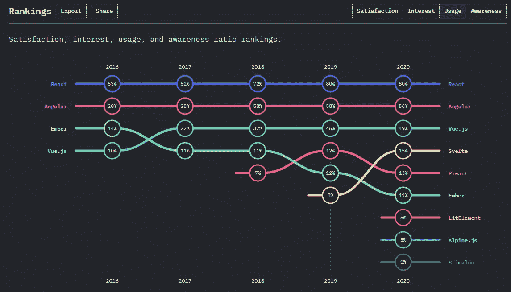
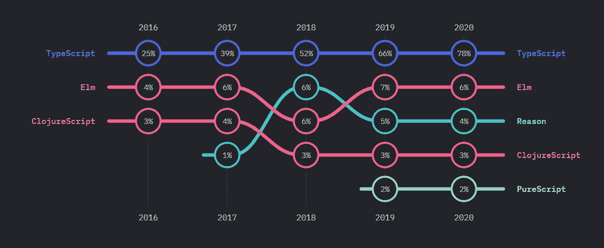
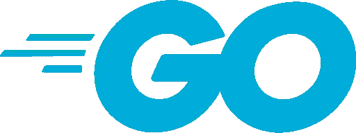
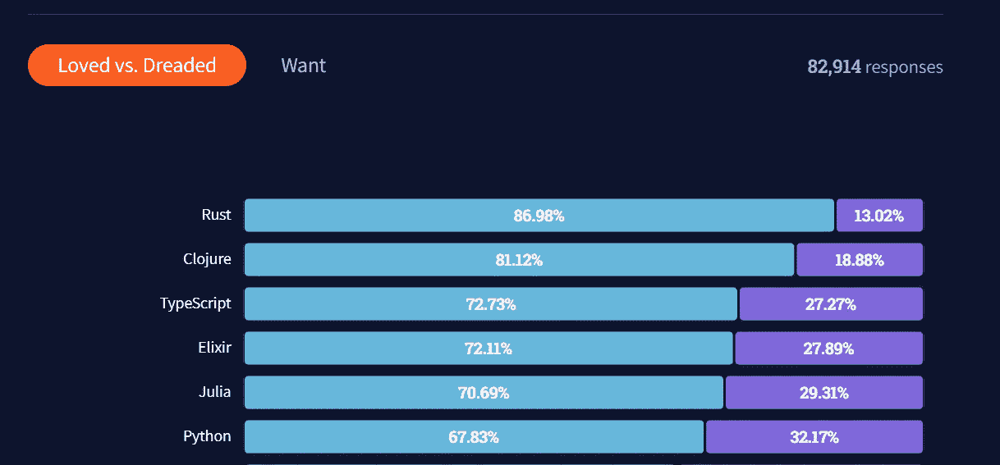

# 2022 年应该学哪种编程语言？

> 原文：<https://medium.com/geekculture/which-programming-language-should-you-learn-in-2022-42dfb716f91d?source=collection_archive---------1----------------------->

## 对你的职业生涯最好的语言

## 一个指南，为即将开始寻找他们的第一，第二或第三语言的开发者。

对于今天的开发者，包括我自己，Python 或者 JavaScript 都是第一编程语言。可能是因为你参加了训练营，从大数据分析角色转型，或者自学。但是一旦你变得更加熟练，问题就变成了——下一步是什么？是的，两种语言都很神奇，可能还没有达到巅峰。然而，学习额外的语言也有好处。学习 Java 或 C++这样的严格面向对象的语言，会让你对 OOP 有更好的理解。像 C 或 Rust 这样的低级语言可以帮助你理解像内存管理这样的概念。

在这一点上，我们已经讨论了 6 种不同的语言，还有更多。那么你应该选择什么呢？看情况。在这篇文章中，我将语言分为两类:你想从事什么领域的工作，以及你想为什么类型的公司工作。对于每一点，我都会给出一两条建议。第一个是我认为会给你带来最大价值的，但总有一个亚军，可能还有一些荣誉奖。让我们进入正题:

# 你对哪个工程领域最感兴趣？

而通用语言如 C、C++、Python 等。无所不能，他们都在不同的领域展现了自己的实力。在此基础上，我们可以将他们分为专业和工程学科。

## 前端工程:JavaScript 和类型脚本

Top 10 Frontend Frameworks (by Usage) in 2020 visualized (Source: [StateOfJS](https://2020.stateofjs.com/en-US/technologies/front-end-frameworks/))

说到前端开发， **JavaScript** ，以及通过扩展 TypeScript，是首屈一指的。正如我们所知，JS 是推动现代网络发展的语言。自 21 世纪初以来，开发人员就开始使用 JavaScript 在每种浏览器中运行。像 jQuery (15 年前)这样的库的早期版本侧重于向静态 HTML 网站添加动画。从那以后，像 React 这样的框架的出现将这种顺序颠倒了过来。现代网站首先用 JavaScript 编写，然后生成提供给用户的 HTML。现在，所有主要的前端框架都使用 JavaScript。因此，使它成为每个试图进入前端开发的人的首选语言。

Usage of JavaScript flavors in 2020 visualized (Source: [StateOfJS](https://2020.stateofjs.com/en-US/technologies/javascript-flavors/))

JavaScript 的统治地位并不意味着每个人都对这种语言感到满意。在过去的几年中，出现了许多 JS 的“风格”,试图解决所察觉到的问题。它们的共同点是，最终代码会被编译回 JavaScript。这个类别中无可争议的赢家是 **TypeScript** 。TypeScript 于 2012 年首次发布，现在由微软维护，它为 JS 添加了静态类型。一个使开发更安全的特性，并且该语言更适合大型项目。作为一个严格的超集，每个有效的 JS 程序也是一个有效的 TypeScript 程序。因此，从 JavaScript 迁移到 TypeScript，反之亦然，比学习一门全新的语言要容易得多。

如果这还不够，我还想给**飞镖**一个荣誉奖。作为 Flutter 框架背后的语言，Dart 是 Google 维护的面向对象语言。使用 Flutter，你可以开发编译成本地移动应用程序和网络应用程序的程序。

## 后端开发:Go 和 Python

服务器端开发可能是语言中最明智的选择。在高性能语言类中， **Go** (或 **Golang** )是最有趣的。与众不同的是，谷歌开发它是为了应对现代云环境的挑战。

那是什么意思？Go 正好位于 Python 这样的高级语言和 C++和 Rust 这样的系统级语言之间。一方面，Go 是一种编译语言，可以提供极快的性能。这也为您提供了编译时错误检测。此外，Go 包含一个强大而严格的类型系统，使得它可以保存类型。这两项技能结合在一起已经可以防止开发过程中的许多生产错误。另一方面，Go 也提供了许多高级语言的附加功能。该语言在通道和垃圾收集方面提供了一个内置的并发模型。

如果开发速度是最重要的，那么 Python 是我的首选。现在流行于各种领域，Python 在服务器端有很强的背景。点和案例:Instagram 的后端是用 Python 写的。Django 和 FastAPI 等社区驱动的框架与广泛的标准库相结合，让您可以专注于核心应用程序逻辑。过去几年增加了一些特性，比如(可选的)类型提示和协议——保持 Python 的相关性，更适合大规模项目。但是，你牺牲的是性能。作为一种解释语言，编译过程必须在运行时进行，这使得 Python 在许多典型用例中比 Go 慢 10 倍。

## 区块链发展:坚固与生锈

Ethereum is currently the most popular platform for Smart Contract

不同于目前为止介绍的其他通用语言， **Solidity** 的存在是为了编写智能合同。以太坊团队核心成员开发的 Solidity 是开源的。因此，今天不仅以太坊智能合约使用可靠性，许多较小的竞争链也使用可靠性。Solidity 是面向对象的，静态类型的，并带来了开箱即用的解决方案区块链相关的话题，如投票，众筹，盲目拍卖和多签名钱包。

回到通用语言。在区块链世界里，**铁锈**因给索拉纳供电而闻名。作为一种编译的系统级语言，Rust 可以达到其他高级语言如 Python 和 JS 可望而不可及的速度。因此，与 Solidity 相比，它也是一种更强大、更全面的语言。

这两者之间的决定取决于你的目标。如果你现在的主要目标是进入区块链/智能控制开发，Solidity 是你的首选。然而，如果你打算先学习一门新语言，然后再将它应用到智能合约中，那就选择 Rust。

## 系统开发:Rust 和 C++

你陷得更深了？你不仅想开发应用程序，还想开发其他人用来开发应用程序的平台？在这种情况下，低级语言是你的首选武器。这里你是在用可读性和开发速度来换取执行和控制的速度。

Rust leads the “most loved” category for 6 years in a row (Source: [Stack Overflow Developer Survey 2021](https://insights.stackoverflow.com/survey/2021#technology-most-loved-dreaded-and-wanted))

2022 年一个好的现代起点是**铁锈**。如前所述，Rust 被用于开发像 Solana 区块链这样的现代平台。与 C++等其他低级语言相比，Rust 可读性更强，并且提供了内存安全。这是一个巨大的好处，使微软在 Rust 中重写了 Windows 的一些最底层例程。另一个案例研究是[AWS bracket](https://firecracker-microvm.github.io/)，这是一个支持名为 AWS Lambda 的小工具的租户分配的系统。

C++ 完全胜过铁锈的地方在于它的扩散程度。Windows 操作系统、MySQL、Spotify 和 YouTube 后端——所有系统都是用 C++编写的。C++最初是作为“带对象的 C”开发的，在 80 年代和 90 年代开花结果。一整套新工具和库使得它对需要编写高性能应用程序的每个人都很有吸引力。作为 C 语言的严格超集，要想接近计算机的运行方式，唯一的等待就是编写汇编。因此，在开发嵌入式系统时，C++仍然是一个流行的选择。例如，当你想为流行的微控制器 Arduino 写东西时，你会碰到它。Arduino IDE 使用 C++作为默认语言。

# 你想为谁工作？

不仅仅是你的职业决定了你使用哪种语言。不同的公司类型会有完全不同的技术组合。总的来说，我们可以把它们分为初创企业、大型企业、传统企业和 FAANG。

## 初创企业:JavaScript

在初创企业中，最重要的是速度。你越快写出 MVP 并迭代它，你就能越快找到你的市场。其次，人才库也起着很大的作用。一个拥有 5-10 名工程师的公司不能花费时间用一种他们不熟悉的语言来培训员工。大多数早期初创企业选择的语言是 JavaScript。JS 是完美的，因为它允许一个小团队，甚至一个全栈开发人员在 NodeJs 中编写前端，即 React 和后端。同时保持一种语言，避免上下文切换。同样，JavaScript 开发人员也可以在需要时在产品的不同角色和部分之间切换。最后，JavaScript 拥有无与伦比的库生态系统。利用这些可以节省编写代码的宝贵时间，并再次提高您的速度。

## 大公司:Java

Must watch: [Interview with a Senior Java Developer in 2022](https://www.youtube.com/watch?v=kdMG40wUCm4&ab_channel=Programmersarealsohuman) (it’s hilarious)

Java 是世界上一些大公司的首选语言。Java 是由 SunMicrosystems 在 20 世纪 90 年代开发的(并在市场上大量销售),现在归 Oracle 所有。它承诺了可移植性，并保持大型代码库易于维护。理论上，Java 虚拟机的使用意味着相同的代码将在每个环境中运行。再加上面向 IT 高管和大学的集中营销，Java 成为世界上最常用的编程语言之一。这是它今天仍然存在的地方。没错，对 Java 的抱怨可以追溯到 25 年前。然而，Oracle 和用户群的持续发展意味着即使在云时代，Java 仍然是高性能的选择。

## 法昂、微软和特斯拉:做你的研究

FAANG 的运营规模意味着他们拥有与典型的初创公司或公司非常不同的选择。谷歌在这里最值得一提，因为它甚至在 2007 年开发了自己的 Go 语言。它也是 Dart 背后的主要驱动力，Dart 是谷歌的 Flutter 中使用的语言。但他们不是唯一拥有自己语言的公司——苹果有 SWIFT 和 Microsoft .NET。此外，大多数拥有小型开发团队(多达数百人)的公司为了提高效率会选择两三种语言。苹果，基于他们的工作职位，使用至少 7 与 Python，JavaScript。C++，Java，Objective-C，Swift，甚至 Perl。

从好的方面来说，对于这些公司来说，也更容易找到描述他们活动的博客文章。所以如果你的主要目标是为了 FAANG (+M)，那就自己做研究吧。听听他们会议上的演讲，看看他们的博客帖子，甚至是他们的招聘启事。这些公司的与众不同之处还在于它们有更长远的眼光。如果你是一名出色的 Java 开发人员，但谷歌正在寻找一份 Golang 工作，你将在一名平庸的 Go dev 上占得先机。一家初创公司不可能抽出 3 个月的时间让你学习一门新语言的语法——谷歌可以。

# 结束语

到目前为止，我们谈到了六种不同的语言，我认为它们是 2022 年最重要的选择。当然，还有无数的其他语言，许多我没有提到的语言被广泛使用。以 C，PHP，甚至 COBOL 为例。另一方面，每年都有新的语言出现，并将在未来几年塑造它们的利基市场。以科学计算领域的 Julia 为例。

我个人的建议是——无论你选择什么，确保你的下一门语言和你的第一门语言属于不同的类别。如果你已经懂 Python(高级语言，非常适合做原型)，那就不要学 JavaScript。最好开始看看 Rust 或 C++，开始了解内存管理，并在性能很重要的时候有一个替代方案。

无论你选择什么——学习另一门语言会拓展你的视野，让你成为一名更好的工程师。祝你好运！