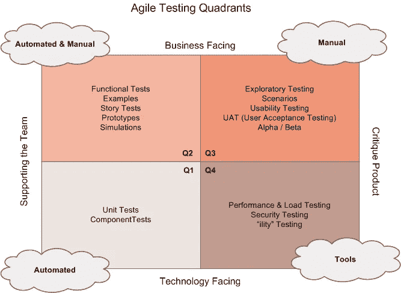

# 我应该对我的软件应用程序进行哪些测试？

> 原文：<https://medium.com/geekculture/which-tests-should-i-use-for-my-software-application-bb5103b96d46?source=collection_archive---------41----------------------->

## 了解如何使用敏捷测试矩阵

Image Source: Unsplash

# 首先，什么是自动化测试？

简单来说，就是用例的自动模拟。它遵循与手工测试相同的步骤，但是自动化加速了它。重复运行相同的脚本来测试软件模块的工作功能。

## 为什么要进行自动化测试？

1.  它有助于降低测试成本。
2.  当人类的大脑可以从事其他活动时，它也节省了大量的时间。
3.  最重要的是，它减少了人为错误的机会。

> 你可能会说，但它也需要维护，这需要时间。但是如果你把这段时间看作是投资的首付，那么从长远来看，这段时间会给你带来丰厚的回报。

自动化测试可以在不同的平台、操作系统和设备上运行。

## 自动化测试的类型:

1.  单元测试
2.  集成测试
3.  组件测试
4.  功能测试
5.  UI 测试

# 有这么多种自动化测试可用，我应该为我的项目选择哪一种呢？

## 这就是敏捷测试象限出现的地方！

该模型由 Brian Marick 于 2003 年开发，用于对不同类型的测试进行分类，并在早期阶段确定测试所需的资源。

它按照 X 轴和 Y 轴的惯例分布在 4 个象限中。

## 象限 1 —

这个象限描述了在开发阶段支持团队的面向测试的技术。这些测试总是自动进行的，它们的主要目的是确保功能处于工作状态。它充实了软件构建的基础。

> **示例** —单元测试、集成测试、组件测试

理想情况下，大多数测试都是在象限 1 中编写的，因为它们是在产品开发的同时编写的。

## 象限 2-

它们是支持开发的面向业务的测试。象限 2 测试主要用于回答问题和发现信息。这反过来验证了正在构建的应用程序的特性。

> **示例** —自动化测试中的功能测试、UI 测试。在这个象限中，手工测试的例子包括使用像网页这样的原型。

这些测试在开发期间和开发之后进行。它们有助于在软件最终发布之前发现错误。

## 象限 3-

该象限包括对产品进行评论的面向业务的测试。它主要包括手工测试，但是自动化也可以加入其中。它们提供了关于产品当前工作状态的有价值的反馈。它们本质上更加面向用户。他们通过尝试确定用户如何参与产品来关注用户体验。象限 3 测试试图理解应用程序的工作流程。

> **示例** —探索性测试、可用性测试、A/B 测试。

它们可以在开发完成之前或之后进行。象限 3 测试背后的主要目标是找出可以进一步改进的地方，并发现软件中的 bug。

## 象限 4-

该象限包含面向技术的测试，这些测试也会对产品进行评论。在这个象限下，所有的测试都是自动化的。这里使用特定的工具进行测试。象限 3 测试的主要目标是提供关于应用程序的目标信息。

> **示例** —性能测试、负载测试、安全测试、可靠性测试。

象限 4 测试的执行取决于应用中最重要的部分。他们关注产品中特性的优先级。它们用于测量数据，这些数据可用于分析以做出明智的决策。

敏捷测试象限方法可以在产品的整个计划、开发和发布阶段使用。

> 注意:敏捷测试象限并不意味着所有 4 个象限的测试都是必需的，也不意味着测试必须执行的任何时间顺序。

> 仅此而已！感谢您一路阅读！请留下您的反馈。😄
> 
> 也可以在: **LinkedIn:**[https://www.linkedin.com/in/spreehadutta/](https://www.linkedin.com/in/spreehadutta/)
> **insta gram:**[https://www.instagram.com/spreeha.dutta/](https://www.instagram.com/spreeha.dutta/)
> **推特:**[https://twitter.com/DuttaSpreeha](https://twitter.com/DuttaSpreeha)
> **GitHub:**[https://github.com/Spreeha](https://github.com/Spreeha)
> **邮件:**spreehadutta@gmail.com