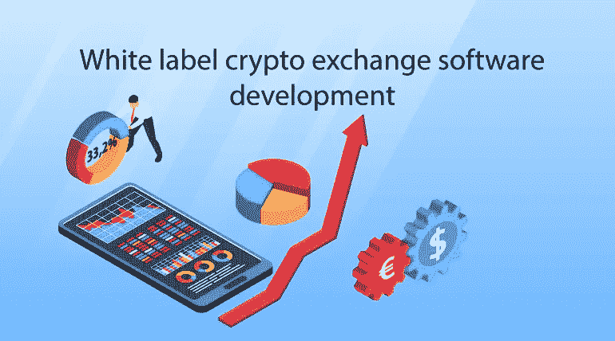
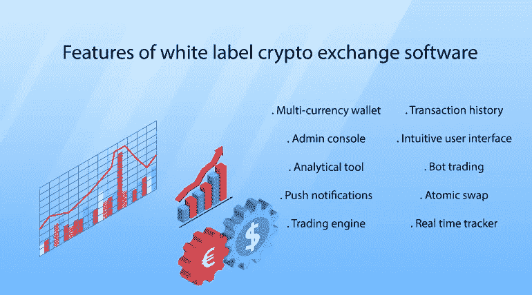
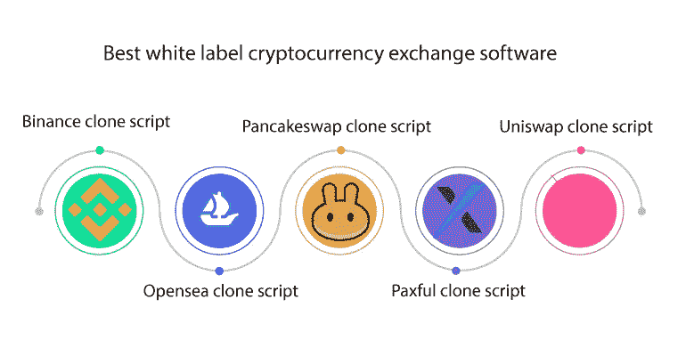
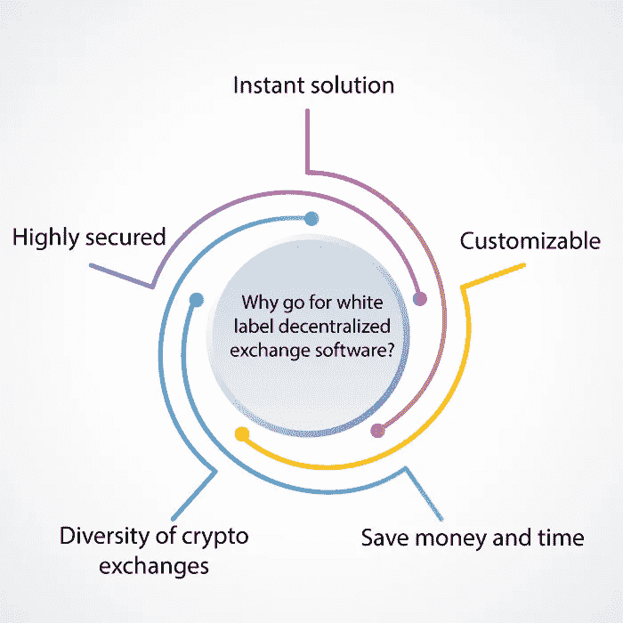

# 白标加密交换软件开发

> 原文：<https://medium.com/geekculture/white-label-crypto-exchange-software-development-4651377c9d7e?source=collection_archive---------15----------------------->

白标加密交换软件开发不需要复杂的过程。它是预制的，完全可定制的。因此，您可以根据您的业务需求对其进行专门化。White label exchange script 是一个非常受欢迎的平台，但在开始开发之前，请详细分析市场。这里是一个完整的指南，包括所有关于加密交换白标软件开发的细节，还有一个重要的问题，白标加密交换成本。

# **什么是白标加密货币？**

加密货币交易所是一个允许用户交易各种数字货币的交易平台。白标加密交易所的功能有助于交易。在加密货币中，交易者可以交易法定货币和代币。白标平台是定制的平台，在定制的平台中提供与流行和最常用的平台相似的功能。

从零开始创建一个加密交换平台被白标解决方案所取代，白标解决方案是更实惠和即时的解决方案。一般来说，白色标签指的是可以使用和定制的产品。企业倾向于重新命名它，就好像它是他们创造的一样。 [**白标加密交易所软件开发**](https://radindev.com/white-label-crypto-exchange-software/) 是一种经济省时的方法，可以创建一个加密交易所，为著名的原始交易所提供迷人的操作系统。

# **白标加密交换脚本的特性**

多币种钱包

加密钱包的开发必须是安全的，并提供一些选项来促进交易。多币种钱包使来自不同区块链的用户能够以一种轻松安全的方式进行交易。

管理控制台

管理员可以通过管理控制台处理操作系统的不同方面。白色标签加密交换软件开发的管理控制台可以完全定制，所以，管理员可以添加加密，管理资金等。

分析工具

这个功能是专门针对专业交易者的。该功能可以显示移动平均线等技术指标，因此用户可以做出明智的决策。开发分析工具会像其他功能一样增加白标加密交换的成本。

推送通知

在加密交换白标开发中推送通知允许用户跟上平台中最新发生的事情。有了这个功能，价格等信息可以不断更新。

交易引擎

交易引擎是白标加密交易所的核心特征之一。这可以显示报价、出价、指示交易的可能性、创建时间表等等。

直观的用户界面

每个用户，不管是新人还是专业人士，都更喜欢用户友好的界面。为了提高保留率和用户参与度，在白标加密交换软件开发中开发一个简单易用的界面。

交易历史

所有交易历史都存储在白标加密交易脚本中，可以在任何需要的时候显示。此功能还可以跟踪任何未经授权的访问或非法活动。

Bot 交易

Bot trading 代表加密交换白标软件开发中的交易者。该特性基于您的策略做出有关交易的决策，而忽略手动中断。

原子交换

原子掉期是自我监管的自动交易合约，允许两个用户在没有第三方的情况下从不同的区块链进行交易。像原子交换这样的附加特征影响了白标加密交换部分。

实时跟踪器

white label crypto exchange 软件开发中的实时 taker 帮助用户比较加密货币的不同方面，包括价格、排名和交易量。它有助于更好的交易决策。

# **最佳白标加密货币兑换软件**

## Pancakeswap 克隆脚本

White label pancakeswap 克隆脚本是领先的分散式 exchange pancakeswap 的%100 自定义副本。Pancakeswap 是最流行的分散式交换脚本，带有本机令牌 CAKE。白标 pancakeswap 克隆脚本是投资者非常需要的交易所克隆，因为它执行令人难以置信的交易协议和高级别的安全原则。我们的网站上有免费的 [**pancakeswap 克隆脚本**](https://radindev.com/pancakeswap-clone-script/) 的演示，你也可以查看白标加密交换的费用。

## 币安克隆脚本

币安是最著名的中央加密交易所，交易费用最低。在币安脚本中，还有一个不可替代代币的市场。像其他流行的交换平台一样，有一个白色标签的币安克隆脚本可用于启动交换脚本。在一个白标加密交换软件开发中，你可以要求**的功能。**

## **Opensea 克隆脚本**

**Opensea 是 NFT 最大的市场。区块链联邦理工学院的 NFT 开放海洋市场。不可替代的令牌是加密领域的一个趋势主题，因此对使交易 NFT 可用的市场的需求正在增加。由于 opensea 是最受欢迎的，也是最大的已知 NFT 市场，因此 opensea 克隆脚本创建了一个适当的突出的副本。**

## **Uniswap 克隆脚本**

**uni WAP 是另一个流行和使用的分散式 exchange 脚本，您可以在白色标签 uni WAP 克隆脚本中运行与 uni WAP 完全相似的功能。uniswap 的白标加密交换软件开发需求很大。Uniswap clone 是一个分散的平台，用户可以在其中交易、赚取、交换和赢得加密货币。通过白色标签 uni WAP 克隆，您可以运行 uniswap exchange 脚本的相同功能和特性。**

## **Paxful 克隆脚本**

**Paxful 是一个全球性的 p2p 加密交易所，创造了一个金融环境。在 paxful 中，用户有多个支付网关。像 Paxful 这样的白标加密交换软件开发，就是一个定制的性价比很高的交换脚本。**

# ****白标加密交换开发与使用刮刮卡****

**从头开始开发加密交换需要人力和时间。显然，它需要更多的资金，因此最终产品适合需要大量目标用户的大型企业。它从初始阶段开始，所有你想要的功能都必须先开发出来，不能在未来定制。所以，你不能拘泥于技术栈和用户需求的最新更新。这就是我们推荐白标加密交换软件开发的地方。**

**加密交换白标开发是划算的。它可以定制，在很短的时间内完全满足您的业务需求。关于白标交换脚本的一个重要事实是它可以即插即用。白标加密交易所可以立即部署，白标加密交易所的价格受分配时间的影响很大。**

# ****为什么选择白标加密交易所？****

****

**Crypto exchange 白标软件开发是一种即时解决方案，对于资金较少的初创公司和企业家来说更实惠。从头开始创建并不是启动加密交换的经济上设计良好的解决方案。白标平台是 100%可定制的，你作为投资者可以选择易于使用和简单的界面。**

**加密货币和被动收入来源是市场中的趋势问题，因此许多人计划加入该社区并开始交易。因此，有很多新加入加密交易平台的人经验不足。因此，一个拥有易于使用的界面的平台——足够吸引大量受众——可能是打开市场的一种方式。**

**白标加密交易所软件开发配备了安全功能，这对经验不足的交易者很重要，因为他们是新进入市场的。许多安全功能，如双因素身份验证、智能合同原则、托管系统、KYC/反洗钱验证等，都是实现平台安全性的最重要功能。然而，随着执行先进的操作系统，白标加密交换成本是预算友好的。**

# ****什么是白标加密交换平台类型？****

## **分散交易所**

**在白标加密交换软件开发的需求上，dex 已经达到了像 pancakeswap 克隆脚本这样的高度 pick。分散交易所是一个直接的交易空间，为市场提供了最大的透明度。在 DEX 中，用户不需要中央授权就可以交易。它更安全，可以建立在许多可靠的区块链上，如 ETH、币安、Tron 等。分散的交换脚本为市场提供了更少的流动性，但它仍然推出了加密领域最常用的平台之一。**

## **集中交易所**

**与 dex 不同，中央交易所需要中央授权才能交易。99%的交易都是在集中的交易所脚本中完成的，这给交易所带来了更多的流动性。中央交易所的运作方式类似于传统交易所，由一名操作员控制整个交易过程。你可以要求白标加密交换软件开发，以获得高流动性。**

## **点对点交流**

**在点对点加密交换或 p2p 交换中，用户直接从他们的钱包中进行交易。它高度安全，交易者可以在交易时完全控制他们的资金和数字资产。在 p2p 加密交换脚本中，托管系统充当交易安全和隐私的中心。整个交易过程由托管系统确认。在 p2p 加密交换白标软件开发中，托管系统角色是一个高度安全的功能。**

## **混合交易所**

**混合交换脚本结合了集中式和分散式加密交换脚本的优点。混合加密交换提供了 DEX 平台的安全性以及 CEX(集中式交换)脚本的流动性和快速性。你可以启动一个白标混合交换脚本来解决德克斯和 CEX 的问题。混合白标加密交换成本取决于添加的功能。**

# ****启动您的白标加密交换软件****

**许多新兴的创业公司和投资者都选择了白标加密交换软件开发解决方案。由于白标交换脚本提供了广泛的优势，它已经获得了很大的吸引力。白色标签不需要任何专业知识来管理开发过程。它是安全的，并采用最新的技术堆栈开发。**

**复杂的界面和简单的设计，使所有用户都能够参与平台并开始交易，而没有交易空间的经验。对于新手来说，安全性是白标加密交易所的一个基本特征，而对于有经验的人来说，它可能不那么重要。一般来说，与其他平台相比，易于使用的平台可以接触到更多的用户。专业交易者关心的是提供流动性、价值、法律部门等功能。**

# ****白标加密交换成本****

**白标加密交换价格取决于许多因素，如您需要的附加功能，项目的复杂性，以及开发和部署需要多长时间。然而，白标加密交换的成本取决于你所要求的准确程度。最近非常需要白标加密交换软件开发，许多提供商公司提供他们的白标解决方案。您可以要求免费演示，以检查功能和价格。**

# ****Crypto exchange 白标软件开发有什么好处？****

**启动您的加密交换平台**

**经济的解决方案**

**性价比高**

**更快上市**

**高度灵活**

**安全功能**

**令人惊叹的用户界面/UX**

**轻松部署**

**提高你品牌的知名度**

**无错白标加密交换软件**

# ****结论****

**crypto exchange white label development 是一个定义良好的解决方案，用于向市场推出交易所，以使投资者和交易者能够出售、购买和交易各种交易。白标加密交换成本是预算友好的，因此，你可以节省大量的金钱，更重要的是节省时间。从零开始的白标交易所开发可能会消耗更多的金钱和时间，这是不合理的，只要白标加密交易所软件开发解决方案可用。**