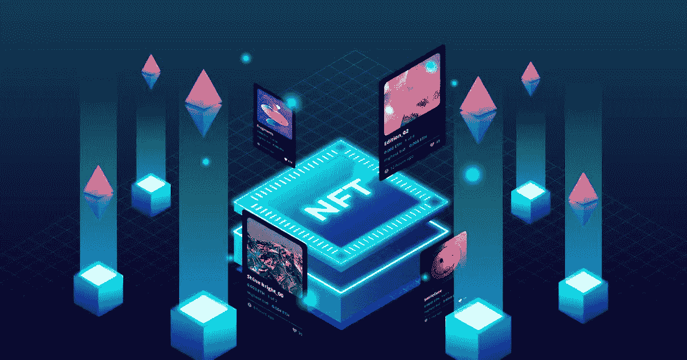

# 白标多链 NFT 市场发展-完整指南

> 原文：<https://medium.com/geekculture/white-label-multi-chain-nft-marketplace-development-complete-guide-dbb61f42255e?source=collection_archive---------16----------------------->

T 多链概念是指在单一的 NFT 市场上，利用各种区块链技术来铸造和交易 NFT。多链网络必须与其他区块链同步，从而集成不同的区块链技术。

> 我想大家都知道，NFT 的市场价格在 2021 年上涨了 1785 %，超过了 190 亿美元。这是巨大的！

NFT 可以被认为是数字领域的主流，投资者都是为了利润。区块链网络有大量的选择，NFT 有其局限性或传播，显示出其互操作性的明显下降。想要一个快速的解决方案，引入一个多连锁店到 NFT 来建立不止一个而是多个区块链将是最合适的。我们必须清楚的是， [**多链 NFT 平台**](https://www.appdupe.com/nft-marketplace-development) 应该更值得和可及。

# **是什么让白牌多连锁店 NFT 市场成为理想之选？**

1.  **性价比**

一个多连锁的 NFT 市场并不需要价值百万美元的艺术品。考虑到用户的稀缺，制定一个钱包友好的多链 NFT 市场，在这种情况下，它是加密货币。例如，以太坊是一个昂贵的区块链和索拉纳是最便宜的相比。人们可能想选择一个适合的设计。

**2。智能合同的潜力**

当我们进入数字媒体时，我们总是担心我们的信息被泄露。因此，安全性在这里起着至关重要的作用。它高度依赖于列出的所有智能联系人的实力。如果它是高度安全的，那么在让无 bug 程序上船方面一定有所发展。为了追求拥有所有这种安全和无缺陷的市场，所有智能合同都应该经过彻底的测试，在此之后，NFTs 销售者可以见证该领域中任何市场的可信度。它应该能够抵御任何黑客攻击、破坏和中断。

**3。分叉**

你一定知道在 NFT 什么是分叉。硬分叉会导致复制 NFT，因此抗分叉区块链铸造是非常必要的。

**4。速度**

对于任何企业来说，利润都是目标。为了获得巨大的利润，一个人必须能够策划一个涉及良好的价值存储和渠道的数字系统。我们还应该清楚，速度并不意味着与高得离谱的价格和低质量的安全妥协，这将危及区块链的声誉

# **那么现有最好的区块链会是什么？**

我可以给你一些建议，告诉你什么是最好的选择。

首先是在 NFT 市场非常受欢迎和被广泛使用的区块链，以太坊。以太坊是因为它很容易生成，只需几次点击和数据，并促进互操作性。但是，不要说它们是市场上最好的。它们有自己的缺点。

*   高成本和可扩展性正受到限制。
*   网络中的流量控制很弱。

第二个是平衡计分卡；他们在市场上建立了自己的地位，开发了索引生态系统和一些工具，没有花费太多时间。他们确实比以太坊工作得更好，而且确实知道他们相当便宜。

第三，多边形。它们比 BSC 便宜，而且交易速度很快。Polygon 是最新的，它因能够使用并行链进行扩展而出名。

# **推出白色标签多连锁店 NFT 市场**

在几个小时内轻松创建区块链的最快方法是拥有一个开源的区块链开发结构，可以提供更大的期望。它有内置模块(网络、陈旧存储等。).列出几件事，它们是成功的 [**在 NFT**](https://www.appdupe.com/nft-marketplace-development)市场推出多连锁店的前期要点。

1.  **动态性质**

当设计一个多链 NFT 市场时，它需要拥有像块生产者这样的模块，因为它们将在大集合中出现，并与最佳区块链框架一起用于动态复合事物，如数据学习、交易等。

1.  **基础设施和可用性**

它必须支持以太坊和比特币的创新。它应该能够完成许多复杂的功能，能够在恶劣的环境中安全可靠地工作。

**3。可定制**

与其他区块链网络相比，灵活性对于创建具有个性化功能、能够承受高风险的定制区块链是必要的。

**4。分散式**

一个理想的多链区块链应该用更少的工作为开发者提供应用集成的解决方案。他们应该完全分散用户友好的区块链应用程序。

**5。亲和力**

它必须是一个平台，让区块链网络获得与区块链的互通性。

**6。电子装备**

推出多链 NFT 市场应该是一个平台，软件和 NFT 市场开发人员可以在必要时创建应用程序。它必须具备整合的功能，就像其他区块链一样。

**7。安全性**

它必须有一个多链连接和一个共同的安全层，以便独立的链可以在他们的安全赌注费用。

8。治理

让独立的区块链在不放弃治理的情况下从网络中获得回报是强制性的，这是一个创建和启动区块链的更简单的过程，时间更少，更具成本效益。

多链 NFT 市场的特点需要一个本质上分散的区块链，该区块链具有支持并行交易、跨不同链的多次转移以及增强网络间支持的区块链基础设施，以启动多链 NFT 市场

# **结果**

区块链的基础设施可以为设计和启动去中心化的应用程序提供更加灵活的舞台，这些应用程序可以利用以太坊和比特币的最佳创意，以便需要它们的开发人员可以轻松使用它们。

在 NFTs 蓬勃发展的市场中，一些推出 NFTs 的知名公司看到了无限的收益。推出自己的 [**白标多链 NFT 市场**](https://www.appdupe.com/multi-chain-nft-platform-development) 会更容易，每个区块链内的连接性更好，它们的集成，能够脱颖而出的独特功能，最低的成本要求，并支持所有板载网络。