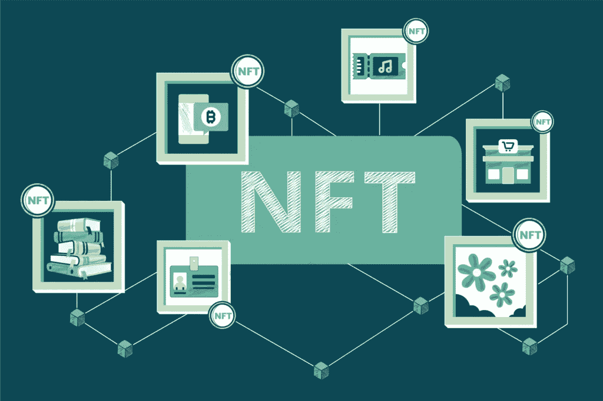

# 白色标签 NFT 市场-为您的企业定制的 NFT 市场

> 原文：<https://medium.com/geekculture/white-label-nft-marketplace-customizable-nft-marketplace-for-your-business-2553b4e5c030?source=collection_archive---------17----------------------->

> NFT 市场遍布各国，已经成为加密领域的主要部分。如果你正试图进入密码世界并尝到成功的滋味，你需要建立某种形式的 NFT 市场，并使其达到官方。但是，要让它最早进入市场，你需要一个白标方案。提供这种开发服务的公司都可以使用这种解决方案。

此外， [***白标 NFT 商场***](https://www.blockchainappfactory.com/white-label-nft-marketplace?utm_source=GeekCulture&utm_medium=26th+Mar22&utm_campaign=vishnu) 就是现成的 NFT 商场，可以根据您的业务需求进行定制。

***让我们深入了解一下 NFT 的白色标签市场。***

## **贴有白色标签的产品**

白色标签从产品上去除创造者的品牌和标志，代之以购买者的品牌名称和标志。

我们使用的手机是白色标签的一个很好的例子，因为首要品牌并不完全制造手机；只有该品牌的软件会被制造出来，而另一家公司会制造外壳、电池和屏幕。然后，一家顶级手机公司会用第三方品牌替换他们的品牌。

现在，您应该对白色标签的工作原理有了基本的了解。然而，白标 NFT 平台和传统 NFT 平台之间的唯一区别是，白标 NFT 市场平台可以即插即用。相比之下，传统的 NFT 市场平台开发需要从头开始构建整个平台。

## **白牌 NFT 市场的优势**

就开发过程而言，白标 NFT 市场的主要优势在于其可达性。然而，由于这些平台似乎是完全通用的，它们变得易于开发，您将能够在几分钟内完成。因此，不会有任何东西从零开始构建，因为该平台会查看重载。

尽管是通用的，白标产品是进一步定制的良好基础。然而，快速简单的开发过程可以减轻你的大部分工作量，让你更专注于设计引人注目的用户界面(UI)和用户体验(UX)。

当与可靠的 [***NFT 发展公司***](https://www.blockchainappfactory.com/nft-development-services?utm_source=GeekCulture&utm_medium=26th+Mar22&utm_campaign=vishnu) 合作时，推出白色标签的 NFT 市场也允许很大的灵活性。此外，您可以使用操作系统的工具轻松定制和实现新功能。因此，您可以确保该平台适合您的目标市场，并包含您需要的功能，同时避免噱头。

最后，白标软件经过了广泛的测试。因此，当启动一个白色标签的 NFT 市场时，你不必担心程序错误或其他开发问题。

## **白标 NFT 市场开发**

世界各地的用户现在都有兴趣转向白标 NFT 市场平台，因为它们简单易用，最重要的是，具有成本效益。

> 白标 NFT 市场是如此用户友好和可定制，它可以建立在各种平台上，包括多边形，以太坊，币安智能链和流行的拍卖门户网站。定制、钱包集成、元掩码集成和其他 API 集成包含在白标 NFT 市场和贸易图表中，以显示价格波动和新的 NFT 趋势。

以下是赋予白牌 NFT 市场开发平台优势的特性:

➤ **即插即用:**

用户可以使用白标 NFT 市场解决方案轻松启动 NFT 市场。

➤ **可定制可配置:**

用户可以根据他或她的喜好定制和配置白标签 NFT 市场效果平台。

➤ **高端安全功能:**

与传统的 NFT 市场相比，白标 NFT 市场精心设计，具有顶级的可靠安全功能。

➤ **人性化平台:**

白标 NFT 市场的交互式 UX/用户界面可以根据用户的要求进行定制。

➤ **集成 NFT 钱包:**

为了管理和交易非金融交易，该平台集成了多个 NFT 钱包。

**➤跨链灵活性:**

白标 NFT 市场适应性强，因为它的平台可以根据用户的需求进行定制。但是，该平台可以与 Polkadot 协议集成，以实现跨链连接。

## 创造一个白色标签的 NFT 市场

 [## 白标 NFT 市场开发|推出您自己的白标 NFT 加密收藏品…

### 白标 NFT 市场是一个创收平台，不断增加其加密服务…

www.blockchainappfactory.com](https://www.blockchainappfactory.com/white-label-nft-marketplace?utm_source=GeekCulture&utm_medium=26th+Mar22&utm_campaign=vishnu) 

平台的所有者拥有对平台的控制权，并且基于他们的需求和要求，管理员可以添加、删除和更改功能。每个现有的市场都使用区块链网络，如 Solana、Cardano、Ethereum、Polygon、币安智能链(或 BSC)等。白标 NFT 市场的优势在于，创建时间大大缩短，并允许企业快速推出自己的平台。以下是要遵循的步骤:

**选择区块链—** 这一阶段包括研究和决定最适合 NFT 市场的区块链网络。每个网络都有自己的优势，从长远来看，选择最好的网络有利于市场。

**为平台创建令牌—** 此阶段需要为市场中列出的非功能性交易构建令牌协议。硬币可以遵循 ERC721 或 ERC1155 规格。

**创建&集成所需的智能合同—** 在分散的市场中，智能合同被用来处理交易和活动。然而，它们都是自动执行的协议，不需要被监视或监控。它们是任何分散的白牌市场的必备产品。智能合同的创建和实施是必需的。

**·IPFS 存储集成—** 用户数据存储在区块链数据库中，而市场上提供的 NFT 记录在 IPFS 存储器中。搭建好平台后，你可以将 IPFS 整合到市场中。

**·创建一个易于使用的界面—**NFT 市场的用户界面(UI)必须令人愉快且用户友好。它使用户受益，并通过使网站更具视觉吸引力来增加网站的流量。当有人访问一个网站时，用户界面(UI)是他们看到的第一件事，一个糟糕的 UI 会破坏网站的受欢迎程度。

**·以测试模式运行测试—** 在这一领域，市场经历了一系列测试。测试团队建立了一个测试网络，并对产品进行了广泛的测试。这种技术确保了平台没有 bug、没有缺陷、没有错误。

**发布—** 现在，您可以开始发布您的产品，并向全球用户提供。专业的支持团队可以解决用户可能有的任何问题或顾虑。

## **为什么 NFT 市场要贴白色标签？**

大多数企业家没有从零开始开发 NFT 平台，而是选择为他们的加密领域业务开发白色标签 NFT 市场。与其他人相比，他们在创业方面是最好的。

但是，如果你想知道为什么你应该选择一个白色标签的 NFT 市场，而不是从零开始建立自己的 NFT 平台，这是因为这样做的好处和特点。与从头开发一个 NFT 市场相比，开发一个 NFT 白标市场所需的时间和成本是最少的。启动白标 NFT 市场将有助于管理员快速建立标准的 NFT 业务。

## **结论**

[**Whitelabel NFT 市场**](https://www.blockchainappfactory.com/white-label-nft-marketplace?utm_source=GeekCulture&utm_medium=26th+Mar22&utm_campaign=vishnu) 永远是 NFTs 世界的一个趋势。在你即将到来的冒险中，启动一个总是一个额外的优势。利用 NFT 顶级开发公司的解决方案，启动你的职业生涯。当你从白标解决方案提供商那里获得这样的服务时，你将成为当今世界上一名成功的企业家。白标解决方案还使您能够根据业务需求的所有要求最早推出您的产品。对于那些试图在市场上最早推出产品的人来说，白标解决方案是成功创业的必备条件。