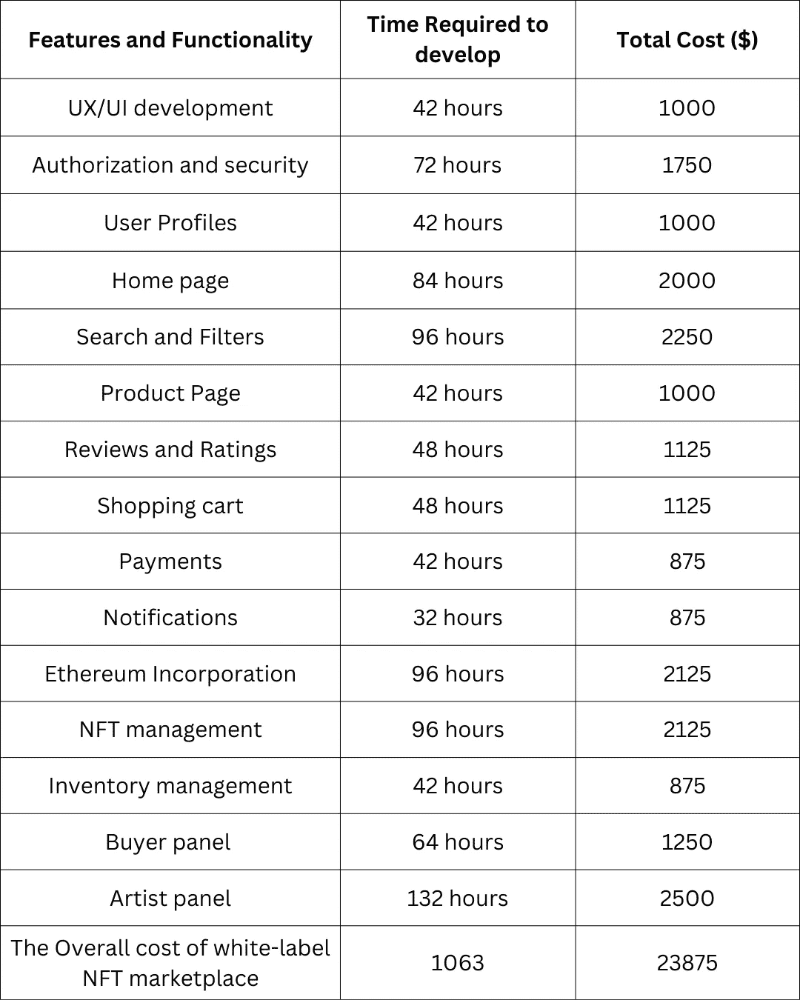
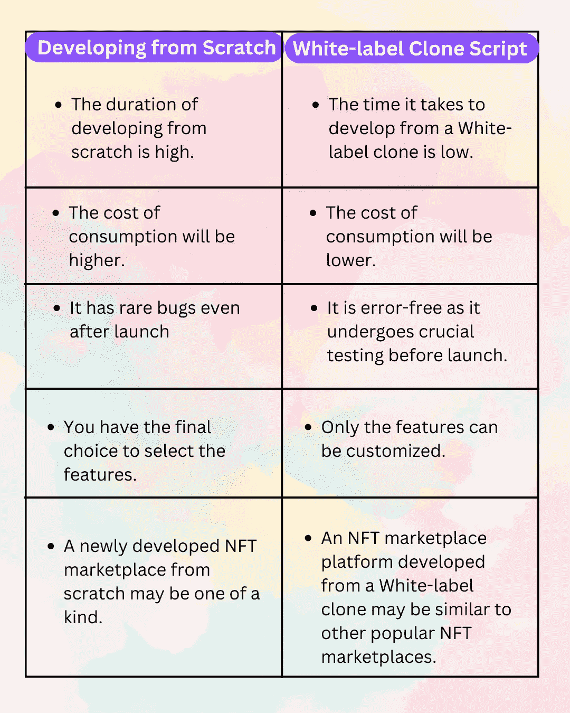

# 白标 NFT 市场发展——创业终极指南

> 原文：<https://medium.com/geekculture/white-label-nft-marketplace-development-an-ultimate-guide-for-startups-856acdcf2357?source=collection_archive---------6----------------------->

非功能性思维正随着许多隐喻进入这个秘密世界的每一部分。NFT 爱好者现在将几乎每一种实物商品都标记化，因此希望有一种方式来方便独家交易者。为了参与 NFT 贸易，你需要超越国界。有一个更独立的 NFT 市场的用户参与 NFT 交易的高需求。企业家很可能会在商场里站稳脚跟，商场是各行各业寻找越来越多额外机会的万能工具。白标 NFT 市场开发服务减轻了非功能性交易和拍卖的负担。一家基于区块链的合资企业涉及基于核心的非功能性测试是一个很好的选择！

这个博客提供了深入的开发过程，成本和工作过程，并需要建立一个白色标签 NFT 市场。

# 什么是白牌 NFT 市场？

白色标签意味着从产品上去除创作者的品牌和标志，并为购买者使用品牌名称和标志。

例如，我们使用的智能手机是白色标签的一个很好的例子，因为只有软件完全由领先品牌生产，但手机的外壳、电池和屏幕都是由不同的公司制造的。但领先的智能手机公司将移除第三方公司的品牌，并建立自己的品牌名称。现在，你对白色标签的功能有了基本的了解。

Whitelabel NFT 市场是一个预先设计和可定制的解决方案，能够对不可替代的代币进行趋势分析，包括数字资产和收藏品。与从零开始建立一个 NFT 交易平台相比，使用白色标签的 NFT 市场更适合希望推出自己的平台并进入 NFT 领域的初创公司。作为一个定制的解决方案，它可以适应个人的业务需求。这与用于开发和注入区块链技术的特征是一致的。

# 白牌 NFT 市场开发

到 2029 年，NFTs 的未来预计将达到 1638.3 亿美元。这可能会促使许多人进入这个市场，碰运气赚钱，并通过启动 NFT 平台转换为加密货币。然而，发展这样一个 NFT 市场的成本很高。

虽然白标 NFT 市场是快速推出 NFT 平台的一种经济有效的方法。由于是预建的，开发成本和时间要少很多。相反，从零开始开发市场需要时间和资源。最好使用白标 NFT 市场解决方案来建立您的 NFT 市场。此外，你可以选择使用白标克隆软件创建一个类似于现有流行的 NFT 市场的平台。比如，你可以去克隆全球流行的 NFT 市场 Opensea。这样你就可以启动一个类似于流行的平台，获得所有的特性和功能，并根据自己的喜好进行定制。你还需要什么？一切都是现成的，以快速部署您的 NFT 市场。联系白牌 NFT 市场发展公司，开始你的 NFT 市场发展。区块链专家在白标 NFT 市场开发中遵循这一工作流程。

*   确定区块链网络
*   UI 开发
*   智能合同开发
*   存储设置
*   集成前端和后端
*   在测试网上
*   部署

# 开发一个白色标签的 NFT 市场要花多少钱？

根据一些估计，功能丰富的白色标签 NFT 市场的成本从 1000 到 9000 美元不等。更确切地说，白牌 NFT 市场的成本取决于客户想要添加到他们的 NFT 市场的功能。例如，选择具有高级功能的高科技区块链网络(如以太坊或 BSC)将需要更多的开发时间，从而导致开发成本增加。除了特性之外，安全特性和功能也是白标 NFT 市场价格的一个因素。我在下面提到，更多的信息是关于开发一个白色标签的 NFT 市场的每一部分的详细成本。

在我分别分析了白牌 NFT 市场开发成本的各个部分之后。评估白牌 NFT 市场的主要特征将是有益的。

# 为什么选择白色标签的 NFT 市场？

NFT 市场正在迅速成为数字空间中一个有利可图的商机。其惊人的增长促使许多交易商投资 NFT 市场。惊人的功能和各种领域吸引了更多的商人和商业风险。通过立即推出白色标签 NFT 市场平台，识别有价值的商业机会。照亮白色标签的 NFT 市场吸引了投资者。

**可靠的安全性—** 白标 NFT 市场开发平台为其用户提供了一个高度安全的平台，可以安全地管理交易。可信的交易设施提高了白标 NFT 的选择率。

**多标准支持** —白标 NFT 市场认可为您独特的数字资产创建 NFT 所需的所有标准。它还允许大宗形式的非金融交易。

**完全个性化—**NFT 市场解决方案支持端到端定制，用户可以根据自己的业务需求定制平台。

**透明**——NFT 平台将对客户一清二楚，让每一笔交易历史透明化。

# 从零开始和白牌 NFT 市场的区别

# 白色标签 NFT 市场的诱人特征

*   宏伟的 NFT 店面
*   改进的过滤器选项
*   高级令牌搜索
*   数字钱包集成
*   投标选择权
*   多重支付网关
*   基金管理
*   NFT 排名
*   法定货币支持
*   多设备兼容性
*   轻松启动

# NFT 最好的白牌商场是哪家？

创建一个白色标签的 NFT 市场将有利于降低开发成本和市场开发的时间要求。但是用像 Opensea clone 和 Rarible clone 这样受欢迎的克隆脚本建立一个白色标签的 NFT 市场将有利于你为你的市场带来更多的流量。

Opensea clone、Rarible clone 和其他流行的克隆主要用于 NFT 平台开发的白标 NFT 服务中。大多数商业人士和创业公司选择这些克隆产品用于他们的 NFT 市场开发，因为它们具有独特的内置特性。开发白标平台的最终目标是因为该平台的快速启动和无障碍访问。市场上有一些流行的白标解决方案，您可以选择适合您业务的解决方案。

*   Opensea 克隆
*   稀有克隆
*   索拉纳克隆
*   索拉雷克隆
*   基础克隆
*   超稀有克隆
*   无聊猿游艇俱乐部克隆人
*   克隆羊等。

# 白牌 NFT 市场是如何运作的？

白标 NFT 市场与编程的智能合约和平台功能一起工作，并因 NFT 买家和卖家而异。

**买家**

想要购买 NFT 的加密用户必须通过提供他的加密钱包和用户信息在 NFT 平台上注册。一旦注册，用户可以通过拍卖交易平台上列出的 NFT。如果拍卖列出的 NFTs，用户可以出价，并且只有当卖方接受出价值时，NFT 才会被转移到买方的钱包中。在公开拍卖中，卖家预先确定 NFT 的价值，并将其列在 NFT 平台上。因此，在这种情况下，一旦买方出价，NFT 将被转移到买方的钱包，密码将被转移到卖方的钱包。

**卖家**

卖家还必须在 NFT 平台上注册，并提供指定的所有信息。在平台上注册后，用户必须将他的数字资产存入 NFT。铸造是一种方法，其中数字资产在区块链网络上铸造，而 NFT 信息与地址一起存储在区块链网络上。一旦卖方通过确定 NFT 的加密值而在拍卖或公开拍卖中将 NFT 列入市场。一旦卖家支付一些费用将数字资产铸造成 NFT，市场上就铸造了一个 NFT。

# 使用白标 NFT 市场开发的好处

选择白标 NFT 市场发展的好处是，

*   现成的解决方案
*   可定制的
*   低成本
*   安全性
*   钱包整合
*   用户友好的平台
*   分散
*   更快的交易速度
*   交叉链相容性

# 包扎

总之，我希望这篇博客能让你明白白牌 NFT 市场发展的重要性。NFTs 是 2022 年最受欢迎的话题，并将在未来继续下去，NFTs 的业务已经升级，永远不会放缓。与 2022 年相比，NFTs 在 2022 年创造了创纪录的 10 亿美元市场，预计 NFTs 将在 2023 年达到高峰并创造新纪录。因此，在 NFT 市场上开始他们的加密领域业务的创业公司将会看到他们的利润达到数百万。顶尖的 [**白标 NFT 市场开发公司**](https://www.alwin.io/white-label-nft-marketplace-development-company) 将在各种区块链网络上为您的一流 NFT 市场编程，如以太坊、币安智能链、Tron、Cardano、Polygon、Solana 等等。