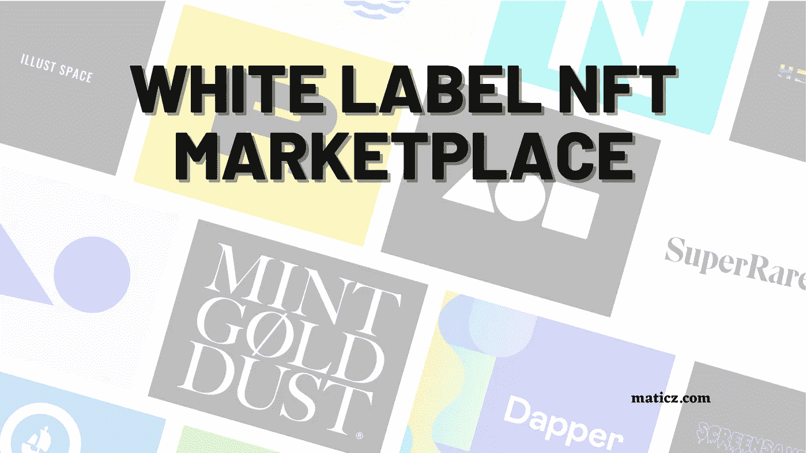

# 白色标签 NFT 市场-完整指南

> 原文：<https://medium.com/geekculture/white-label-nft-marketplace-development-b9f277f29d9b?source=collection_archive---------10----------------------->

## 白色标签 NFT 市场

白标 NFT 市场是一个市场就绪，100%可定制的 NFT 市场，作为一个交钥匙软件启动一个具有高级特性和功能的 NFT 市场。凭借其广泛的定制选项，白标 NFT 市场提供了一个全栈解决方案，允许企业家快速部署 NFT 市场进入市场，并产生有利可图的收入流。NFT 市场使用基于微的架构开发，具有很强的可扩展性和高度的性能导向，数百万数字内容创作者可以将他们的数字资产打造为 NFT 并上市销售。

[白色标签 NFT 市场](https://maticz.com/whitelabel-nft-marketplace)允许用户标记诸如数字艺术、音乐、视频、数字收藏品甚至房地产等东西。白标 NFT 市场的不同模块使其更加通用，允许所有者定制平台的每个部分。可以添加各种附加组件和功能来增强 white label nft marketplace 的功能，使其成为启动 nft 市场平台的更具成本效益的解决方案。

## 白标 NFT 市场开发

区块链专家致力于按照客户的要求设计和开发白标 NFT 市场，从而增加流量并满足用户的期望。目前 NFT 市场的大部分是在区块链网络上发展起来的，如以太坊、币安智能链、索拉纳、多边形和卡尔达诺。创业者选择白标 NFT 市场不仅是因为工作的时间效率，也是因为 NFT 从各个领域涌入这个平台。

由于白标 NFT 市场是用 NFT 市场的开发脚本构建的，它可以在最短的时间内以低成本部署，这使得企业家和商人在加密领域开始了他们的白标 NFT 市场。开发人员通常按照以下顺序规划他们的白牌 NFT 市场开发流程

## 白标 NFT 市场开发流程

区块链专家根据以下工作流程规划白标 NFT 市场开发。企业家和商人需要与专家一起预先规划他们的平台功能，以获得更好的结果。

*   UI 开发
*   确定区块链网络
*   令牌开发
*   智能合同的编码
*   IPFS 存储的集成
*   Beta 测试
*   部署

**UI 开发** —开发最有吸引力和用户友好的 UI，因为它给用户留下了您的 NFT 平台的第一印象，并且一个易于访问的用户界面将使您受益于许多活跃用户。

**确定区块链网络** —选择任何一个区块链网络，您的 NFT 市场将在其中建立。大多数 NFT 市场都建立在以太坊、币安智能连锁、卡尔达诺、索拉纳、多边形之上。

**令牌开发** —必须为市场上列出的 NFT 开发令牌标准。令牌可以是 721 或 1155 标准，并且所开发的令牌是端到端加密的。

**智能合同的编码** —分散市场中的运营和交易通过编程的智能合同进行监控和处理。开发人员的最终任务是为市场中的所有操作模式编码。

**整合 IPFS 存储** —市场上上市的 NFT 存储在 IPFS 存储中，用户数据和其他数据存储在 DB 中。开发市场后，这些存储将与市场集成。

**测试版测试** —在存储与集成后，市场将通过一系列测试来修复错误问题。在推出之前，市场在 testnet 上进行了测试。

**部署** —开发的市场随后被部署在客户的服务器上，并面向全球所有用户发布到全球市场。

要了解 NFT 市场的完整开发过程，请查看[如何创建 NFT 市场](https://maticz.com/how-to-create-nft-marketplace)博客。

## 白色标签 NFT 市场如何运作？

白标 NFT 市场功能与编程的智能合同和平台功能因 NFT 买方和卖方而异。

**买方**

想要购买 NFT 的加密用户需要用他的加密钱包注册 NFT 平台，并提供用户信息。一旦注册，用户将能够通过竞价交易平台上列出的非功能性交易。列出的 NFT 将被拍卖或公开竞价。如果 NFT 被拍卖，则用户将能够出价，并且只有当卖方接受出价值时，NFT 才被转移到买方钱包。在 openbid 的情况下，卖方预先确定 NFT 值，并将其列在 NFT 平台上。因此，在这种情况下，一旦买方出价，NFT 和 NFT 被转移到买方钱包，而密码被转移到卖方钱包。

**卖家**

卖家还必须注册 NFT 平台，并提供所有信息。注册该平台后，用户必须将其数字资产铸造成 NFT。铸造是在区块链网络上铸造数字资产的过程，并且 NFT 信息将与区块链网络上的地址一起存储。一旦铸造，卖方通过确定 NFT 的加密值，在市场上拍卖或公开招标中列出 NFT。一旦卖方支付一些服务费以将数字资产铸造为 NFT，NFT 就在市场上被铸造。

## **为什么要推出白色标签 NFT 市场？**

密码爱好者可能会想，为什么我应该选择一个白色标签的 NFT 市场，而不是从零开始开发市场。让我澄清一下，从零开始开发 NFT 市场是一个好主意，因为它提供了一个独特的平台，独特的功能和独特的特点。但是，与白牌 NFT 市场相比，NFT 市场从无到有的发展需要大量的时间和成本。首次进入加密领域业务的企业家和商人可能会考虑开发和推出白标 NFT 市场，因为它具有降低成本的优势，并且可以在最短的时间内推出。

## 总结

非功能性测试已经成为 2021 年最热门的话题，2022 年也是如此，非功能性测试业务飞速发展，这一趋势永远不会下降。与 2021 年相比，NFT 在 2021 年创造了超过 10 亿美元的市值记录，预计 NFT 将在 2022 年达到新的高度，创造新的记录。企业家们用白色标签 NFT 市场推出他们的加密领域业务，将会获得数百万的利润。Maticz， [white label NFT 市场开发](https://maticz.com/whitelabel-nft-marketplace)公司将在各种区块链网络上规划您的世界级 NFT 平台，如以太坊、币安智能链、Tron、Cardano、Polygon、Solana 等。