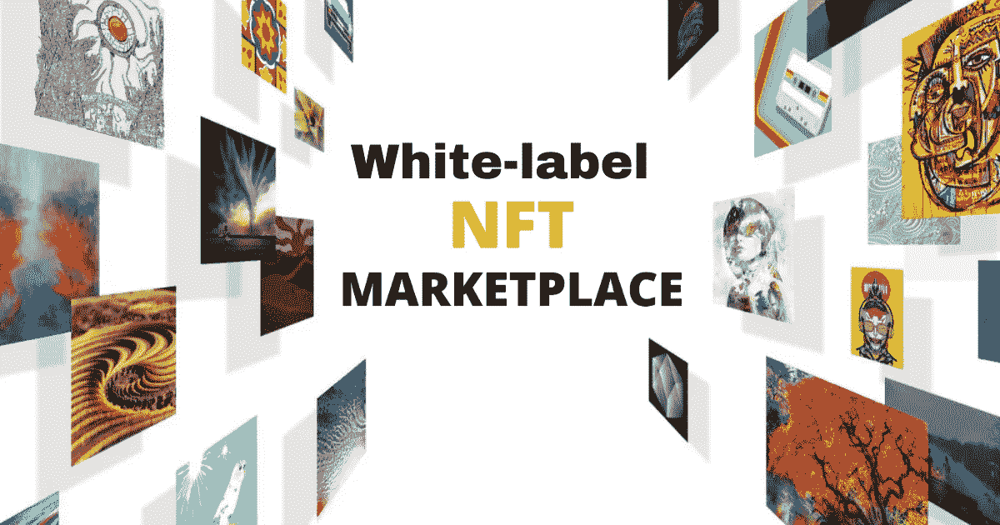
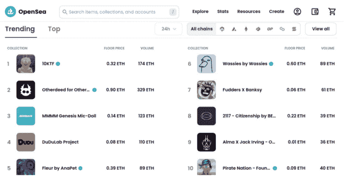
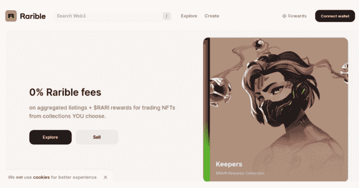
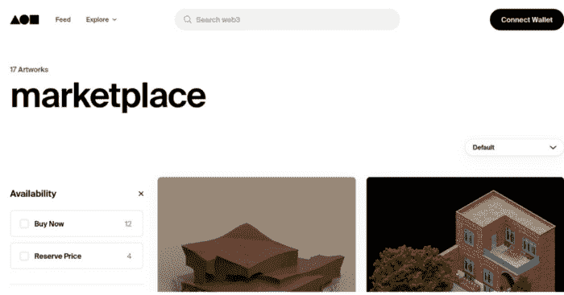
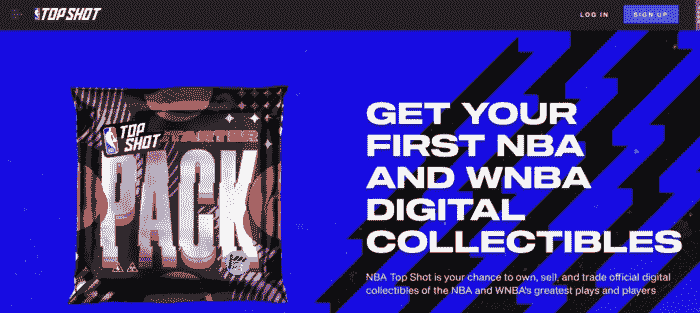
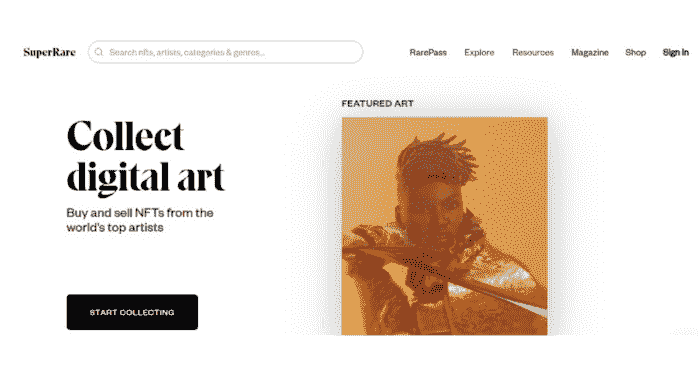
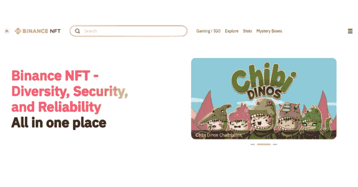

# 白标 NFT 市场——启动 NFT 平台的最明智方式。

> 原文：<https://medium.com/geekculture/white-label-nft-marketplace-the-smartest-way-to-launch-the-nft-platform-8e344d3f8894?source=collection_archive---------8----------------------->

在当今的数字世界中，技术和最新创新正呈指数级增长。像任何其他基于 Web3 的技术一样，NFTs 也受到了很多批评。NFT 从一个陌生的词汇转变为 2022 年的流行语，令人肃然起敬。

2021 年，NFT 股市超过了 10 亿美元大关，这让那些批评变得错误。在希望利用 NFT 趋势的 Web3 创业公司中，NFT 的商业模式似乎是下一个“大事件”。

在各种模式中，****的 NFT 市场发展在他们看来更有前途。这篇博客将探讨白牌 NFT 市场的发展，以及为什么它被认为是企业家进入利润丰厚的 NFT 领域的明智选择。****

****在深入探讨这个话题之前，让我们花点时间了解一下 NFT 平台。****

## ******NFT 市场的作用是什么？******

****促进 NFT 交易的数字平台被称为“NFT 市场”，由于论坛的性质，用户在购买、出售或交换数字资产方面有完全的自由。OpenSea、Rarible、币安、Nifty Gateway、Axie Infinity 和 Foundation 是目前市场上一些最好的 NFT 市场。****

******Reddit 的巨大成功震惊了 NFT 爱好者******

****尽管仅在 120 天前推出，Reddit 的 NFT 市场“金库”已经成为一个价值 1050 万美元的市场。加上超过 200 万的 Reddit 头像所有者，该平台的活跃用户数超过了自称是最大的 NFT 市场 OpenSea。****

## ******作为“商业模式”的 NFT 市场******

****NFT 市场平台所有者通过对其平台上的每一笔成功销售收取佣金来赚取利润。其产生高收入的潜力已经成为创业公司和企业家在 NFT 创业的主要驱动力。****

## ******NFT 市场开发——传统开发方法与白色标签解决方案的对比******

****开发一个功能齐全的 NFT 市场的确切成本取决于你的方法。一些值得注意的因素是包括的特性数量、使用的技术栈、与第三方 API 的集成、开发时间、开发人员的成本和定制化水平。****

****有两种方法可以启动你的 NFT 市场发展进程。****

## ******从无到有的发展******

****从零开始启动一个成熟的 NFT 市场业务是复杂的，在技术上也是艰巨的。然而，开发这样的平台需要持续的资金支持和技术专长。如果你从底层开始建造市场，成本可能在 8 万到 10 万美元之间(甚至更多)。这种选择适合已建立的企业主，对他们来说，花费过多的钱不是问题。但是对于需要一个预算友好的解决方案的企业家来说，这种方法并不适合他们。不要放弃，有一个合适的选择，就是“白色标签 NFT 市场”****

## ******白色标签 NFT 市场******

****白标 NFT 市场是一个预制和可定制的解决方案，具有交易非功能性交易的潜力，包括各种收藏品和数字资产。这些解决方案简化了希望在市场上快速启动其 NFT 企业的企业家和企业主的流程。****

****通过选择这个选项，你可以开发一个类似的 NFT 市场平台，就像一个著名的 NFT 市场(比如 OpenSea，Rarible 等)。)，获得所有特性和功能，根据您的业务需求对其进行定制，并将其投放市场以赢得巨额利润。****

## ******NFT 白色标签市场的主要特征******

****如果你想让你的 NFT 市场在像 OpenSea 等市场巨头中领先。，并且要对目标人群产生积极的影响，它必须包含引人注目的功能。****

******这里列出了使用白色标签 NFT 市场时必须包含的功能:******

*   ****诱人的店面****
*   ****增强型过滤器选项****
*   ****高级令牌搜索****
*   ****钱包整合****
*   ****投标选择权****
*   ****多个支付网关****
*   ****基金管理****
*   ****NFT 排名****
*   ****法定货币支持****
*   ****多设备兼容性****

****除了上述功能外，用户还可以根据业务需求添加更多功能。****

## ******为什么白牌 NFT 市场是企业家的最佳选择******

****现在，让我们一个接一个地了解一下白色标签 NFT 市场的好处。我们开始吧:****

## ******节省时间和成本的解决方案******

****选择白标解决方案来开发 NFT 市场可以节省您的资源，让您免于囊中羞涩。因此，创建一个白标 NFT 市场的成本比冗长的刮擦法要低。****

## ******可根据业务规范定制******

****使白牌 NFT 市场开发更可信的主要附加优势是它提供的定制选项。开发者的船员可以根据后者的业务需求，帮助平台所有者修改平台。通过这样做，平台在用户眼中变得更加独特。****

## ******确保无可挑剔的安全层******

****白标 NFT 市场解决方案(默认情况下)具有强大的安全机制，可以保护它免受各种网络攻击和其他漏洞。此外，访问您平台的用户会很高兴使用它来进行 NFT 交易。****

## ******多次彻底测试******

****由于白牌 NFT 市场是一个预制的解决方案，它将由主题专家进行多次彻底的测试，不可能出现任何错误和技术故障。****

## ******钱包整合******

****白标 NFT 市场通过默认集成钱包完全满足了平台用户。该功能使企业家不必从口袋里掏出更多的钱来开发新钱包并将其集成到平台中。****

# ****2023 年顶级白标 NFT 市场解决方案****

****要使用令人惊叹的 NFT 市场商业模式，你需要了解可以简化你的市场启动过程的最佳 NFT 市场解决方案。****

****以下是全球顶级白标 NFT 市场解决方案列表，用户高度评价其简化业务运营的潜力和能力。让我们开始吧:****

## ******#1 OpenSea 克隆******

********

****OpenSea 仍然是有史以来最大的分散式 NFT 市场之一，用户流量不断增加，市场可交易性相当高。随着用户群的增加，它是 NFT 市场中第一个在数字领域达到十亿美元大关的市场。2021 年 8 月，该平台在 NFT 的交易额远远超过 35 亿美元，令全球 NFT 粉丝感到惊讶。热门投资者如凯文·杜兰特、马克·库班等。，帮助推动该市场的估值超过 10 亿美元，使其超过其他 NFT 平台。由于 OpenSea 无与伦比的声誉，20 世纪福克斯合作伙伴制作并销售了一张特别版的 Deadpool Two 独家数字海报。因此， [**OpenSea 克隆**](https://www.infiniteblocktech.com/opensea-clone?utm_source=guestblog&utm_medium=medium-geekculture-22-11-2022&utm_campaign=muralidharan.g) 是企业家和投资者在开发和推出他们的白牌 NFT 市场时最喜欢的选择。****

## ******#2 稀有克隆******

********

****Rarible 建立在以太坊区块链网络上，通过实施 CryptoKitties 于 2017 年进入加密市场。此外，它被认为是全球市场上第一个也是最著名的 NFT 市场。它为创作者和收藏者提供了一个额外的偏好和空间，让他们一起理解和适应各自的需求。不仅如此，即使面临其他市场的激烈竞争，Rarible 至今仍继续保持其原创性。该平台的界面简单易用，允许技术轻松进步。Rarible Clone 是 NFT 最独特的交易平台，拥有一系列域名。Rarible clone 包含诱人的功能，包括发现收藏、高级过滤器选项、个性化提要等。由于其活跃用户的巨大用户群， [**稀有克隆**](https://www.infiniteblocktech.com/rarible-clone-script?utm_source=guestblog&utm_medium=medium-geekculture-22-11-2022&utm_campaign=muralidharan.g) 成为继 OpenSea clone 之后最受欢迎的白色标签 NFT 市场的下一个商业模式。****

## ******#3 金恩克隆******

********

****一个名为金恩克隆的独家白色标签 NFT 平台允许通过以太坊区块链网络交易来自多个域的数字资产，就像金恩平台一样。这是一个可定制的解决方案，专门用于交易具有最佳功能的资产。这种现成的、经过全面测试的解决方案可供企业家在实施必要的定制后进行部署，其理念是成功启动 NFT 市场，如区块链领域的金恩。****

## ******#4 基础克隆******

********

****名单上的下一个是 Foundation clone，这是一个现成的解决方案，具有购买、销售和铸造数字资产的功能，没有任何麻烦。包括数字资产列表、交易绩效跟踪和多币种支持在内的重要功能使其成为企业家的可行解决方案。此外，该解决方案帮助企业家推出一个完美的面向社区的 NFT 平台，类似于 NFT 基金会市场。谈到创收选项，企业家可以向他们的克隆体添加更多的收入模式，如服务费、上市费和销售额，这可以提高他们的业务 100%的成功。****

## ******#5 NBA 顶级投篮克隆******

********

****像 NBA Top Shot 这样的 NFT 市场具有一些基本功能，允许用户交易与原始平台类似的各种体育收藏品。它的显著特征包括钱包集成、验证、NBA 资产交易、去中心化、展示、包裹投放等。利用 NBA Top Shot 克隆，新手企业家可以立即推出他们想要的平台，并为体育爱好者创造一个完美的交易各种类型的体育收藏品，如纪念品，时刻，体育卡等。，不费吹灰之力。这个解决方案将是那些想尽快在 NFT 体育产业留下印记的人的理想选择。****

## ******#6 超稀有克隆******

********

****这是一个由以太坊区块链技术支持的数字 NFT 市场解决方案，允许企业家像 SuperRare 一样启动 NFT 市场。像 SuperRare 这样的 NFT 市场拥有与现有平台类似的功能和特征，使用户能够创建他们独特的数字作品，并在没有技术故障的情况下进行交易。此外，它将成为投资者(资金支持者)和创作者的完美数字论坛，并通过创收能力为他们带来最佳利润。****

## ******#7 币安 NFT 市场克隆******

********

****简而言之，币安 NFT 市场的克隆是一个百分之一的白色标签解决方案，是对币安 NFT 市场的完美复制。这个平台有潜力将艺术家和 NFT 爱好者聚集在一起。其易于访问的功能和顶级的安全层是主要因素，使其更可信的用户谁使用这个论坛的无缝 NFT 交易。****

## ******#8 Sorare 克隆******

********

****Sorare clone 是一个 100%现成的商业解决方案，使企业家能够基于 NFT 技术推出他们自己的梦幻足球游戏平台。想要进入 NFT 博彩业的企业家可以使用这种解决方案，而不是选择冗长的传统开发方法。****

## ******白标 NFT 市场—成本估算******

****你的白色标签 NFT 市场的确切费用完全取决于你想包括的功能。一个具有顶级功能的白色标签 NFT 市场的成本约为 **$10K 到$90K。**此外，功能和安全特性也会影响成本。如果您(平台所有者)需要将许多功能和安全特性添加到您的白标 NFT 市场，成本可能会增加。****

## ******收尾思路******

****我们在博客的结尾。我希望你对 NFT 白牌市场发展的本质有所了解。****

****如今，许多白牌 NFT 市场平台已经崛起，并在市场上成功运作。****

****这种白标解决方案还能让商业大亨和想成为 NFT 大人物的人(像你一样)将他们拥有 NFT 市场的商业模式变成现实。****

****为了以可承受的价格开发功能齐全的白牌 NFT 市场，必须与可靠的白牌 NFT 市场解决方案提供商**建立联系。******

******在最终确定你想要的技术合作伙伴之前，对这些公司进行一些研究，这将最终引导你找到一个可靠的合作伙伴。******