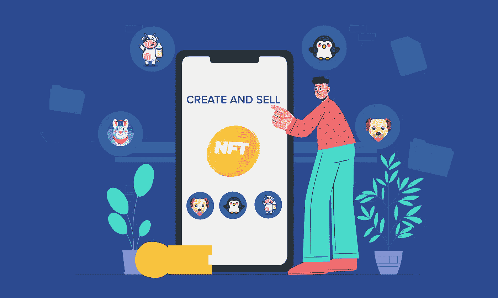
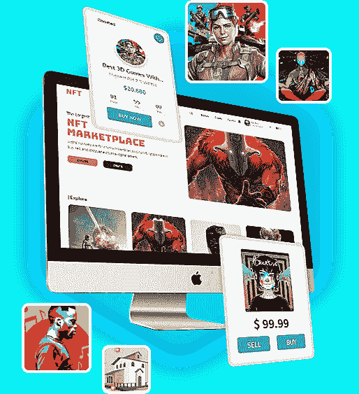

# 白标 NFT 市场:为什么你的 NFT 企业更喜欢这个解决方案？

> 原文：<https://medium.com/geekculture/white-label-nft-marketplace-why-prefer-this-solution-for-your-nft-venture-5463998aff2d?source=collection_archive---------14----------------------->

不可替代代币的出现证明了区块链技术对商业的影响。这最终标志着地球上 NFT 时代的革命。NFT 市场利润丰厚，因此提供了巨大的创收空间。如果我说 NFT 市场在 2021 年创造了大约 250 亿美元的收入，你可能不会相信。NFT 市场潜力巨大，是世界上最可靠的市场之一。作为企业家，你再也找不到这样一个在 NFT 市场创业的迷人场景了。

在这个快速发展的时代，花大量时间从零开始创建一个 NFT 平台是一件大事。现在出现了一个白标解决方案，它减轻了花太多时间从基础起草市场平台的压力。写这篇博客的目的是想记下关于选择一个 [**白标 NFT 市场**](https://www.appdupe.com/nft-marketplace-development) 来开始你的创业的想法。

# **NFT 市场——序曲**

众所周知，NFT 是内置于区块链技术中的数字资产；他们需要一个全面的平台来展示。NFT 市场仍然是创作者和收藏者之间的联系渠道。数字创作者可以进入该平台，将他们的数字文件制作成 NFT。同一个平台也将使他们能够推出他们的 NFT 系列。

NFT 市场是一个平台，个人和创作者出售和购买他们的 NFT。NFT 市场可能是一个交易非金融交易的平台，但这个平台是提供各种 NFT 相关服务的大本营。数字创作者可以在这些平台上创造和标记他们的非功能性词汇。他们可以决定是向个人出售还是拍卖他们的 NFT。用于开发不可替换令牌的区块链技术被用于开发 NFT 平台。

但是当谈到发展 NFT 市场时，作为企业家，你有多种选择。您可以从头开始开发 NFT 平台，也可以选择白标解决方案。然而，白标解决方案通常被认为是在 NFT 创业最简单的选择。

# **为什么您的企业更喜欢白标 NFT 市场解决方案？**

白标是创造一个与现有产品相似的产品，并用不同的属性重新命名它的过程。白标 NFT 平台是一个预先构建的解决方案，供个人创建、铸造、标记和交易 NFT。

企业家选择白标解决方案，因为它们具有成本效益并且易于部署。但是，在选择白标解决方案之前，您必须了解它们的重要性。不过最好还是研究一下，跟着 [**NFT 平台开发 101**](https://javascript.plainenglish.io/nft-platform-development-101-9fc6db800719) 了解清楚。选择白标 NFT 市场的优势如下:

## **即时科技发展**

当你决定从零开始发展你的 NFT 市场时，记住你必须花费相当多的时间和精力。开发一个 NFT 平台将需要大约 5 至 6 个月才能完成。如果你想开发一个有很多进步和复杂性的平台，肯定要花一年多的时间来开发。另一方面，我们有白色标签的 NFT 平台，使您能够在更短的时间内以更低的复杂性启动您的企业。

## **经济高效的解决方案**

从零开始建立一个 NFT 市场没有错，但唯一令人担忧的是随之而来的巨额薪酬。作为企业家，你必须准备好花费 10 万美元来发展你的 NFT 市场。这只是一个基础价格，当你根据自己的要求定制时，成本会更高。然而，白标 NFT 平台具有成本效益，你可以节省数百万美元。

## **钱包整合**

发展 NFT 市场最关键的一步是开发和整合加密钱包。要在你的 NFT 平台上策划钱包开发，你必须专注于单独整合钱包。但是在白色标签的 NFT 平台中，它们很容易与加密钱包集成。这将最终节省您从头开始集成它所花费的时间和金钱。

## **标准化特征**

重要的是要建立一个与其他 NFT 平台截然不同的 NFT 市场。这是让你的平台在市场上独树一帜的原因。当你得到一个白标解决方案时，它是作为一个具有必要技术特征和功能的现成解决方案来到你的手中。但是，它还为您提供了一个选择，让您可以根据自己的需求定制解决方案。

## **高度安全**

由于 NFT 非常独特和罕见，因此确保这些数字收藏品存储在更安全的环境中非常重要。NFT 市场的发展应该强调为创作者和收藏者提供一个安全的交易场所。一旦数据加密技术出现问题，平台的安全性将完全崩溃。为了支持这一点，白标 NFT 平台带有内置安全性，可以毫不费力地保护您的 NFT 平台。该平台是预先构建的，已经通过了几个级别的测试和安全性。所以当你购买它时，你不必担心它的安全性。

## **白牌 NFT 平台的有趣特性**

[**NFT 平台开发**](https://www.appdupe.com/nft-marketplace-development) 应该拿出很棒的特性来支持 NFT 平台的功能。白牌 NFT 市场中包含的一些顶级功能如下:

*   市场平台的店面将作为一个仪表板，所有关于 NFT 的信息，如他们的出价，价格，所有权细节将被记录。
*   该平台支持高级搜索和过滤选项，使用户能够立即搜索他们想要的 NFT。
*   该平台支持钱包集成，用户可以向加密钱包注册。这些加密钱包可以与平台集成，以执行 NFT 活动。
*   创作者可以在平台上列出他们的 NFT，供个人购买。
*   有竞价和卖出两种选择。创建者可以上传他们的 NFT 以及描述和固定价格。

## **总结**

采用一个 [**NFT 市场发展解决方案**](https://www.appdupe.com/nft-marketplace-development) 对企业家来说非常有利。这不仅具有成本效益，还可以节省您从头开始开发 NFT 平台的时间。因此，明智地为你的企业选择一个白标解决方案。